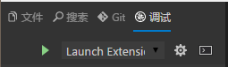
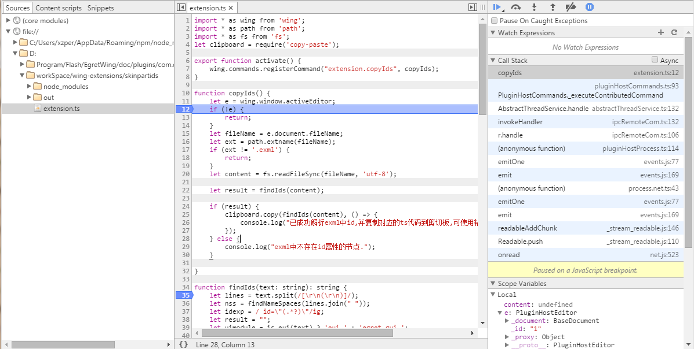

我们提供多种插件项目的调试方式。下面介绍两种方式

# 使用EgretWing调试插件项目

切换到调试栏，然后在下拉列表中选择 Launch Extension ，最后按启动按钮或者F5可启动调试. 如下图

然后直接在ts源代码上设置断点即可。

强烈推荐这种方式.

# 使用node-inspector调试插件项目

与其他普通 `NodeJS` 项目相同，可以使用 [`node-inspector`](https://github.com/node-inspector/node-inspector) 和 [`chrome浏览器`](http://www.google.cn/chrome/browser/) 来调试 Wing插件 项目。

## 安装node-inspector

使用 `npm` 命令安装 `node-inspector` 到全局位置

	$ npm install -g node-inspector

## wing 命令行参数

如果要调试指定插件需要通过特定的命令行参数启动wing。

选项 | 默认 | 描述
---- |:--------:| ---- 
`--debugPluginHost` | 5870 | 调试插件的端口号
`--extensionHomePath` |   | 指定插件的根目录，此路径下包含一个或者多个插件
`--extensionDevelopmentPath` |   | 指定当前插件的目录，此路径为正在开发的插件路径

## 启动调试

下面以Windows为例说明启动调试的过程。 假如我们要调试的插件位置为

	D:\workSpace\wing-extensions\skinpartids

首先找到wing可执行程序的路径，通过带命令行参数的方式启动wing。

Windows下默认的可执行程序路径为

	D:\Program Files\Egret\EgretWing\EgretWing.exe

Mac下默认的可执行程序路径为

	/Application/EgretWing.app/Contents/MacOS/EgretWing

那么启动Wing的调试命令行为

	$ "D:\Program Files\Egret\EgretWing\EgretWing.exe" --debugPluginHost --extensionDevelopmentPath="D:\workSpace\wing-extensions\skinpartids"

以上命令指定了一个特定插件的位置，并开启5870端口，等待调试器连接。

## 启动node-inspector

接下来开启一个命令行窗口，启动node-inspector

	$ node-inspector --debug-port=5870

按照提示，打开 `chrome浏览器` 访问网址

	http://127.0.0.1:8080/?ws=127.0.0.1:8080&port=5870

切换到 `Sources` 标签页即可看到相关的源代码，并可以在任意位置设置断点。

> Note: 
>- 如果在 `Sources` 标签页找不到插件的源代码，很有可能是插件还没有激活，相应的代码还没有加载。这时只需要在wing中执行一次激活插件的命令，激活插件。然后刷新浏览器页面即可看到插件代码。
- 如果在插件的 `tsconfig.json` 编译选项中开启了 `sourcemap`，则可以直接在ts代码上设置断点。