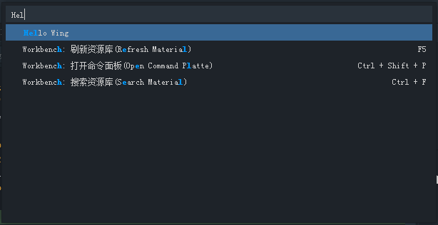

扩展点允许开发者在wing中自定义一些扩展功能。 通过插件的 [`package.json`](../../../Wing/plugin/configDes/README.md) 的 `contributes` 字段定义扩展点。目前支持下列扩展点


* [`commands`](#contributes.commands)
* [`keybindings`](#contributes.keybindings)
* [`configuration`](#contributesconfiguration)

## contributes.commands

自定义命令 `command` 。定义的命令可以在命令面板(Command Palette)中找到并执行。

>**Note:** 当命令通过快捷键或者命令面板被执行时, 将派发 [`activationEvent`](../../../Wing/plugin/activation/README.md) `onCommand:${command}`.

可使用下列字段：

名称 | 必需 | 类型 | 描述
---- |:--------:| ---- | ------
`command` | 是 | `string` | 表示命令的唯一id.
`title` | 是 | `string` | 表示命令的名称，此属性将显示在命令面板中.


### 例子

```
...
"contributes": {
	"commands": [{
		"command": "extension.sayHello",
		"title": "Hello Wing"
	}]
}
...
```




## contributes.keybindings

自定义快捷键 `keybinding`。可以自定义命令执行的按键绑定。

>**Note:** 可以定义不同操作系统平台的快捷键。

>**Note:** 当命令通过快捷键或者命令面板被执行时, 将派发 [`activationEvent`](../../../Wing/plugin/activation/README.md) `onCommand:${command}`.

可使用下列字段：

名称 | 必需 | 类型 | 描述
---- |:--------:| ---- | ------
`command` | 是 | `string` | 快捷键绑定的命令的id
`key` | 是 | `string` | 快捷键的按键组合，可以的按键的组合字符串参见 附录1 .
`win` |   | `string` | 在windows平台下的按键组合，如果用户在windows下，此属性将覆盖`key`字段指定的按键组合.
`mac` |   | `string` | 在mac平台下的按键组合，如果用户在mac下，此属性将覆盖`key`字段指定的按键组合.
`when` |   | `string` | 快捷键何时被触发的表达式，可用的属性值参见 附录2 .


### 附录1 `key`字段可用的按键组合字符串规则

按键规则一般由组合键 + 其他按键组成。 

组合按键表示如下：

操作系统 | 组合键
---- | ---------
MACOS X | `ctrl+`, `shift+`, `alt+`, `cmd+`
Windows | `ctrl+`, `shift+`, `alt+`, `win+`

>**Note:** 特殊的可以使用 `ctrlcmd` 表示windows下的`ctrl`, mac下的`cmd`


其他按键表示如下：

* `f1-f15`, `a-z`, `0-9`
* `` ` ``, `-`, `=`, `[`, `]`, `\`, `;`, `'`, `,`, `.`, `/`
* `left`, `up`, `right`, `down`, `pageup`, `pagedown`, `end`, `home`
* `tab`, `enter`, `escape`, `space`, `backspace`, `delete`
* `pausebreak`, `capslock`, `insert`


使用空格分割的按键序列，例如(ctrl+k ctrl+c)，表示先按ctrl+k，再按ctrl+c 才能触发该快捷键。

如果要使某一命令既可以按ctrl+k触发，又可以按ctrl+c触发，请定义两组keybinding，command相同，但是key字段不同。


### 附录2 `when`字段可用的字符串

`when`字段可以使用 `!`, `&&`, `==`, `!=` 等表达式限定条件。如

`!inDebugMode`  , `editorTextFocus && editorLangId == 'ts'` 都是可用的表达式。


* `editorFocus` 编辑器获得焦点时
* `editorTextFocus` 文本编辑器获得焦点时
* `editorLangId` 表示编辑器的语言id，`editorLangId` 通常对应编辑器对应文档的扩展名
* `inDebugMode` 表示启动调试时

更多字段请期待后续版本更新。

### 例子

定义命令 `"extension.sayHello"` 的windows下快捷键为 `Ctrl+F1`，mac下快捷键为 `Cmd+Shift+F1` :

```
...
"contributes": {
	"keybindings": [{
		"command": "extension.sayHello",
		"key": "ctrl+f1",
		"mac": "cmd+shift+f1",
		"when": "editorTextFocus"
	}]
}
...
```

## contributes.configuration

提供可设置的选项，用户可以在全局或者工作空间的设置中修改这些设置信息。

插件的开发者需要提供一套 JSON schema 来描述这些可以配置的选项，这样用户在修改时，能够得到编辑器的智能提示。

你可以通过下面的方法来读取用户自定义的配置信息
`wing.workspace.getConfiguration('myExtension')`.

### 例子

```
...
"contributes": {
	"configuration": {
		"type": "object",
		"title": "TypeScript configuration",
		"properties": {
			"typescript.useCodeSnippetsOnMethodSuggest": {
				"type": "boolean",
				"default": false,
				"description": "Complete functions with their parameter signature."
			},
			"typescript.tsdk": {
				"type": "string",
				"default": null,
				"description": "Specifies the folder path containing the tsserver and lib*.d.ts files to use."
			}
		}
	}
}
```

## contributes.languages

提供一种新语言的信息，以便 EgretWing 能够支持它的开发.

这这一节中, language 一般是指一个跟文件名相关的id (See `TextDocument.getLanguageId()`).

EgretWing 有三种方式确定一个文件使用的开发语言，这三种方式可以独立使用
1. 文件的扩展名 (下面说的 `extensions`)
2. 文件名 ( 下面说的 `filenames`)
3. 文件的第一行中的文本 (下面说的 `firstLine`)

最后一项 Wing 需要的信息就是 `aliases`：语言的别名，这个属性值列表的第一个会作为语言的显示名称，显示在编辑器的右下角和语言选择列表中。

当用户打开了一个文件，Wing会用这三个规则匹配文件，来确认文件所使用的语言，同时，Wing会抛出一个 activationEvent `onLanguage:${language}`(例如下面例子的 `onLanguage:python`),来激活对应的插件。


### 例子

```
...
"contributes": {
	"languages": [{
		"id": "python",
		"extensions": [ ".py" ],
		"aliases": [ "Python", "py" ],
		"filenames": [ ... ]
		"firstLine": "^#!/.*\\bpython[0-9.-]*\\b"
	}]
}
```
## contributes.debuggers

为 Wing 提供一个 debug 适配器，帮助 Wing 连接到一个外部的 debug 服务，扩展 Wing 的调试功能。

debug 适配器运行在一个单独的进程中，与 Wing 之间采用特定的协议来通信。你需要提供至少一个可执行的脚本来实现这个 debug 适配器。


### 例子

```
...
"contributes": {
	"debuggers": [{
        	"type": "node",
        	"program": "./debugger/out/node/nodeDebug.js",
        	"runtime": "node",
        	"enableBreakpointsFor": { "languageIds": ["javascript", "typescript", "coffeescript"] }
        }]
}
...
```

## contributes.grammars

提供一套 TextMate grammar 来为 Wing 添加语言支持。你需要提供，这组语法需要适配的语言 `language`，语法的 TextMate `scopeName` 值，和 语法定义文件的路径

>**注意:** 语法定义文件的格式可以是 JSON (扩展名 .json) 或 XML plist 格式 (如果扩展名不是 json 就认为是这种格式).

### 例子

```
...
"contributes": {
	"grammars": [{
		"language": "shellscript",
		"scopeName": "source.shell",
		"path": "./syntaxes/Shell-Unix-Bash.tmLanguage"
	}]
}
...
```

## contributes.themes

为 Wing 提供一个 TextMate theme 代码配色主题。你需要指定一个 `label` 表明这个主题是暗色主题还是浅色主题，还有主题文件的路径（XML plist 格式）


### 例子

```
"contributes": {
	"themes": [{
		"label": "Monokai",
		"uiTheme": "vs-dark",
		"path": "./themes/Monokai.tmTheme"
	}]
}
```

## contributes.snippets

```
"contributes": {
	"snippets": [{
			"language": "go",
			"path": "./snippets/go.json"
	}]
}
```

## contributes.jsonValidation

提供特定 json 文件的 JSON schema， `url`可以是插件中内置的文件，或者一个远程的url，例如 [json schema store](http://schemastore.org/json)

```
"contributes": {
    "jsonValidation": [{ 
 		"fileMatch": ".jshintrc",
 		"url": "http://json.schemastore.org/jshintrc"
	}]
} 
```

## contributes.views

**Tips**: 此扩展点需要EgretWing版本>=3.0.6

在特定视图注册一个`webview`面板。提供`url`的可以是插件中内置的文件，或者一个远程的url。目前支持在右侧栏`utility`注册面板。

可使用下列字段：

名称 | 必需 | 类型 | 描述
---- |:--------:| ---- | ------
`type` | 是 | `string` | 面板的类型.目前仅支持 `utility`
`id` | 是 | `string` | 面板的唯一id.
`title` | 是 | `string` | 面板显示的名称.
`url` | 是 | `string` | `webview` 对应的url链接或者 `html` 路径.
`order` | 否 | `number` | 面板在当前Part中的显示顺序。
`icon` | 否 | `string` | 面板选项卡上要显示的图标.

### 例子

```
"contributes": {
    "views": [{
		"type": "utility",
        "id": "test",
        "title": "测试",
        "icon": "images/icon.svg",
        "url": "./web/index.html"
	}]
} 
```

