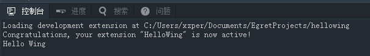

本文将通过一个简单的插件示例项目(HelloWing)，教会大家如何创建，构建，调试，发布一个wing插件项目。

HelloWing插件添加一条`command`，执行命令将会在控制台输出 `Hello Wing` 。

### 创建插件项目

**1**. 打开Wing `文件` - `新建项目` 菜单选择 `基本Plugin项目`。

输入项目名称 hellowing，点击完成。

**2**. 项目插件过程中会自动安装依赖模块，之后打开一个新窗口编辑显示的项目。对项目模板进行适当改动。

**3**. 创建插件入口`extension.ts`和入口方法`activate`。

	export function activate() {
    	//TODO
	}


> 每个插件都需要一个入口ts和入口方法`activate`来激活插件。入口ts的位置在`package.json`中定义。

**4**. 修改`tsconfig.json`设置编译项目所需要的各个参数。以本项目为例，内容如下

	{
		"compilerOptions": {
			"module": "commonjs",         //定义编译使用的模块规范。'commonjs'或者'amd'
			"outDir": "out",              //定义js文件输出目录。
			"sourceMap": true,            //是否生成sourceMap。
			"watch": true,                //是否开启自动编译
			"moduleResolution": "node"    //模块解析策略。 node或者classic。
		},
		"exclude": [
			"node_modules"                //编译器排除的目录。
		]
	}

> 有关`tsconfig.json`的更多说明参考 [官方文档](https://github.com/Microsoft/TypeScript/wiki/tsconfig.json)

**5**. 在项目根目录下创建`package.json`定义插件的基本信息。基本内容如下：

	{
		"name": "HelloWing",
		"description": "A Simple Extension For Egret Wing.",
		"version": "1.0.0",
		"publisher": "egret",
		"categories":[
			"Other"
		],
		"icon": "images/icon.png",
		"engines": {
			"wing": "^3.0.0"
		},
		"main": "./out/extension",
		"dependencies": {
		},
		"devDependencies": {
		}
	}

> 有关`package.json`的更多说明参考 [插件描述文件](../../../Wing/plugin/configDes/README.md)

以上步骤完成后插件项目的目录结构应该如下：

```
.
├── .gitignore
├── .wingignore                 // 插件发布时要排除的文件列表
├── .wing
│   ├── launch.json             // Debug启动配置文件
│   ├── settings.json           // 项目设置文件
│   └── tasks.json              // 任务配置文件
├── images
│   └── icon.png	            // 插件图标
├── node_modules                // 依赖模块
│   ├── egretwing               // 包含插件api，以及安装编译等脚本的模块
│   └── typescript
├── out                         // js输出目录
│   ├── extension.js 					
│   └── extension.js.map
├── typings                     // .d.ts目录
│   └── index.d.ts              // 引用的插件api
├── extension.ts                // ts源代码
├── package.json                // 插件描述文件
├── README.md
├── tsconfig.json               // ts编译配置
```


### 编写插件代码

**1**. 在`package.json`中注册[插件扩展点](../../../Wing/plugin/extendPoint/README.md)。这里需要创建一个`extension.helloWing`的命令。在`package.json`添加一下内容：

	"contributes": {
		"commands": [
			{
				"command": "extension.helloWing",
				"title": "Hello Wing"
			}
		]
	}

**2**. 在`package.json`中定义[激活事件](../../../Wing/plugin/activation/README.md)。当执行`extension.hellowing`命令时激活插件。在`package.json`添加一下内容：

	"activationEvents": [
		"onCommand:extension.helloWing"
	]

**3**. 接下来就可以开始代码的编写了。在激活方法`activate`中注册`extension.hellowing`命令的实现方法。在控制台输出 `Hello Wing` 的消息。代码如下：

	import * as wing from 'wing';

	export function activate() {
		console.log('Congratulations, your extension "HelloWing" is now active!');
		wing.commands.registerCommand('extension.helloWing', helloWing);
	}
	
	function helloWing() {
	    wing.window.showInformationMessage("Hello Wing");
	}

> `import * as wing from 'wing';`这一句导入`wing`模块，就可以使用`wing.d.ts`中定义的api。

> `wing.commands.registerCommand`这句表示注册命令对应的实现方法。

> 这里不仅可以使用`wing.d.ts`和`node.d.ts`中的api，甚至能通过npm下载第三方模块，实现各种功能。

### 编译项目

在Wing中使用**Ctrl/Cmd + Shift + B**编译项目。编译后的js代码将输出到 `out` 文件夹中。

### 测试插件

Wing提供方便的[调试插件](../../../Wing/plugin/debug/README.md)支持插件的测试和调试。

如果启动成功，控制台会输出

	Loading development extension at C:/Users/xzper/Documents/EgretProjects/hellowing

表示Wing已经识别并正在加载`hellowing`插件。

使用 `Ctrl/Cmd+Shift+P` 快捷键打开命令面板，执行 `hellowing` 命令。便可在控制台看到 `Hello Wing` 的输出。




### 发布插件

使用 `Ctrl/Cmd+Shift+P` 快捷键打开命令面板，执行 `ExtensionsManage: Package` 命令。将生成的`.wext`文件分享到[Egret论坛](http://bbs.egret.com)](https://github.com/egret-labs/wing-extensions)。

> 发布时可以在 `.wingignore` 项目中的文件中定义排除文件。
