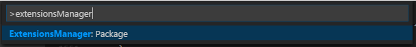
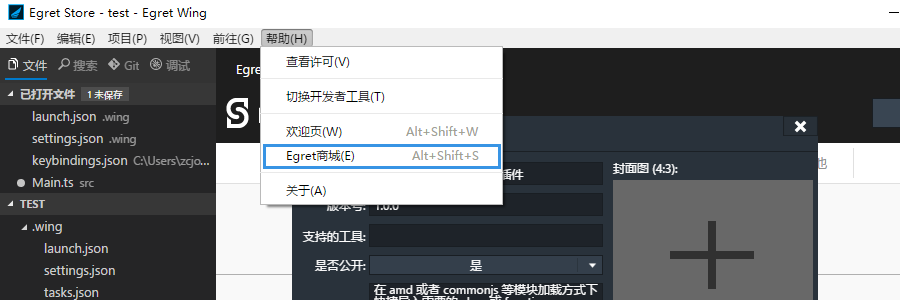
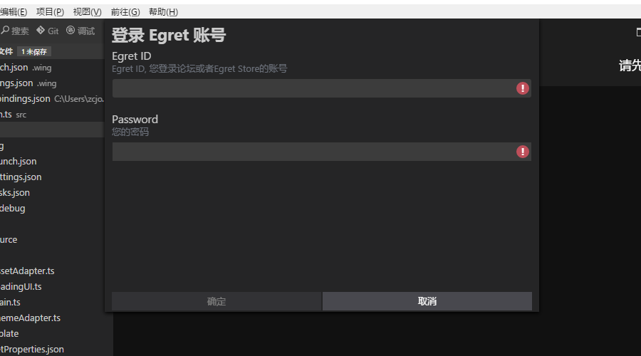
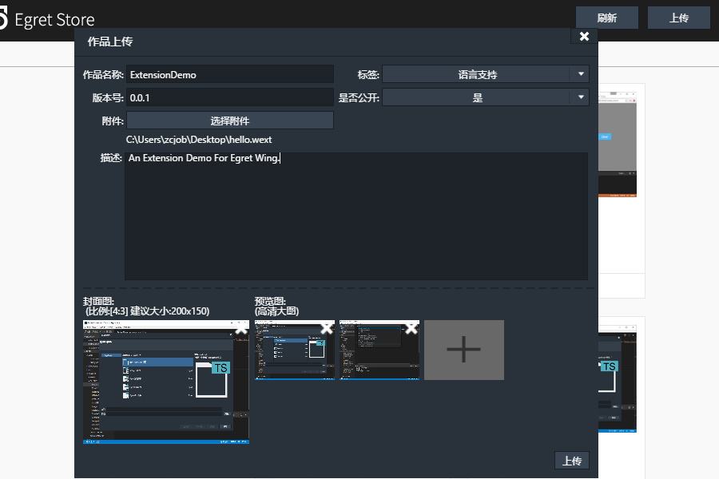
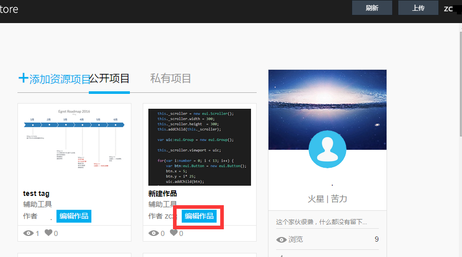
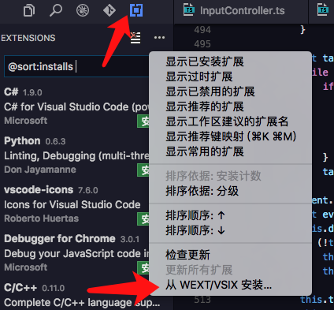

## 打包插件
在`.wingignore`中配置好发布要排除的文件或文件夹。 使用 `Ctrl/Cmd + Shift + P` 打开命令面板，选择 `ExtenstisonsManager: Package`

发布完成后会在项目目录下生成后缀为`.wext` 的插件文件格式。

您可以将发布后的文件分享给其他用户，手动安装。或者上传到 Egret Store 让所有的开发者下载使用。

### 上传到 Egret Store
在 “帮助”菜单中打开 Egret Store。

用您的 Egret ID (论坛或 Egret Store 账号)登录。

点击右上角的“上传”按钮，填写所需的信息，选择您打包好的 Wing 插件，点击上传。

为了保证 Egret Store 中插件的可用性，上传成功后请等待工作人员的审核。

### 更新 Egret Store 中的插件版本

当我们需要更新线上版本的时候，可以点击您的用户名，打开个人作品页面。点击插件下放的“编辑作品”按钮。

在打开的编辑作品面板中，选择新版本的插件，编辑相关资料，点击“上传”即可。编辑完的作品，请等待管理员审核后即可被大家下载使用了。

## 安装插件

点击  Extensions-》 从 WEXT/VSIX 安装

