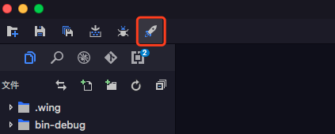

## 发布功能介绍
- 发布Egret项目：在弹出的窗口中配置发布信息，并发布当前 Egret 项目。

## 使用命令行发布
您可以使用命令 `egret publish` 命令来发布 `Html5` 项目

## 使用可视化工具发布
  * 1）点击图中红色框标注的按钮

 
 * 2）在弹出的面板中，左侧可以选择要发布的项目类型。

 

3）在 Html5 类型里可以填写版本号，用于版本控制。比如版本号填写了v1,那么发布出来的项目结构如下图所示

