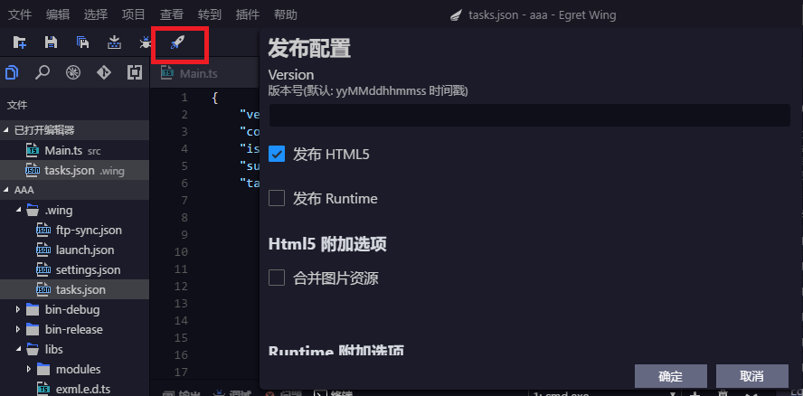
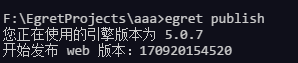
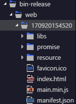

## 发布功能介绍
- 发布Egret项目：在弹出的窗口中配置发布信息，并发布当前Egret项目。
- 发布Egret项目并上传：发布成功后，将当前项目上传至ftp服务器。（ftp上传功能参见FTP上传功能介绍。）

## 发布配置介绍
- 版本号：用于发布时，在`bin-release/web/`目录下创键以版本号为名的子文件夹，如果为空，系统会随机创建版本号。
- 发布方式：可选html5(网页)与native（本地）方式。
- 是否压缩：发布native本地应用时是否进行压缩
- 压缩密钥：压缩使用的密码

## 发布按钮

图中红色框标注的按钮。

##使用命令行发布
描述:
    发布项目，使用GoogleClosureCompiler压缩代码

参数说明:
 -    project_name   项目名称，按照操作系统的命名规范命名
 -   --version      设置发布之后的版本号，可以不设置
 -   --runtime      设置发布方式为 html5 或者是 native方式，默认值为html5
 -   --password     设置发布zip文件的解压密码
 
 例如：
 
 
 
 发布后的项目文件夹：
 
 