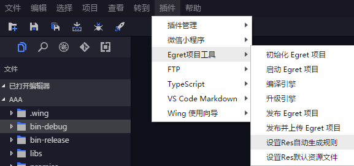
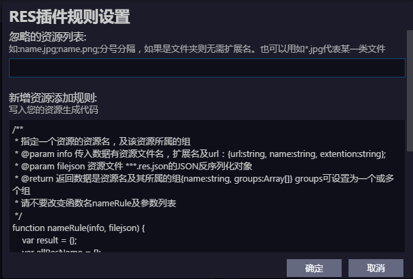

点击`插件---Egret项目工具---设置Res自动生成规则`



在上方可以设置忽略列表，下方添加代码：



```
/**
 * 指定一个资源的资源名，及该资源所属的组
 * @param info 传入数据有资源文件名，扩展名及url：{url:string, name:string, extention:string};
 * @param filejson 资源文件 ***.res.json的JSON反序列化对象
 * @return 返回数据是资源名及其所属的组{name:string, groups:Array[]} groups可设置为一个或多个组
 * 请不要改变函数名nameRule及参数列表
 */
function nameRule(info, filejson) {
    var result = {};
    var allResName = [];
    if (filejson.resources) {
        for (var i = 0; i < filejson.resources.length; i++) {
            allResName.push(filejson.resources[i].name);
        }
    }
    var name_suffix = 0;
    do {
        var name_suffix_str = name_suffix++ === 0 ? "" : "" + name_suffix;
        result.name = info.name + name_suffix_str + "_" + info.extention;
    } while (allResName.indexOf(result.name) !== -1);
    result.groups = ["preload"];
    return result;
}
```
