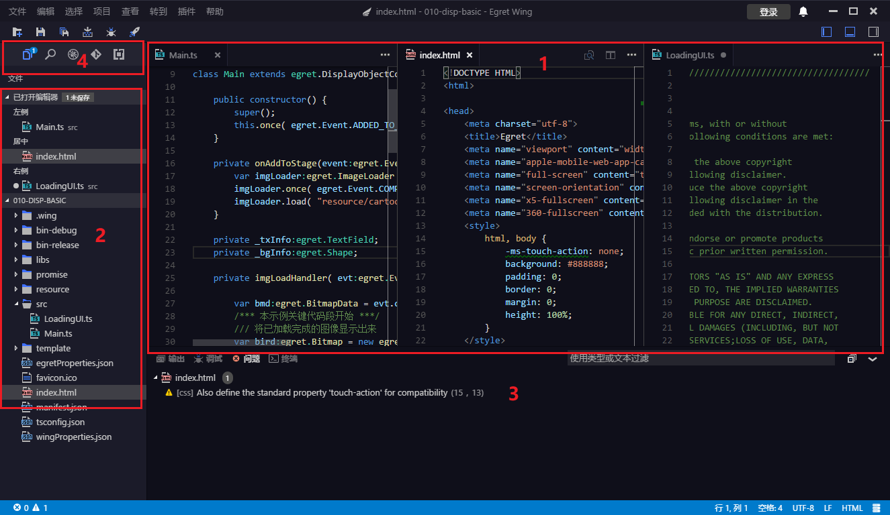
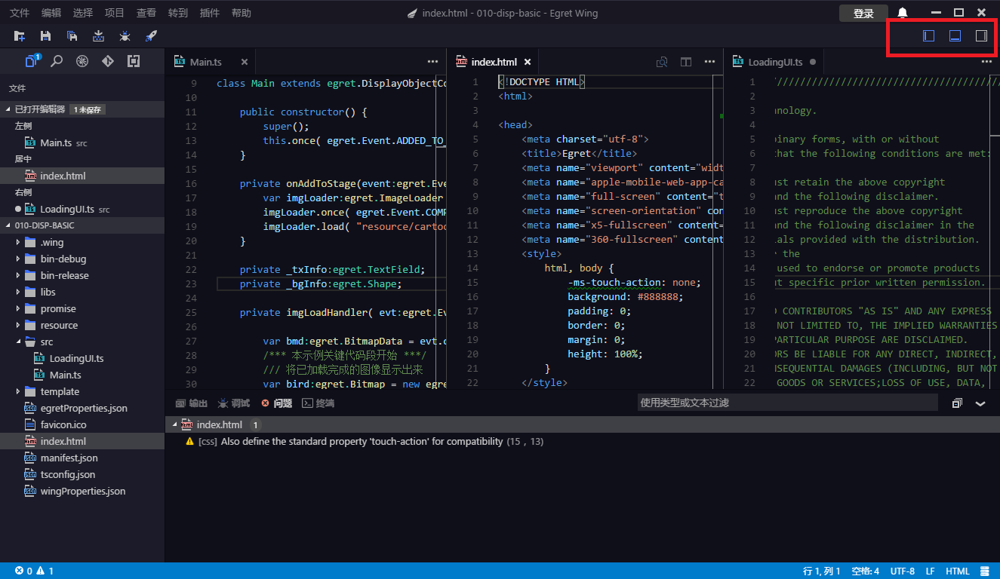
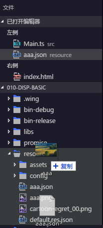
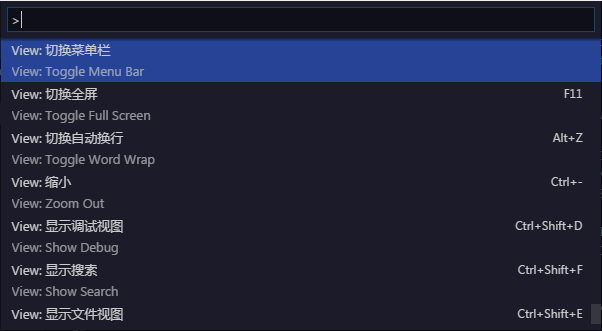

### 基本布局
Wing有着简单直观的布局，为代码编辑区保留了最大化的空间，同时也保留了足够的空间来浏览项目中的文件。Wing的UI主要分为下面的几大块：
1. 编辑器：编辑代码的主要区域，你能够并排打开三个编辑器进行开发。

2. 项目列表：显示正在编辑的文件或文件夹额外的信息。

3. 底边栏：包含输出，控制台等等常用的面板。

4. 侧边栏：包含文件，搜索，Git和调试等功能面板。

每次打开Wing的时候，它会自动还原到你上次关闭它的状态，包括打开的文件夹，各个面板的布局以及上次打开的文件。

> 可以点击上图红框中的三个按钮，显示/隐藏界面。

### 多编辑器编辑
你可以同时打开3个并排显示的编辑器。

如果你有一个正在显示的编辑器，有几种方式来打开一个并排显示的编辑器。
- 在文件列表中，按住`Ctrl`(Mac:`Cmd`)点击一个文件
- 在文件列表中，右击一个文件，点击“在侧边编辑器打开”
- 按快捷键 `Ctrl+\` 在新编辑器中打开正在编辑的文档

注意，不论你合适打开一个文件，当前活动的编辑器总是会显示新打开的文件的内容，所以，当你想要在特定的编辑器中打开文件时，请先点击一下它，来激活这个编辑器。

当你同时打开了多个编辑器窗口的时候，你可以通过按 `Ctrl/Cmd` + `1`,`2`或`3`来切换到您需要的编辑器。
> 你可以通过拖动编辑器的标题栏，来重新排列几个编辑器的顺序，通过编辑器间的分隔线来调整每个编辑器的大小

### 文件管理器

“文件”面板可以用来浏览、打开、管理项目中的文件和文件夹。

当你在Wing中打开了一个文件夹的时候，该文件夹中所有的内容会显示在“文件”面板中。在这里你能进行各种文件操作：
- 创建、删除文件或文件夹，或者重命名。
- 通过拖动来移动文件或文件夹
- 你可以使用右键菜单来查看所有的操作

> 你可以直接从文件系统拖动文件到文件面板来复制到当前目录，之后上方会有提示信息

### 命令面板

命令面板能方便的查找和执行命令，使用快捷键 **F1** 或者 **Ctrl+Shift+P** 呼出面板。

面板每一项都是一个命令，如果该命令有快捷键在右侧会显示对应的快捷键。

### 调试控制台

如果配置了 `launch.json` 可以通过快捷键F5 或者 调试面板启动调试。在调试模式下，调试选项卡中的**变量，监视，调用堆栈，断点**折叠菜单都是可用的。

面板中的调试面板中显示程序运行中的输出和报错信息，在下方的输入框中也能输入表达式并动态执行得到计算结果。这个面板与Chrome开发者工具中的Console面板功能类似。

### 输出面板

输出面板显示一些提示消息，显示当前运行状态。输出面板有多个频道(`Channel`)区分不同输出的来源。

例如Tasks频道会输出项目编译过程中相关的信息，GIT频道输出Git执行过程中的信息，Project频道输出项目创建相关的信息等。

