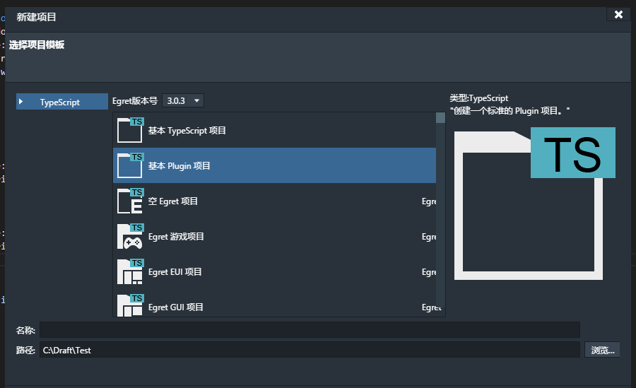
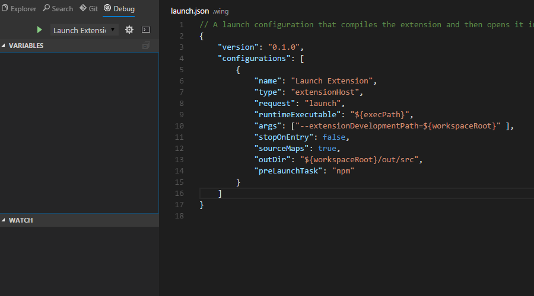
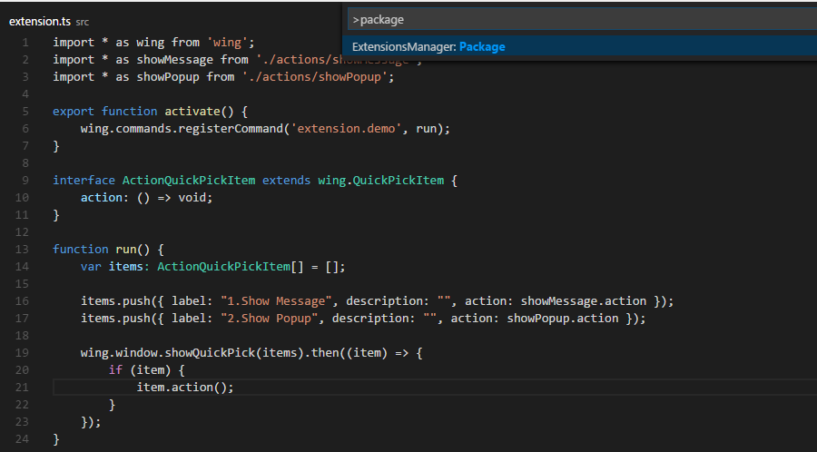
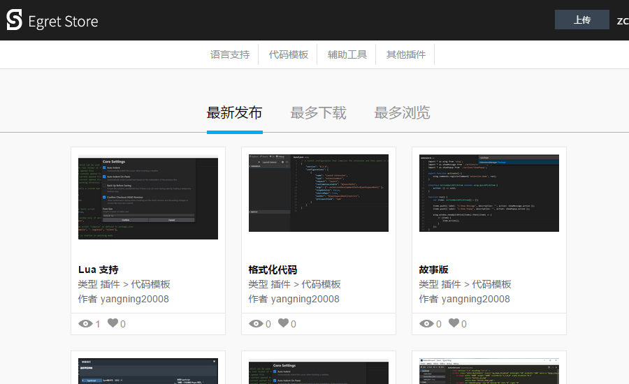
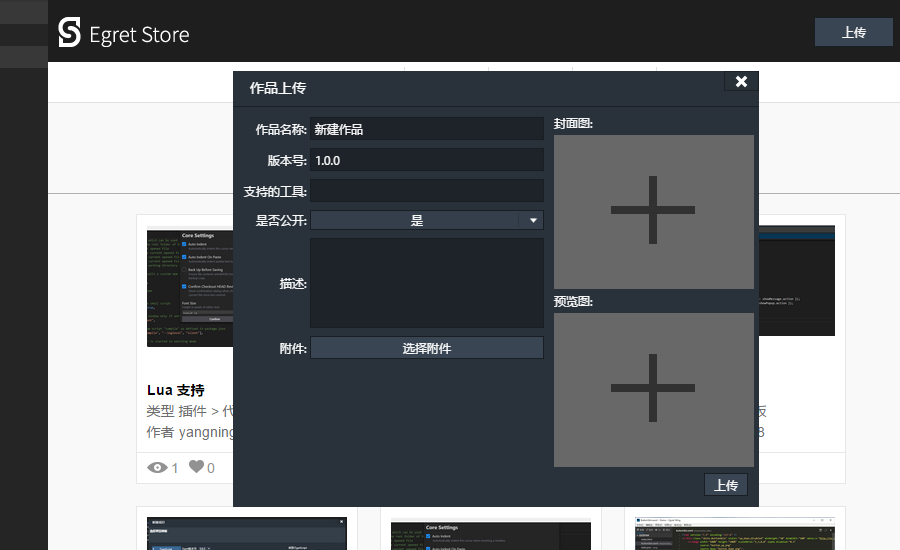
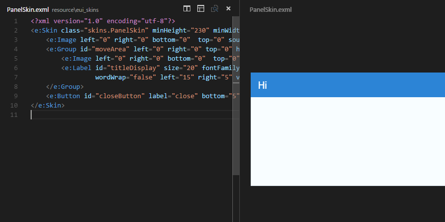
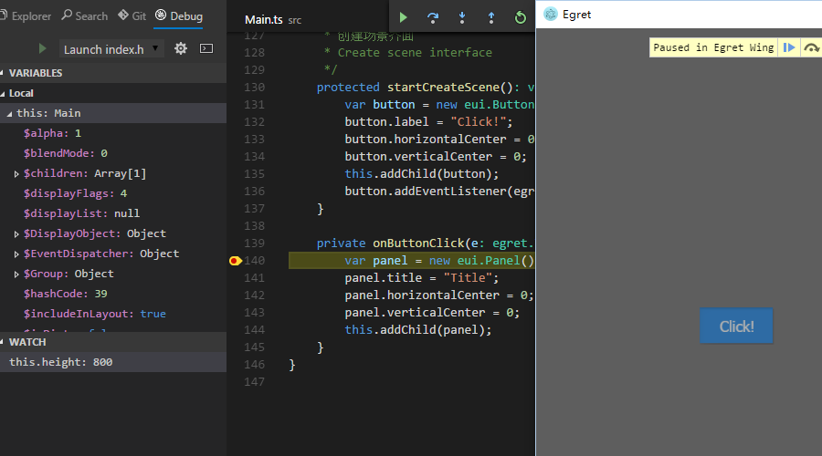

在Egret Wing 3.0.1 这个版本中，我们主要做了以下改进
- 增强了 Wing 插件体系的用户交互能力
- 优化了插件项目的创作和发布流程。
- 集成了 Egret Store，让插件安装体验更加友好。
- 支持了 EUI 项目的EXML预览
- 提升了 Egret 项目的调试体验
- 优化了 Mac retina 屏幕下的显示效果。

下载地址：
[Egret Wing 3.0.1 for Windows](http://tool.egret-labs.org/EgretWing/electron/EgretWing-v3.0.1-win32.zip?t=20160308 "Windows")
[Egret Wing 3.0.1 for Mac OS](http://tool.egret-labs.org/EgretWing/electron/EgretWing-v3.0.1-darwin.zip?t=20160308 "Mac OS")

## 插件体系

### 增强 Wing 插件体系的用户交互能力
在 Wing 2.5 版本的插件体系中，Wing 没有提供很好的UI交互接口，开发者只能用 AIR 等技术自己来实现用户交互。在 3.0.1 中我们加入了 `wing.window.showPopup` 这个方法，来方便的接收用户输入。开发者只需要定义所需数据的类型和描述，Wing会自动构建UI来接受用户输入。

[了解更多插件开发的详细信息>>](http://edn.egret.com/cn/docs/page/778 "了解更多插件开发的详细信息")

    import * as wing from 'wing';
    import {PopupType, Store, IStoreMap, IStoreSchema, IStoreSchemaMap, IFormOptions} from 'wing';
    
    export function action(): void {
    	wing.window.showPopup<IFormOptions>(PopupType.Form, new Store(properties, scheme), {
    		title: '表单例子'
    	}).then((result) => {
    		wing.window.showInformationMessage(JSON.stringify(result.getProperties(true)));
    	});
    }
    
    const scheme: IStoreSchemaMap = {
    	checkbox: {
    		type: 'boolean',
    		title: '复选框',
    		description: '不带默认值的复选框'
    	},
    	inputbox: {
    		type: 'string',
    		title: '输入框',
    		description: '文本输入框'
    	}
    }
    
    const properties = {
    	inputbox: 'Initial Value'
    }

###优化插件项目的创作和发布流程
Wing 3.0.1 现在内置了插件项目的模板，方便开发者快速进行插件开发。

Wing 现在可以直接调试插件项目，在插件项目中直接点击“调试”面板中的调试按钮或者按“F5”即可启动插件项目调试

插件开发完成后可以直接使用插件管理器的“Package”命令打包，方便私下分享或发布到Egret Store。

**自定义文件格式编辑器正在紧张的开发中，敬请期待。**

##Egret Store
###插件商城
Wing 中集成了 Egret Store的插件商城，方便开发者下载安装需要的插件。

开发者可以将打包后的插件直接发布到 Egret Store，或更新现有的插件。

**插件版本更新提醒正在开发中，目前可以使用安装新版本的方式覆盖安装。**

###素材商城的接入正在开发过程中

##支持 EUI 项目预览
作为 EUI 可视化编辑的一环，Wing 目前支持了 EUI 项目的预览，您可以通过切分编辑器窗口的方法实现一边写代码，一边预览的效果。EUI的可视化编辑也已经在最终实现阶段，敬请期待。

##提升 Egret 项目的调试体验
Wing 现在可以使用内置的浏览器直接调试 Egret 或者其他 HTML5 项目。真正实现免配置调试JS/TS。

##优化 Mac retina 屏幕下的显示效果。
Wing 3.0.1 优化了部分面板在 Mac retina 屏幕下的显示效果，UI界面更加清晰。

##Next

接下来的版本中 Wing 团队会继续完善 EUI 的可视化编辑，同时继续完善跟其他服务的整合，在此过程中，会把之前开发者的反馈尽量合并到新发布的版本中，感谢各位的支持。
