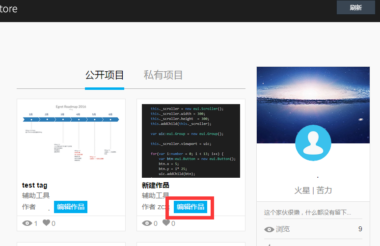
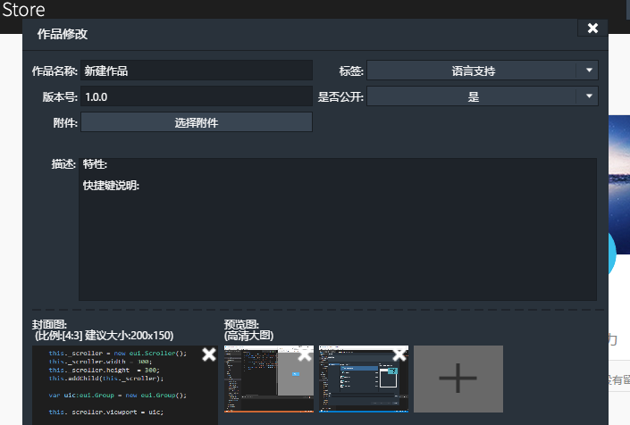
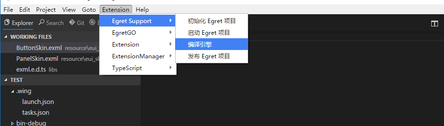
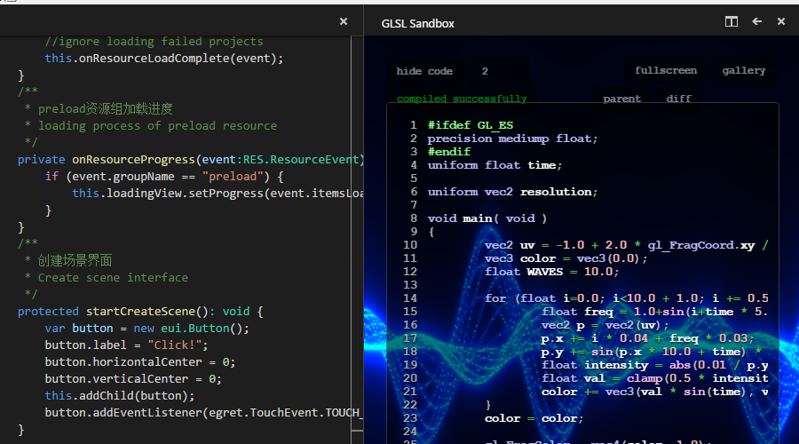
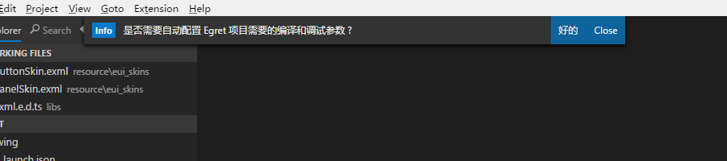
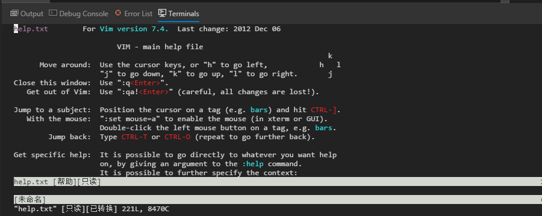

在 Egret Wing 3.0.2 这个版本中，我们主要做了以下改进
- 完善插件商城更新功能，现在可以点击用户名，在“我的作品”页面更新插件版本
- 添加 Egret Support 插件，增加编译引擎、startserver、发布项目和初始化等功能
- 添加插件命令菜单，让插件更加易用
- 添加全功能的控制台，更方便执行外部命令
- 修复开发者反馈的几个bug，感谢 江左梅郎，夏树，卖红太狼平底锅的，卖土豆儿等开发者提供的反馈

路线图

- EUI 可视化编辑（4月初）
- RES 管理（4月初）

下载地址
[Egret Wing 3.0.2 for Windows](http://tool.egret-labs.org/EgretWing/electron/EgretWing-v3.0.2-win32.zip?t=20160322 "Windows")
[Egret Wing 3.0.2 for Mac OS](http://tool.egret-labs.org/EgretWing/electron/EgretWing-v3.0.2-darwin.zip?t=20160322 "Mac OS")
## 插件商城
当我们需要更新 Egret Store 上的版本的时候，可以在商城页面，点击您的用户名，打开个人作品页面。点击插件下放的“编辑作品”按钮。

在打开的编辑作品面板中，选择新版本的插件，编辑相关资料，点击“上传”即可。编辑完的作品，请等待管理员审核后即可被大家下载使用了。

## 插件系统更新
Wing 3.0.2 添加了插件命令菜单，让插件更加易用。

增加了 `wing.complexCommands.previewWebView` 方法，开发者可以定义自己的编辑器。

## Egret 项目支持
当打开现有的 Egret 项目时，会提示开发者自动配置 Wing 3.0 所需的编译和运行配置文件。

增加 Egret 项目所需的编译引擎、startserver、发布项目和初始化等功能

## 内置控制台
Wing 现在内置了全功能的控制台，你甚至可以在 Wing 中运行 vim。

欢迎将您的使用体验反馈给我们。

