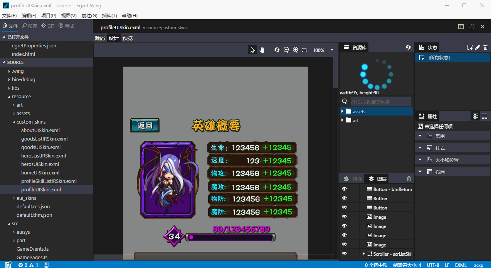
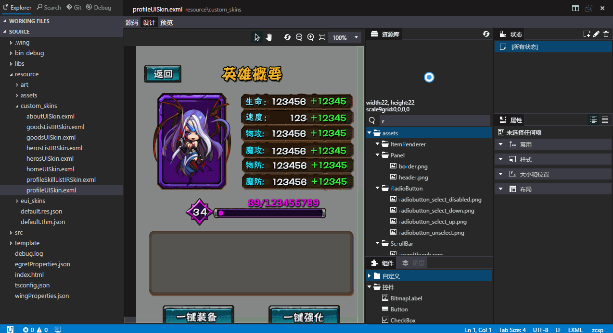

在 Egret Wing 3.0.3 这个版本中，我们主要做了以下改进
- 集成 EUI 可视化编辑器
- 增加安装包和自动更新
- 新增资源管理器右键菜单支持
- 修改部分UI的主题和配色
- 修复部分开发者反馈的 bug

路线图
- RES 管理
- 项目/文件 模板支持
- App 打包支持
- 云端发布支持

已知问题
- EUI面板位置调整无法保存
- 属性面板中，可能会出现文本输入框与滚动位置不同步的情况

下载地址
[Egret Wing 3.0.3 for Windows](http://tool.egret-labs.org/EgretWing/electron/EgretWing-v3.0.3.exe?t=20160406 "Windows")
[Egret Wing 3.0.3 for Mac OS](http://tool.egret-labs.org/EgretWing/electron/EgretWing-v3.0.3.dmg?t=20160406 "Mac OS")

## EUI 编辑器
EUI 编辑器的大部分功能已经移植到 Wing 3.0.3 中，并对一些细节进行了优化。

### 代码模式下关闭 EUI 面板
把 EUI 相关的面板集中放在了 EXML 编辑器中,最大化编码区域

### 资源库模糊搜索
资源库现在支持模糊查询，搜索效率更高

## 优化安装/升级体验
Wing 3.0.3 不再使用 zip 包分发，优化了安装体验，内置新版本检查功能，第一时间得到新版本。

