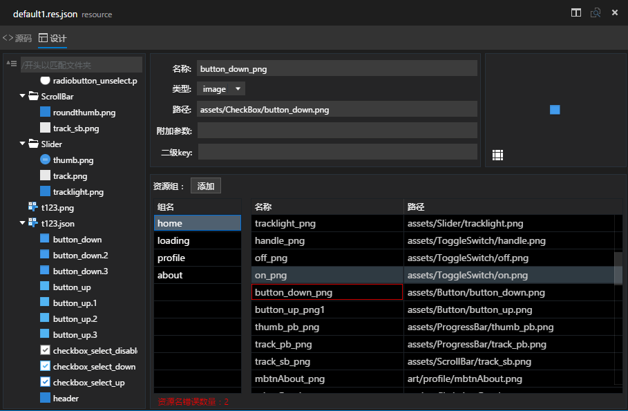
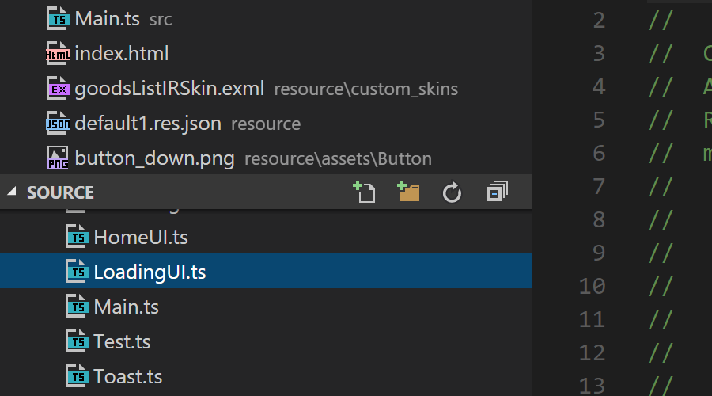
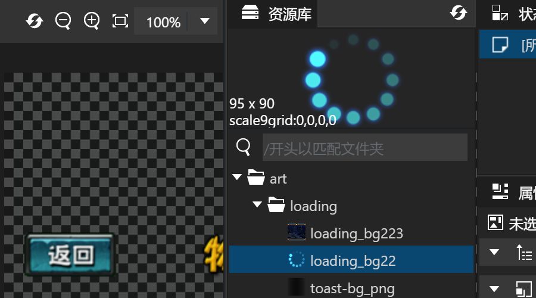
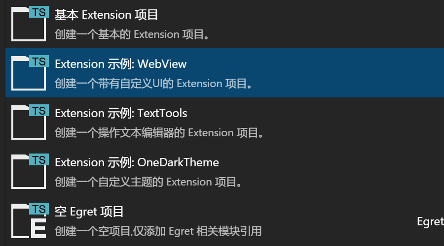
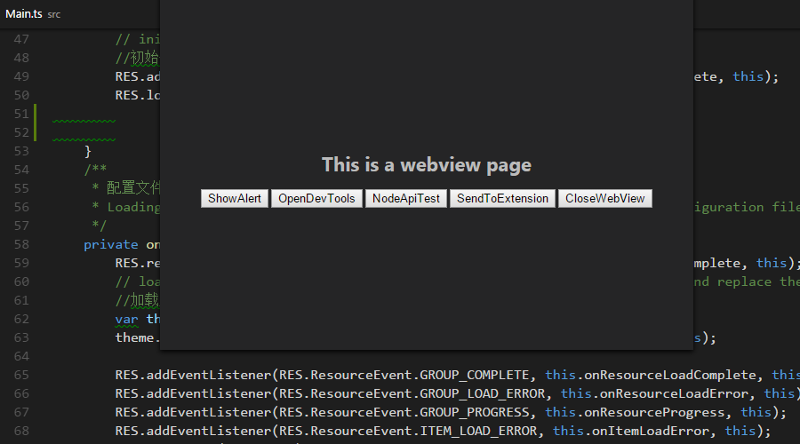

在 Egret Wing 3.0.4 这个版本中，我们主要做了以下改进

- **集成 RES 可视化资源编辑器**
- 添加常用文件的 icon
- 添加资源管理器资源预览功能
- 支持导入Wing 2.5, FlashBuilder, WebStorm, Sublime 等快捷键
- **新建项目向导中添加常用的插件类型示例项目**
- Extension API 改动
    - Popup API
        - **`PopupType` 添加 `WebView` 类型，弹出窗口支持自定义UI。**
        - `IStoreSchema` 添加 `flexibleHeight` 属性支持多行文本输入。
        - `IStoreSchema` 的 `description` 属性支持 **markdown** 语法。
        - Form Popup 按下取消或者 `ESC` 时添加回调，`Thenable` 返回 `null`。
    - **WebView 中添加接口 wing.WebView，支持ipc通讯。**
    - `window` 添加 webview 相关api (  `webviews` , `onDidCreateWebView` , `onDidDeleteWebView`)
- 调试时，显示 Console 输出的行号和堆栈
- 修复 Wing 3.0.3 中出现的若干问题
    - EUI面板位置调整无法保存
    - SpriteSheet 不能编辑九宫格的问题
    - EUI 编辑器选框不能翻转的问题
    - EUI 编辑器 `\n` 预览与实际效果不一致的问题
    - EUI 属性面板不显示 skinName 的问题
    - EUI 按下 `Space` 无法切换到拖拽模式的问题
    - EUI 属性面板没有按照字母排序
    - 当屏幕尺寸较小时，“组件/图层”面板可能会被遮挡
    - EUI 编辑器缩放模式下反复切换编辑器显示错误
    - EUI 编辑器中，皮肤超出舞台，或者缩放后，容易出现内容滚到最右边的情况
    - EUI 设计模式双击组件无法打开对应皮肤或者内嵌编辑模式
    - 图层面板点击后，焦点没有回到主舞台
    - 商城窗口不应该被打开多次
    - 图层面板拖动到其他位置后，所有图层内的内容可能会消失
    - 修改属性面板 切换属性面板 `DataGrid` 布局错误
    
下载地址

- [Egret Wing 3.0.4 for Windows](http://tool.egret-labs.org/EgretWing/electron/EgretWing-v3.0.4.exe?t=2016042620 "Windows")
- [Egret Wing 3.0.4 for Mac OS](http://tool.egret-labs.org/EgretWing/electron/EgretWing-v3.0.4.dmg?t=2016042620 "Mac OS")

路线图
- RES 自动生成
- 项目/文件 模板支持
- App 打包支持
- 云端发布支持

已知问题
- 属性面板中，可能会出现文本输入框与滚动位置不同步的情况

## RES 资源编辑器
RES 资源编辑器的大部分功能已经移植到 Wing 3.0 中，并对一些细节进行了优化。

- RES 编辑器左侧用树形结构还原文件夹结构，查找文件更加方便
- 添加 图片/ SpriteSheet 资源的预览功能
- 更加强大的模糊搜索功能

## 添加常用文件的 icon

Wing 3.0 为常用文件添加了 icon 文件识别更加准确

## 添加资源管理器的文件预览功能

在 EUI 的资源库中，我们将原来的 icon 替换为了您的素材，查找素材更加方便

## 添加常用的插件类型示例项目

新建项目向导中添加了常用的插件类型示例，包含了最常用的自定义 UI，与编辑器交互，自定义主题等等

## Extension API

- Popup API
    - **`PopupType` 添加 `WebView` 类型，弹出窗口支持使用HTML或者 EUI 自定义UI。**
    - `IStoreSchema` 添加 `flexibleHeight` 属性支持多行文本输入。
    - `IStoreSchema` 的 `description` 属性支持 **markdown** 语法。
    - Form Popup 按下取消或者 `ESC` 时添加回调，`Thenable` 返回 `null`。
- **WebView 中添加接口 wing.WebView，支持与 Extension 的主进程通讯。**
- `window` 添加 webview 相关api (  `webviews` , `onDidCreateWebView` , `onDidDeleteWebView`)

具体使用方法请参考示例项目（创建项目，选择 Extension: WebView）

