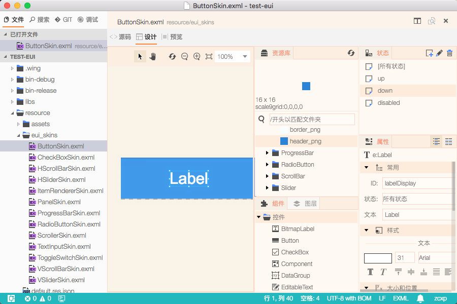
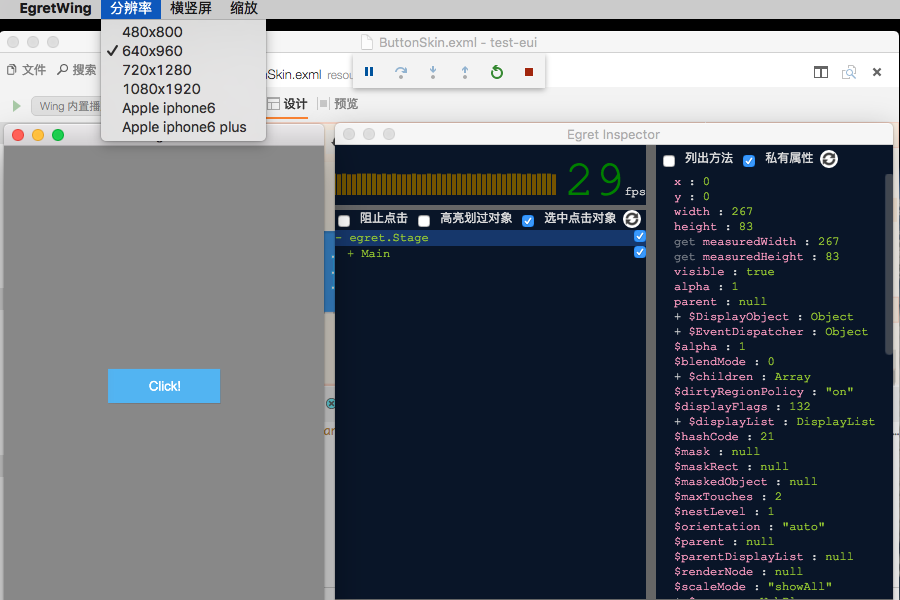
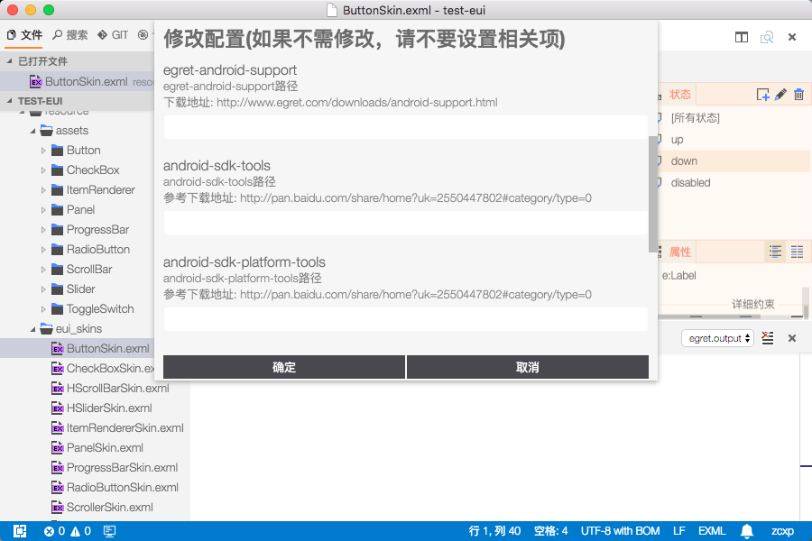
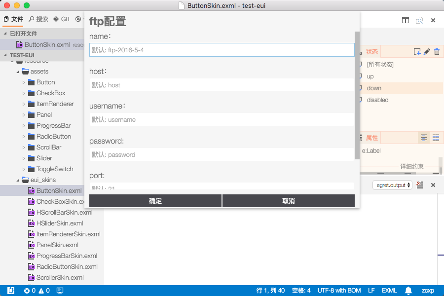

在 Egret Wing 3.0.6 这个版本中，我们主要做了以下改进

 - 添加浅色皮肤
 - 完善调试窗口
    - 集成 Egret Inspector
    - 添加常用窗口尺寸
    - 添加横竖屏模式
    - 添加高 DPI 模拟
 - 增加自动检测资源改动功能
 - 添加消息盒子
 - App 打包流程整合
 - 增加 FTP 功能
 - 优化终端操作体验,增加打开新窗口和清空按钮
 - 增加显示所有已插件的菜单项
 - 添加右边栏 API
 - 增加插件弹出窗口拖动 API
 - 修复上个版本的 bug
    - 新建皮肤的时候 不能不自动加 Skin.exml后缀, 并且皮肤中没有class属性
    - 修复切换 exml 时, 资源库面板自动收起的 bug
    - 属性面板不能响应拖拽的 bug
    - 修复 存在 preLaunchTask 时, 多按 F5 会调试失败的问题
    - 优化 debug log 显示
    - 修复 EUI Group 拖动行为与 2.5 不一致的 bug

## 添加浅色皮肤
这个版本中我们增加了呼声较高的浅色皮肤, 淡黄色为主的配色, 能够缓解眼睛疲劳.
此外, 我们对部分 icon 进行了优化, 辨识度更高.

## 完善调试窗口
Wing 内置的调试窗口变得更加强大了.
- 集成了 UI 调试工具 Egret Inspector
- 添加了常用窗口尺寸
- 添加了横竖屏模式
- 添加了高 DPI 模拟
- 增加了右键菜单, 方便的开启 Chrome 调试工具和 Inspector

## 自动检测资源改动
RES 模块增加了自动检测资源改动功能, 当 resource 目录中有文件改动的时候,
Wing 会自动提示您, 您可以配置自定义的脚本, 将改动自动添加到资源文件中.

您可以通过菜单 "插件/Egret Support/设置 RES 自动生成规则" 按照自己
喜欢的规则来生成资源文件

## 添加消息盒子

为了更好的显示 Wing 内部消息,我们添加了消息盒子, 统一管理来自 Wing 和插件的消息.

## 增加移动 App 打包功能 (Beta)

移动打包功能借助 Egret Android/iOS Support 将您的 Egret 游戏打包成 App.
主要节省了每次编译完成后还需要借助外部 IDE 打包的 时间. 此功能还处于 Beta 阶段
我们希望收到来自您的反馈. 入口:"插件 / Egret Support / 发布移动 app"

## 增加 FTP 功能
Wing 3.0 增加了简单的 FTP 同步功能. 可以将本地文件同步至 FTP. 入口:"插件 / FTP Upland"

## Extension API 改动
 - 添加右边栏 API, 可以定义一个固定在右边的工具栏 [contributes.views](http://edn.egret.com/cn/docs/page/782)
 - 增加插件弹出窗口拖动 API
详情请查看 插件[开发文档](http://edn.egret.com/cn/docs/page/778)

有任何问题,可以通过"帮助" 菜单中的用户反馈功能, 反馈给我们, 我们会第一时间联系您,感谢支持.

