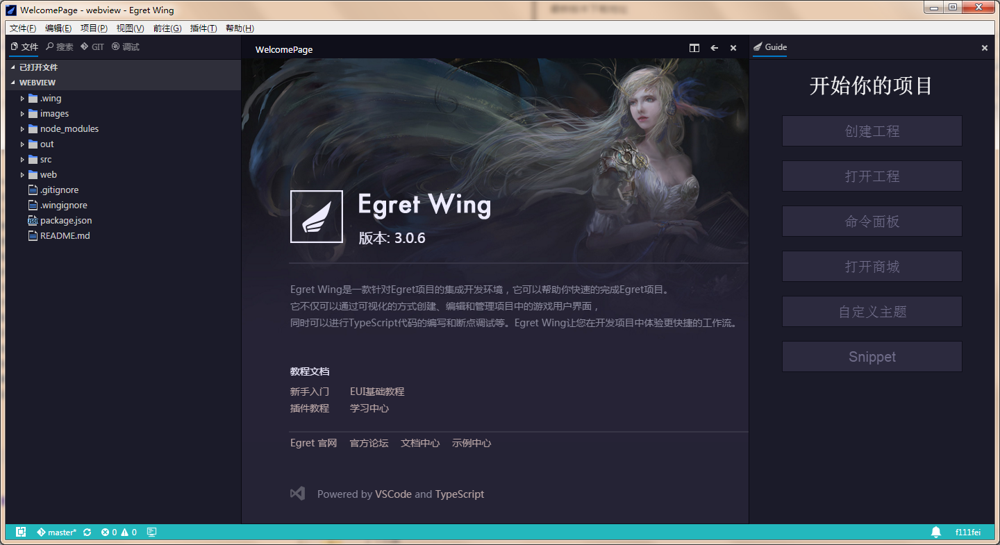
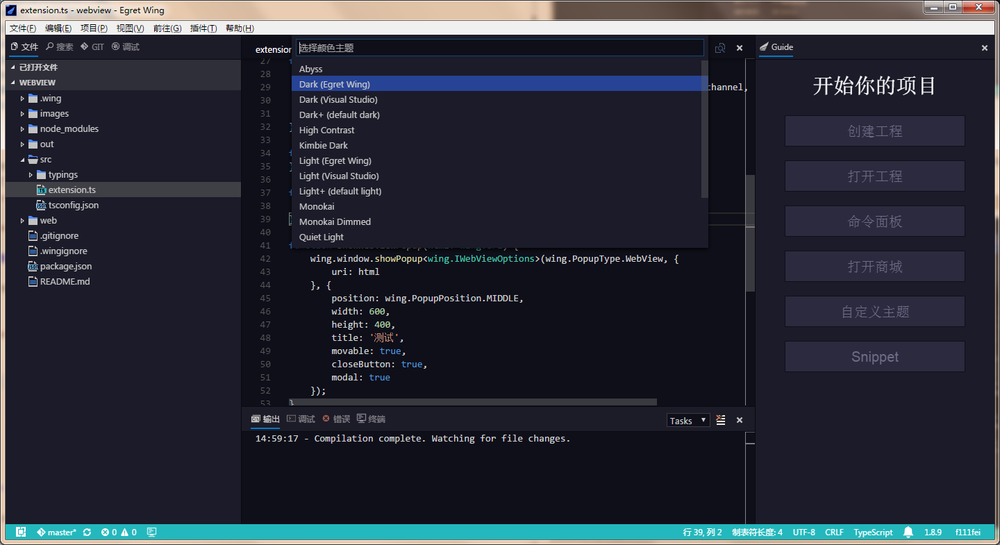
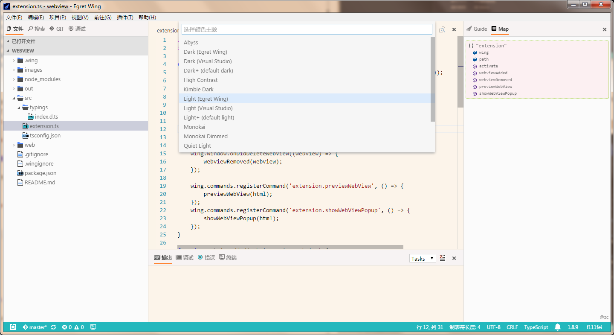
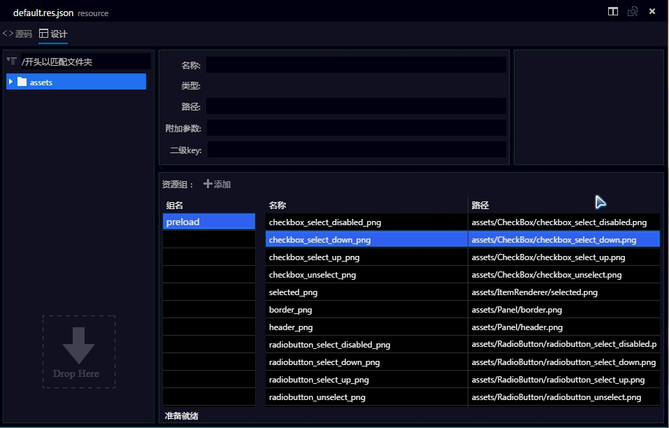
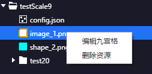
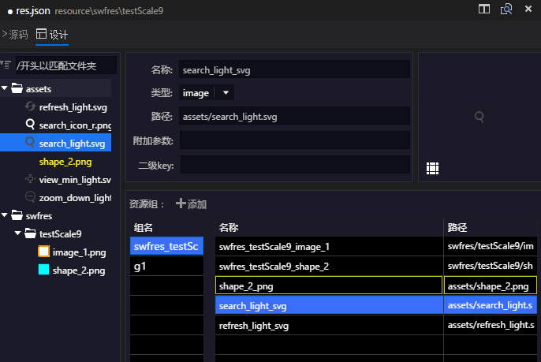

Egret Wing 3.0.7 是 Wing 3.0 的第一个完整版,包含了 Wing 3.0 的所有功能. 这个版本中，我们对社区反馈的问题进行修复。

 - 新增新手向导
 - 优化新增的深色和浅色主题
 - 优化RES编辑器
 - 修复上个版本的 bug
  - 修复新用户默认主题下，代码着色错误的问题。
  - 修复项目清理报错的问题。
  - 修复无法调试插件的问题。
  - 修复WebView无法播放音频和视频的问题。
  - 修复插件商城访问失败的问题。
  - 修复FTP上传的若干问题。
  - 修复右边栏面板某些情况下焦点错误的问题。
  - 修复资源配置文件修改，EUI不更新的问题。
  - 移除EUI编辑界面多余的报错信息。
  - 修复默认皮肤循环依赖导致卡死的问题。
  - 移动EUI组件之后立即再次点击，不会发生选择错误的问题。
  - 修复在同样位置粘贴EUI节点，会自动偏移一部分位置的问题。
  - 修复Group设置cacheAsBitmap内部图片会消失不见的问题。
  - 修复RES切换编辑模式后无法修改资源名的问题。
  - 修复添加sheet文件没有自动添加subkey的问题。
  - 修复删除最后一个组依然显示组内资源的问题。

## 新增新手向导

新用户在首次启动时或者通过命令面板(Start Guide)会开启新手向导，让新用户快速熟悉Egert Wing。
另外我们还更新了欢迎页的部分链接，并添加了与 [VSCode](http://code.visualstudio.com/ "VSCode") 和 [TypeScript](https://www.typescriptlang.org/ "TypeScript") 的链接, Wing 3.0 离不开 VS Code 坚实基础.

## 优化新主题

在上一个版本中我们收到新主题配色不协调的问题。这个版本我们重新调整了配色细节。预览图如下：

深色主题

浅色主题

## 优化RES编辑器

添加资源树与组资源列表关联，自动滚动到所选资源。

资源树右键菜单添加编辑九宫格选项。

添加svg资源支持

使用中得任何问题欢迎跟我们反馈. 感谢支持!

