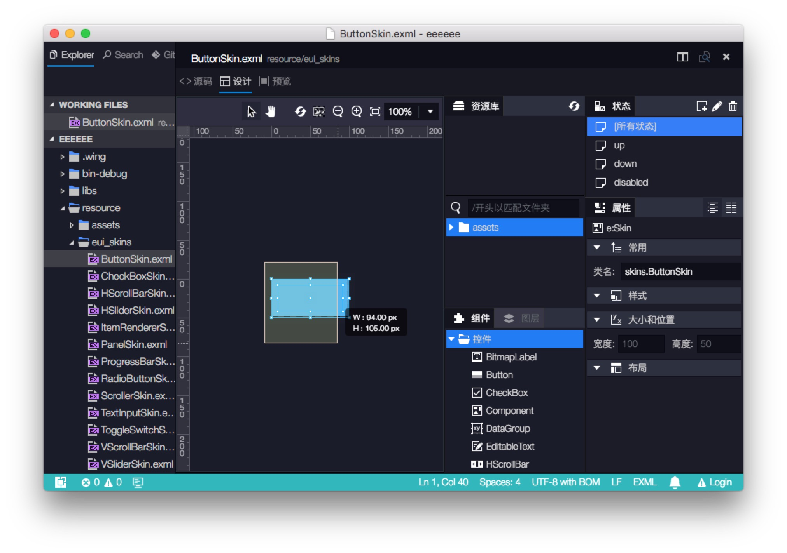
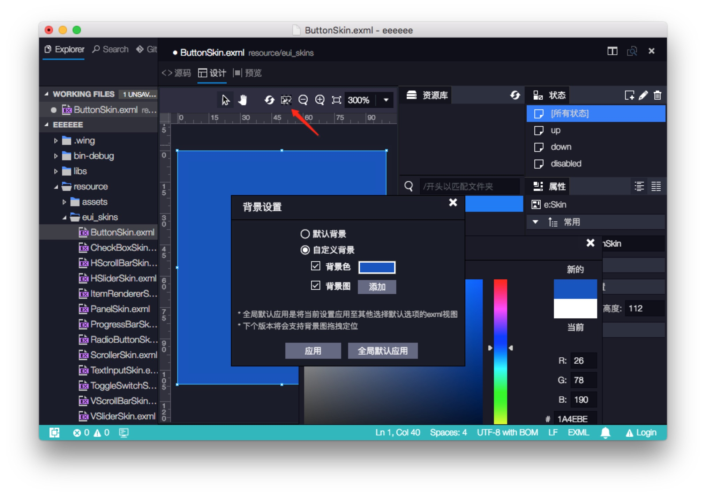
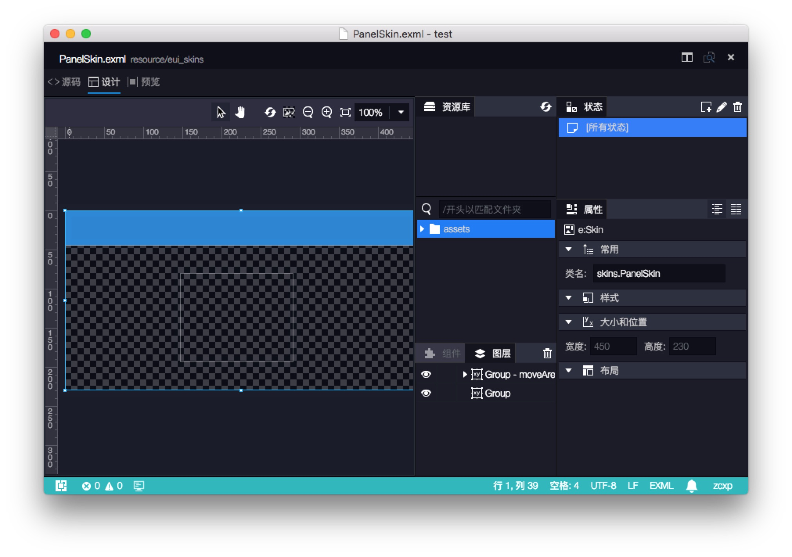
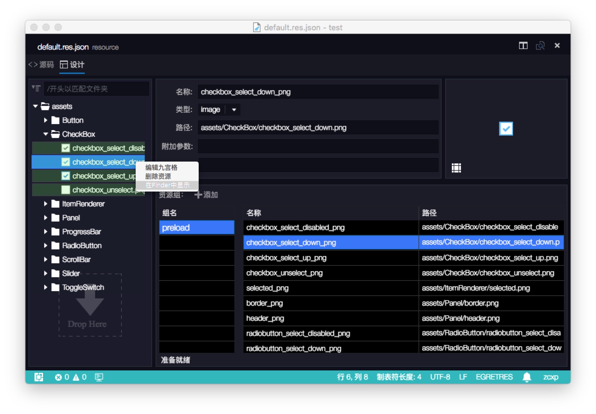
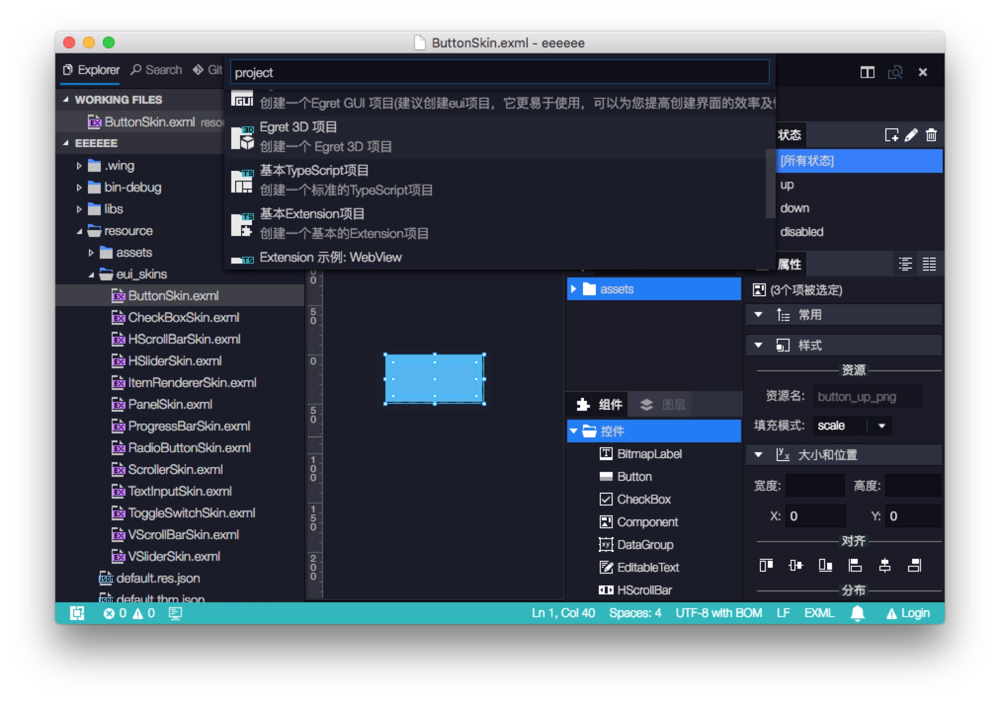

这个版本中我们主要进行了以下改进

- EUI 编辑器优化
    - 添加 EUI 编辑器标尺，选择框信息。
    - 添加设置 EUI 编辑器背景图与背景色的功能。
    - 为 Group 等透明元素添加边框显示。
- 优化 RES 编辑器的体验
    - 增加‘在资源管理器中打开’的右键菜单。
    - 文件外部修改的刷新提示。
    - json 文件格式错误提示。
- Extension API
    - 添加项目模板 API
    - 添加新建文件模板 API 
    - 添加 popup form 数据验证 API
- 调整新建项目向导的展现方式，更方便的支持项目模板插件。
- 优化用户反馈的展现方式，避免误操作引起的覆盖。
- 修复内置调试工具跟某些 JS 库不兼容的问题。

## EUI 编辑器优化
### 添加 EUI 编辑器标尺和选择框信息

### 添加设置 EUI 编辑器背景图与背景色的功能
    注意：这里改变的只是编辑器设计视图的背景色，不会影响组件运行效果。 如果希望修改运行时游戏的背景色，请到项目根目录 index.html 中修改 CSS

### 添加 Group 等透明组件边框

## 优化 RES 编辑器的体验
- 增加‘在资源管理器中打开’的右键菜单。
- 文件外部修改的刷新提示。
- json 文件格式错误提示。

## 调整新建项目向导的展现方式
为了更方便的支持项目模板插件，我们修改了项目创建向导，
开发者在插件中能够方便的创建项目模板，使用简单的 API 完成项目参数输入。

## Extension API
- 添加项目模板 API 
- 添加新建文件模板 API 
- 添加 popup form 数据验证 API
通过模板 API 开发者能够定制“新建项目”和“新建模板文件”中的模板，加速开发过程。
新添加的数据验证 API，能够允许开发者对 Popup form 中的数据进行实时验证，体验更加友好。

