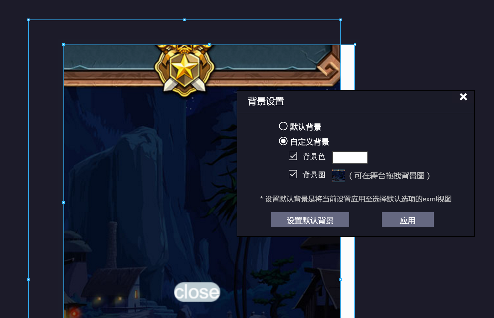
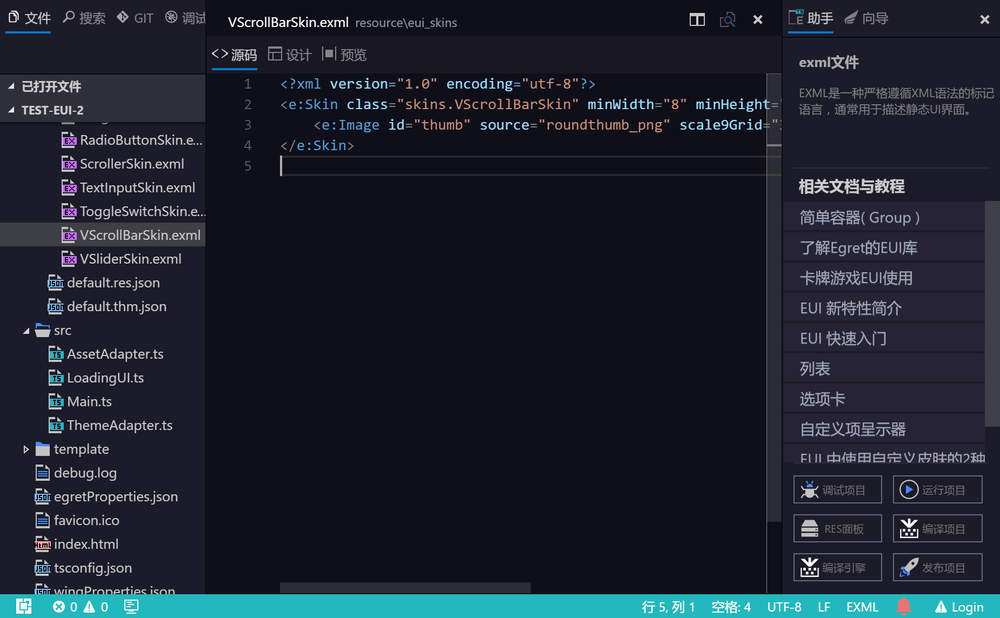

这个版本为稳定性更新，主要进行细节优化和修复 bug。

- 更新核心代码到 VS Code 1.2
- 增加调整 EUI 设计界面背景图位置的功能
- 插件 API 中添加路径选择组件
- 添加 Egret 项目帮助右边栏
- 修复 bug
    - 修改 spritesheet 在九宫格面板不能显示的 bug
    - 修复项目模板的 bug
    - 修复 RES 本地资源无法刷新的问题
    - 修复 RES 读取 UTF8BOM 文件的问题
    - 修复详细属性里无法显示锚点等属性的bug。
    - 修复EUI编辑界面在自动布局的时候会抖动的bug。
    - 修复从图层改变节点可见之后无法再次选中节点的bug。
    - 修复点击EUI缩放之后按空格会再次触发缩放的bug。
    - 修复新创建的项目直接执行调试无法启动的问题。
    - 修复webview中某些情况和mac无法使用快捷键复制粘贴的问题。
    - 修复窗口记忆放大重置的bug
    - 修复 RES 编辑器 subkey刷新无效的bug


## 更新核心代码到 VS Code 1.2

### 编辑器更新
#### 清除自动生成的空格
添加设置项 `editor.trimAutoWhitespace` 让编辑器自动删除由于缩进自动生成的空格。


#### 全选搜索结果
你现在可以在查找时按 `Alt + Enter`, 来选中所有匹配项，并进行修改。


#### 关掉基于文本的自动补全
当遇到不能识别的语言时，VS Code 默认开启了基于文本单词的自动补全。现在你可以通过
`editor.wordBasedSuggestions` 自己决定是否开启这项功能。

#### 可调整尺寸的代码预览框
代码预览框现在可以调整尺寸了


### 工作空间
#### 多标签

微软正在开发，预计7月初完成。

#### VS Code 内置的控制台

目前 VS Code 1.2 中内置的控制台对中文支持有 bug，目前仍然使用 Wing 内置的控制台。

### 删掉一个快捷键绑定
你可以通过在 command 前面加 `-` 来删除系统默认的快捷键绑定。

如：
```javascript
// In Default Keyboard Shortcuts
...
{ "key": "tab", "command": "tab", "when": ... },
{ "key": "tab", "command": "editor.emmet.action.expandAbbreviation", "when": ... },
{ "key": "tab", "command": "jumpToNextSnippetPlaceholder", "when": ... },
{ "key": "tab", "command": "acceptQuickFixSuggestion", "when": ... },
{ "key": "tab", "command": "acceptSelectedSuggestion", "when": ... },
...

// 假如要删掉第二个绑定，在 keybindings.json 中加入:
{ "key": "tab", "command": "-editor.emmet.action.expandAbbreviation" }
```


### 调试

#### 修改调试控制台打开的策略
`launch.json` 中的调试启动项，现在可以通过添加 `internalConsoleOptions` 来控制调试控制台显示的策略。
可选的值为：
- neverOpen - 永远不自动打开调试控制台
- openOnFirstSessionStart - 第一次调试的时候打开
- openOnSessionStart - 每一次启动调试的时候都打开

#### Node.js 调试性能提升
提升了在遇到大型数组，和局部变量过多的情况下的调试性能。

### Extension API
#### 调试 Extension API
我们暴露了 `vscode.startDebug` command，插件可以调用它来启动调试。

```javascript
    let launchConfig = {
        type: "node",
        request: "launch",
        program: "${workspaceRoot}/test.js",
        cwd: "${workspaceRoot}"
    };

    vscode.commands.executeCommand('vscode.startDebug', launchConfig).then(() => {
        vscode.window.showInformationMessage('Debug session started successfully');
    }, err => {
        vscode.window.showInformationMessage('Error: ' + err.message);
    });
```

#### TextMate 语法注入
插件现在可以向现有语言的语法高亮中注入新的样式，来实现新的语法高亮。例如高亮 TODO 或者其他自定义语法。

```javascript
"grammars": [
  {
    "scopeName": "source.todo",
    "path": "./syntaxes/todo.tmLanguage",
    "injectTo": [  "source.js", "source.ts" ]
  }
]
```

## 增加调整 EUI 设计界面背景图位置的功能

我们在 3.0.8 中添加了为 EUI 编辑器设置背景图的功能，在这个版本中，我们加入了
自由调整背景图位置的功能。你可以在打开背景设置窗口后，在舞台中自由调整背景图的位置和缩放。


## 添加 Egret 项目助手右边栏
我们内置了 Egret 项目的右边栏，提供 Egret 项目常用的操作按钮。并根据当前操作推荐相关的文档。



