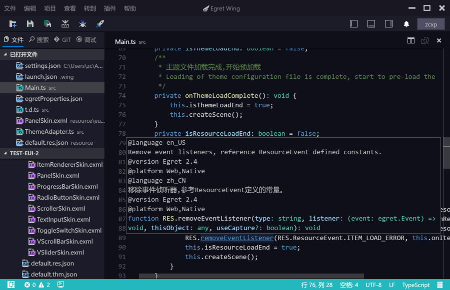
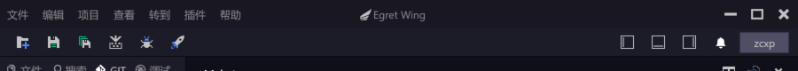
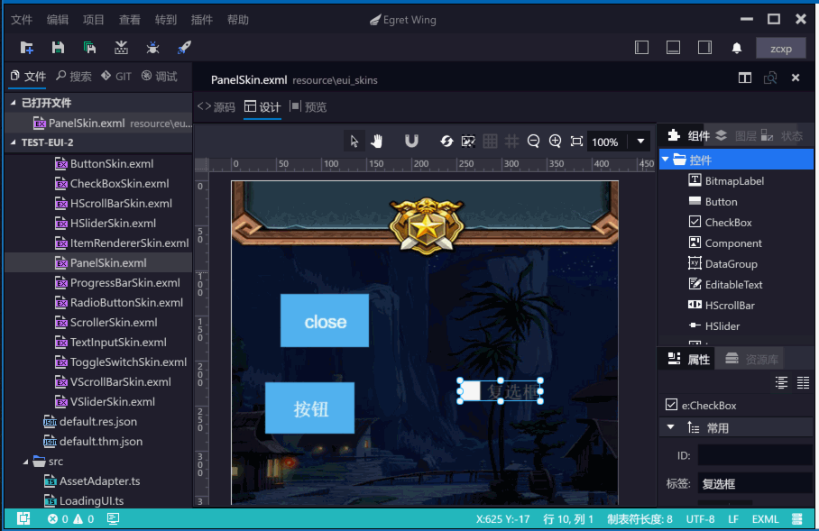
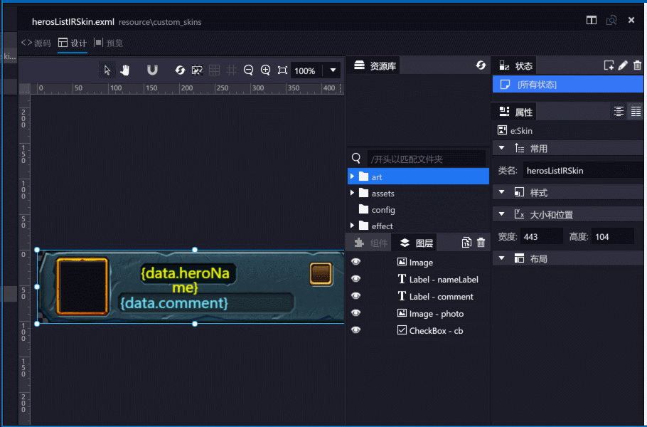
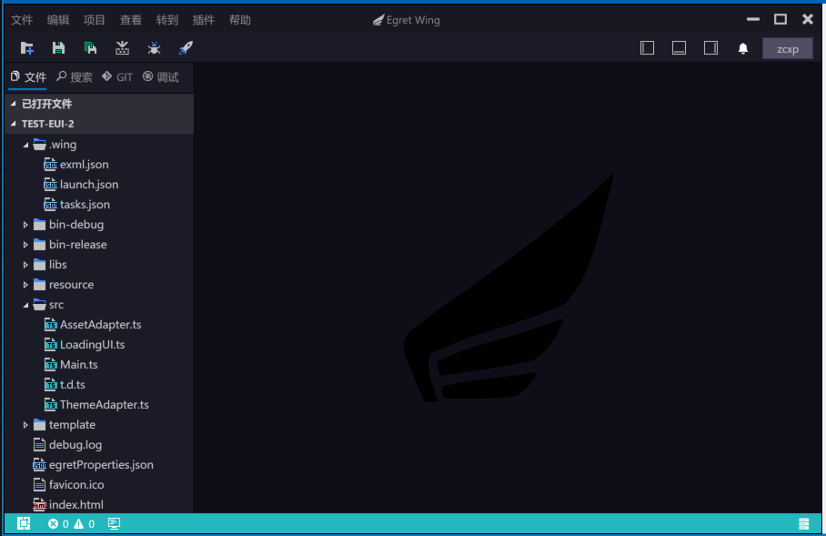
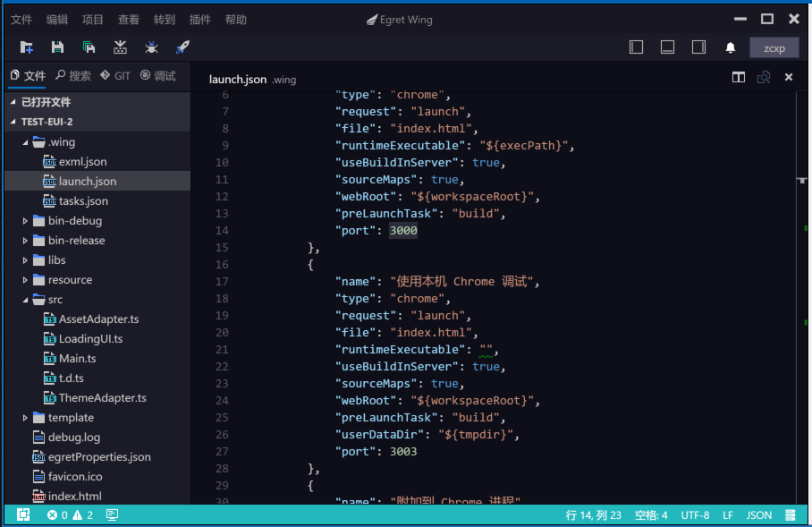

## 全新 UI，更加友好的操作体验

我们调整了 Wing 标题栏和菜单栏的配色，使它更加具有整体性，更具代入感。

添加了工具栏，放置了常用的操作命令，使 Wing 3.1 更接近传统 IDE 的操作体验。

## EUI 编辑器增加辅助对齐功能

为方便 EUI 设计试图开发我们添加了三种辅助对齐功能

- 组件对齐：根据现有组件位置，自动确定组件边界和中线，方便新组件定位
- 网格对齐：根据开发者设定的网格布局，辅助新组件定位和调整‘
- 引导线对齐：开发者可以设置多条引导线，辅助组件定位

## 增加快速生成皮肤部件定义的功能

你可以单个复制或批量复制EXML中组件的声明，然后粘贴到你的 TS 逻辑组件中。

## 增强 Wing 内置 HTTP Server 的功能
- 添加内置 Server 面板，方便开发者查看状态
- 添加二维码显示，方便手机调试
- 添加两个操作按钮，方便设置启动参数

## 增加 Web 和 NodeJS 项目模板
为了吸引更多非 Egret 开发者使用 Wing，我们计划加入更多当前比较流行技术的支持。
本次添加了Web 项目和 NodeJS 的项目模板。让开发者免配置编译和调试。

## 增加新建 TS 文件和 EXML 文件的向导
方便开发者更方便的创建组件。为后面的 TS 和 EXML 联合编辑做好准备。

