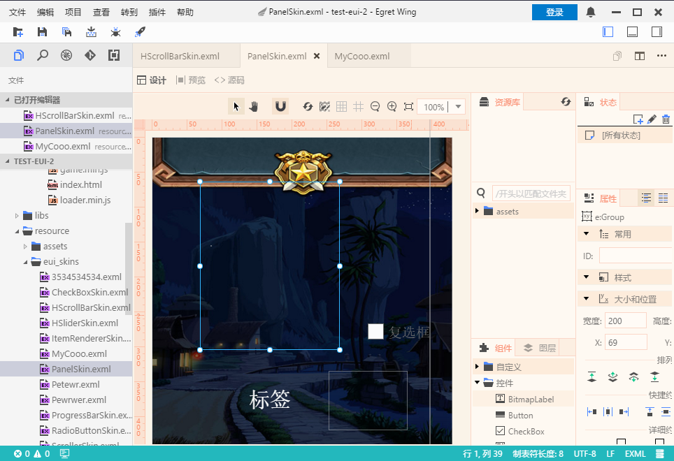
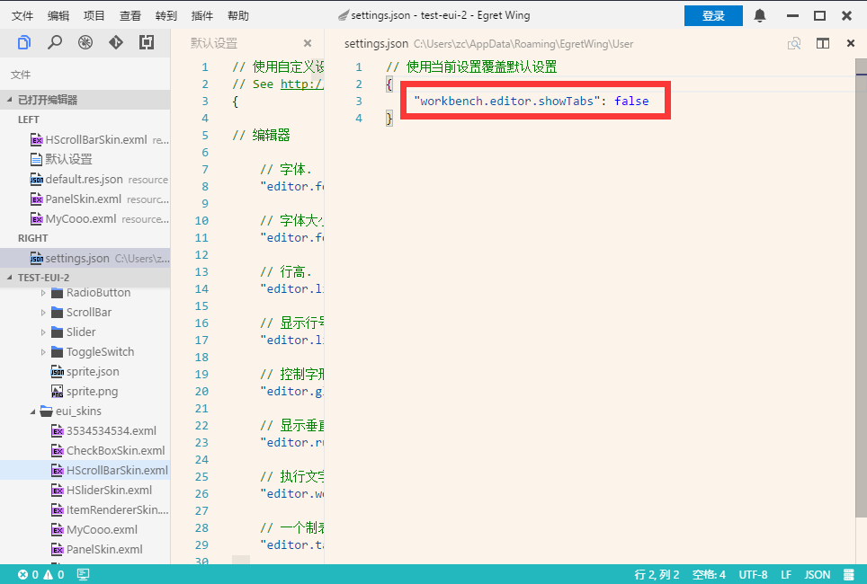
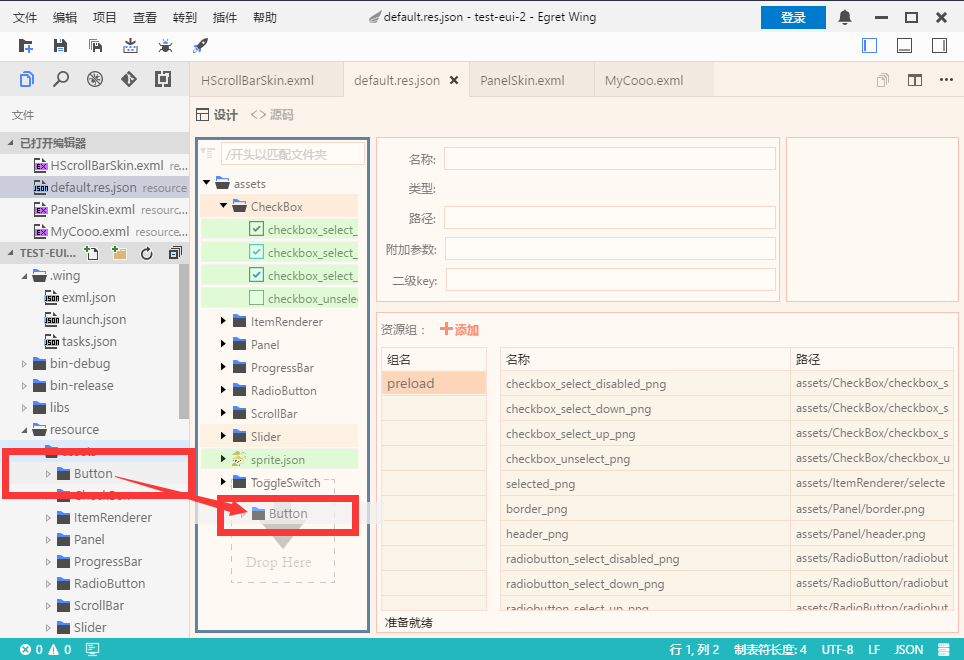
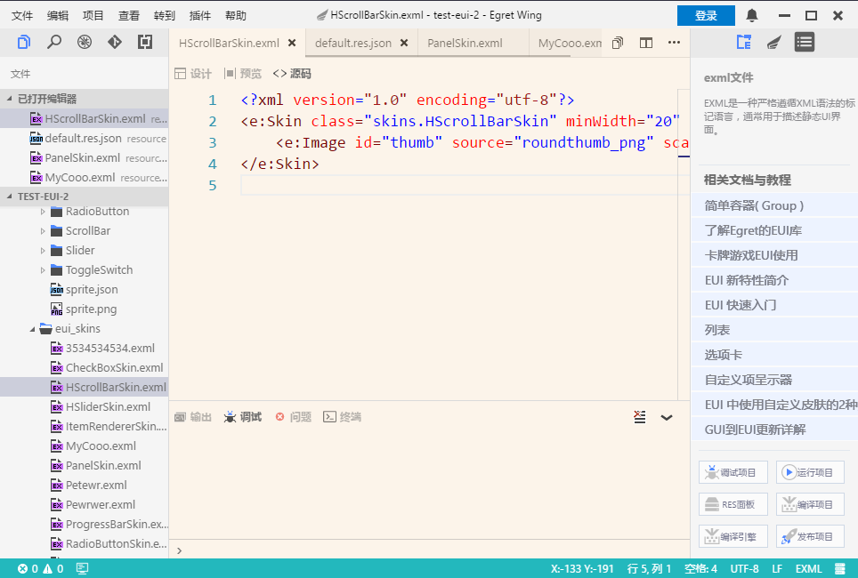
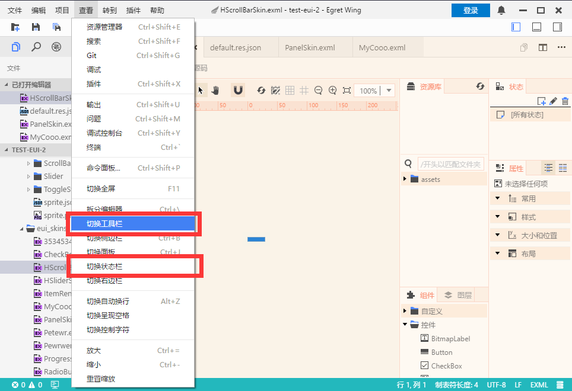
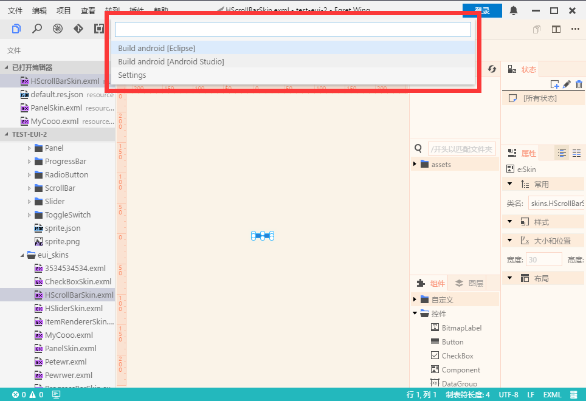

## 添加多标签支持
这个版本中加入了多标签的支持,现在可以更方便的切换打开的文件。

如果你更喜欢原来的设计，可以在用户设置中关闭它

## 优化 RES 编辑的操作体验
你现在可以直接从Wing的文件面板拖动素材到Res编辑器中，来添加资源。

## 优化 Wing 的整体UI布局
我们优化了 Wing 的整体布局，使各个面板更加统一

同时更加了更多选项，比如可以隐藏状态栏和工具栏

## 原生打包增加 Android Studio 支持
结合 Android Support Wing现在可以生成 Android Studio 工程，并完成打包工作。

