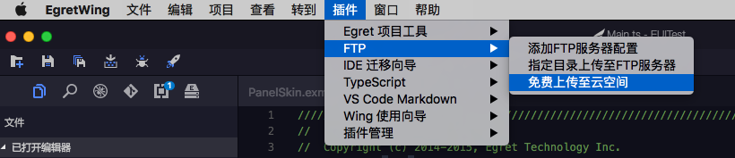
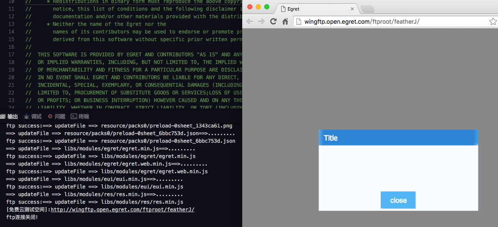
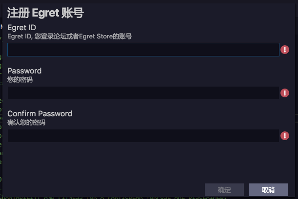
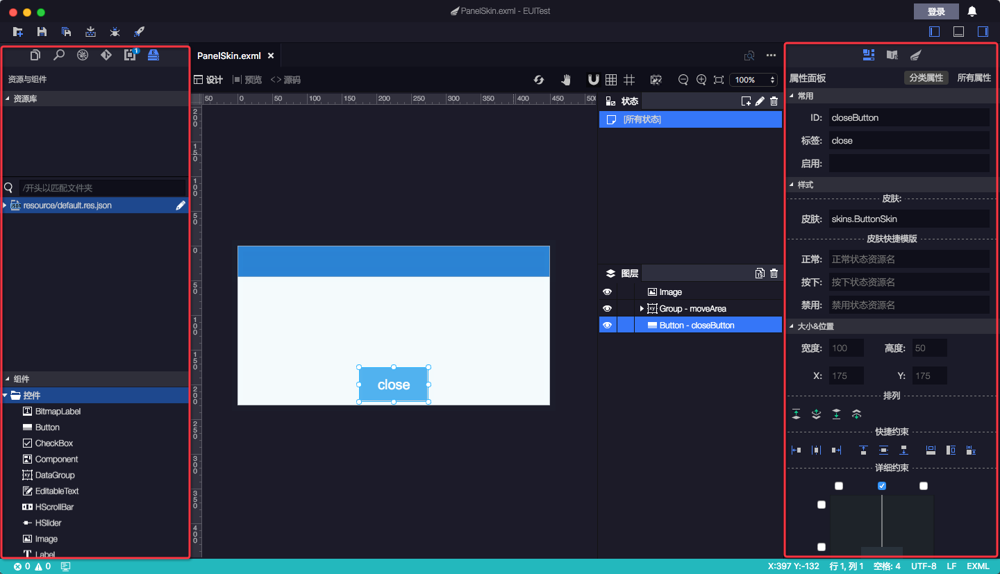
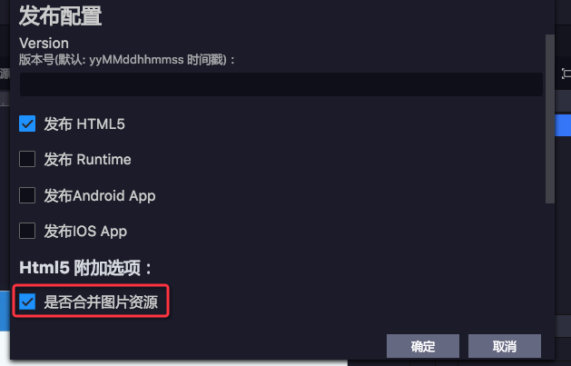
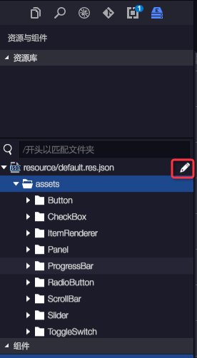
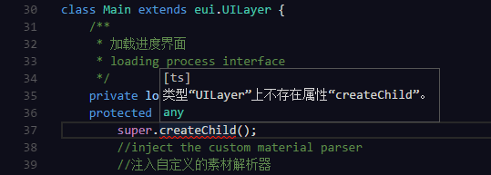

## 提供免费100M测试空间。
- 选择好需要上传的目录之后即可自动开始上传，并打开浏览器运行该项目。

## 集成开放平台注册。
- 更快捷的注册方式。

## 重构Exml编辑器，释放编辑区空间：
- 将属性面板移动到右侧。
- 将顶部工具栏上移。
- 将资源库和组件面板移动左边栏。

## 增加发布html时，资源库的打包功能。
- 资源智能打包，只需要设置好合图的最大尺寸，即可将资源自动分组并打包。

## 资源库细节优化：
- 资源库以资源配置文件进行显示。并且可通过如下图按钮，快速打开对应的资源配置文件进行编辑。

## 对ts代码错误等提示，增加了中文支持。

