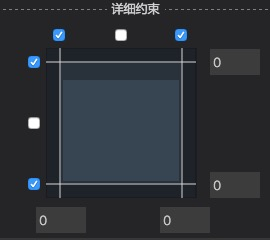
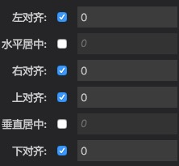
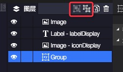

最新版本下载地址

- [Egret Wing 3.1.6 for Windows](http://tool.egret-labs.org/EgretWing/electron/EgretWing-v3.1.6.exe?d=0707)
- [Egret Wing 3.1.6 for Mac OS](http://tool.egret-labs.org/EgretWing/electron/EgretWing-v3.1.6.dmg?d=0707)

在3.1.5中我们对Wing目前界面的一些结构做了重构。3.1.6主要对现有版本的用户体验和细节做优化，当然也更新了一部分新的功能。细节如下：

### 动态读取项目对应引擎为Exml编辑器的运行时。
未来EgretWing中的Exml代码编辑和运行效果将以用户当前引擎为基准，保持编辑效果和运行效果一致。

### 重构状态面板，扩展图层空间。
我们在这个版本中，将状态面板移至到编辑区的底部进行显示，以横向方式排列，从而达到更快捷切换状态的方式。同时可以尽可能的扩展图层面板的空间。

### 优化新建项目过程，增加扩展库的勾选。
在这个版本的Wing中版本中，您可以直接在新建项目中勾选该项目所需的扩展库。

### 细节优化
- 右边栏的展开与否，选中状态，跟随激活编辑器的文件格式变化。
- 在Exml编辑区点击的时候，自动选中左边栏的资源库&组件面板。
- 大小&位置面板中的详细约束，根据右边栏的宽度进行响应式布局。

 

- 可视化编辑区右键菜单中提示快捷键。

 
 
- 图层中增加解组合打组的快捷按钮。

 
 
- 标尺可单独控制开关，不在占用编辑区空间。

 

### 修复
- 修复调试时getter/setter属性无法显示正确值的问题。

 

- 修复部分sheet中资源无法解析的bug。
- 修复Label色值无法手动编辑的bug。
- 修复属性面板下拉框滚动条嵌套时，两个滚动条会同时响应滚轮的bug。

