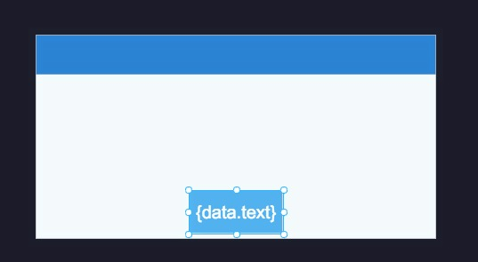
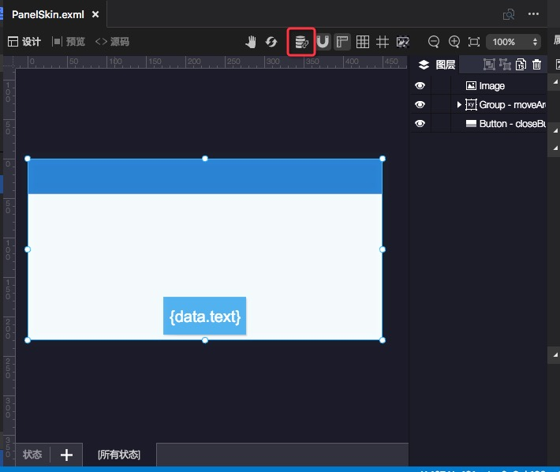
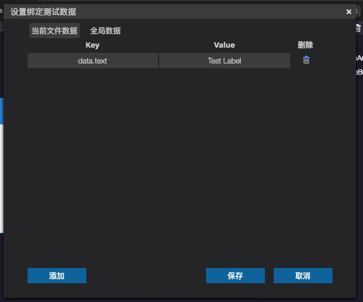
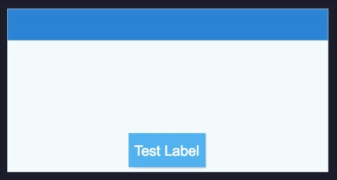
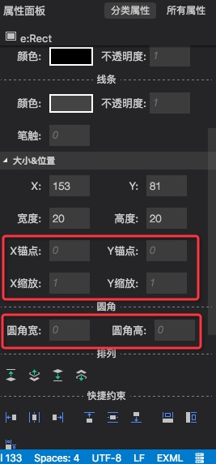

最新版本下载地址

- [Egret Wing 3.1.7 for Windows](http://tool.egret-labs.org/EgretWing/electron/EgretWing-v3.1.7.exe?d=0707)
- [Egret Wing 3.1.7 for Mac OS](http://tool.egret-labs.org/EgretWing/electron/EgretWing-v3.1.7.dmg?d=0707)

这一版本中，我们针对数据绑定功能增加了一个用于可视化编辑的绑定测试数据面板。替换了更加靠谱的自定义组件解析底层。同时对一些操作细节做了优化。详情见下：

### 绑定测试数据
绑定测试数据功能适用于的场景为：正在编辑的皮肤中存在数据绑定，导致在可视化的时候不能正常观察显示效果，不易于可视化编辑。
用新建的EUI项目中的PanelSkin.exml皮肤举例，如果将Button的标签修改为{data.text}，如图：

此时我们已经为按钮设置了数据绑定，但是如何在可视化的效果下能够看到一个临时数据呢？
现在可以通过如下方法，点击图示中的按钮

在弹出的面板中增加一条测试数据：

点击保存，我们此时看到的皮肤编辑界面中，按钮的字样就被替换为了我们刚才设置的数据。

这个功能非常适用于界面中图片(Image)的source属性设置了数据绑定的情况，这样通过添加测试数据，就可以更直观的编辑界面。

### 替换自定义组件解析库
这次我们将自定义组件解析库替换为了更为靠谱的方案，该改动可以有效解决在一些个别情况下自定义组件无法在组件面板中正常识别的问题。

### 细节优化
- 优化了Exml编辑界面下背景设置面板的文案描述。
- 优化了创建项目的默认尺寸。
- 发布合图时，增加了希望合图组的勾选功能。
- 将锚点、缩放以及Rect的圆角属性，开放到常用面板中。

### 修复
- 修复了无法将资源库中的资源拖拽到右侧属性面板对应的输入框的bug。
- 修复内嵌皮肤中无法进行撤销的bug。
- 修复内嵌皮肤嵌套多层容易导致解析失败的bug。
