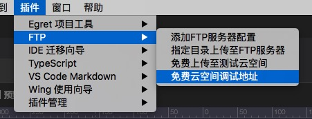

最新版本下载地址

- [Egret Wing 3.1.8 for Windows](http://tool.egret-labs.org/EgretWing/electron/EgretWing-v3.1.8.exe?d=0707)
- [Egret Wing 3.1.8 for Mac OS](http://tool.egret-labs.org/EgretWing/electron/EgretWing-v3.1.8.dmg?d=0707)

这一版本中我们主要对Wing做优化和bug修复。以及增加一些底层的模块为下个版本做准备。详情如下：

### FTP上传功能优化

- FTP地址二维码：

    可以通过如下方式得到上传到服务器的地址二维码，方便手机访问：

    

    点击之后会弹出如下二维码显示窗口：

    

- 停止上传功能：

    在前几个版本中我们加入了FTP的免费云调试空间。但是如果误操作导致错误目录被上传，在本期中您就可以手动进行停止上传了。

### 替换自定义组件解析库
这次我们将和Exml代码提示有关的自定义解析库底层也进行了重构。同时对上个版本的重构进行了优化，提升了解析速度，尽可能避免卡顿问题。

### 优化
- 对Exml代码编辑器中xml头的编辑进行了错误提示。

### 修复
- 在项目中存在多份引擎代码时，引发exml可视化编辑出现异常的bug。
- 在使用了数据绑定的ItemRendererSkin的List进行数据源编辑的时候，容易出现乱码的Bug。
- 使用了内嵌皮肤的组件，复制的时候将内嵌皮肤内的id也重命名的bug。
- 在一些情况下两个Exml编辑器的内容会交换的bug。
- 在一些情况下调试失败的bug。
