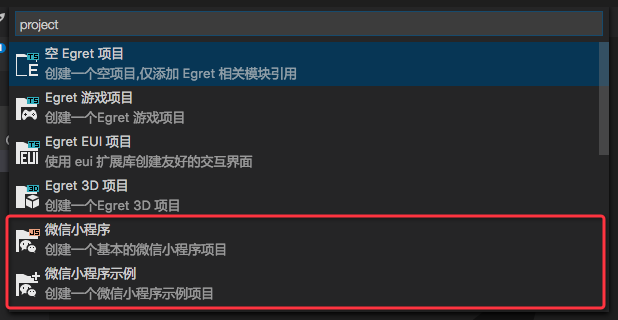
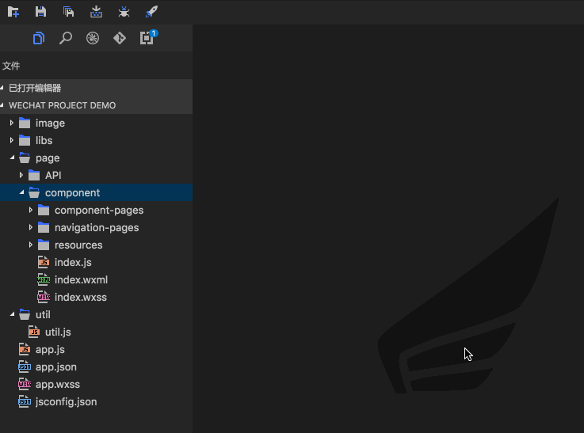
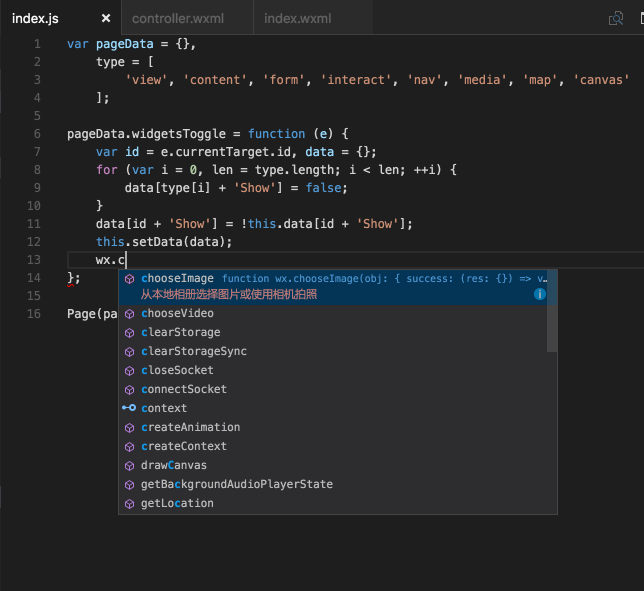
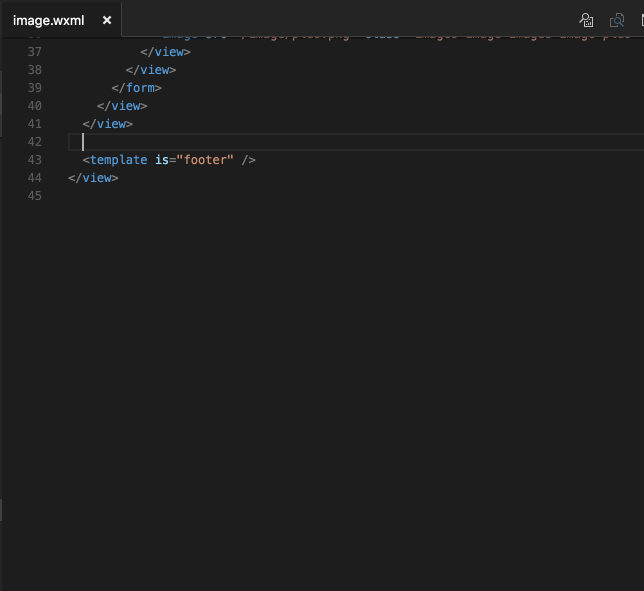
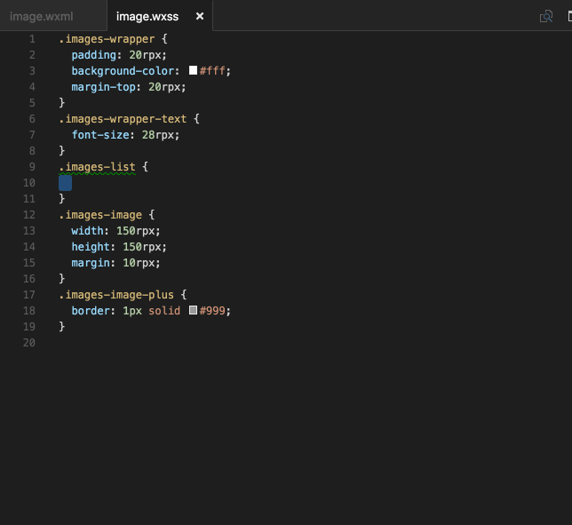
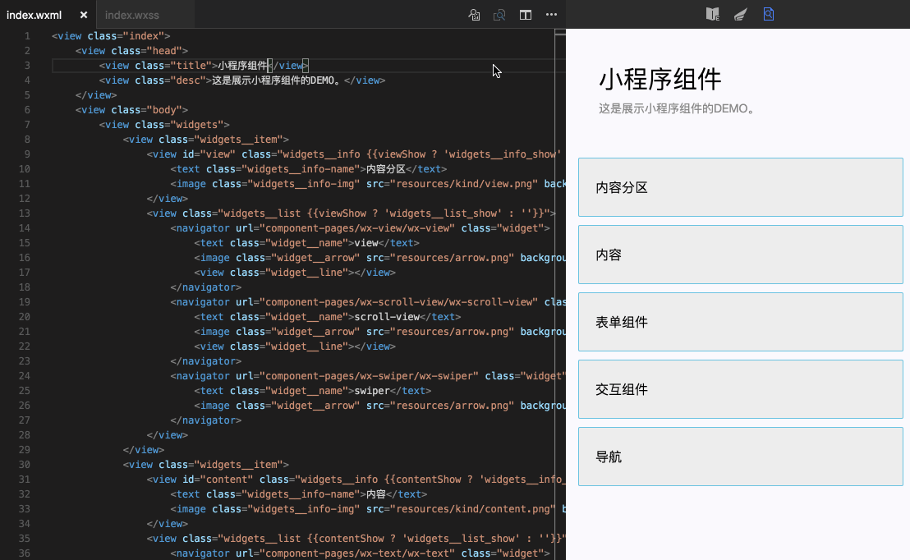
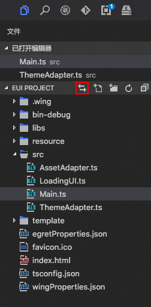
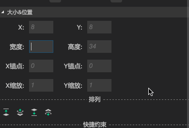

最新版本下载地址

- [Egret Wing 3.2.0 for Windows](http://tool.egret-labs.org/EgretWing/electron/EgretWing-v3.2.0.exe?d=0707)
- [Egret Wing 3.2.0 for Mac OS](http://tool.egret-labs.org/EgretWing/electron/EgretWing-v3.2.0.dmg?d=0707)

本版本中我们着重优化了一些现有的体验问题和细节，并且白鹭研发团队为 Wing 添加了大量微信小程序的支持。

## 新特性介绍：

### 针对微信小程序，提供常用的项目及文件模板：
    

    
新建项目中，我们增加了两个项目模板，一个是基本微信小程序项目，另一个是微信小程序示例项目。

同时，在微信小程序项目中，可以创建一个页面（Page），并生成对应的 wxml wxss 和 js 文件:

### 针对微信小程序全部接口进行代码着色和文档提示支持：

在Egret Wing 3.2中，我们对微信小程序增加了代码提示功能，针对微信小程序代码中的 js 、 wxml和wxss文件， 提供了与微信官方文档内容一致的代码提示，帮助开发者更快捷的遵循微信的接口规范进行项目开发。
我们以示例项目来演示，详情如下：

- js代码提示：

    

- wxml代码提示：

    

- wxss代码提示：
 
    

### 当前编辑页面的实时可视化预览，提升开发效率：

当开发者在 Wing 中对微信小程序的代码进行调整时，Wing会在右边栏实时预览出开发者对文件更改后的效果，帮助开发者提高开发效率。

## 体验优化

- 图层面板拖拽的时候，进行坐标转换。

- 优化保存文件时候可能会造成的卡顿问题

- 增加拖拽一个文件夹到资源管理器的功能

- 在资源管理器上添加一个 编辑器关联的控制开关。

    
    
- 可视化编辑中，设置相同ID的时候，在控制台给个提示，告诉不能够重名

- 文本框加入类型判断，针对数字加入%的支持，和表达式的支持。

- 支持从资源库中拖拽多张图片到自定义皮肤中

- 为所有数字输入框增加表达式计算功能。

    