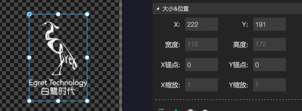
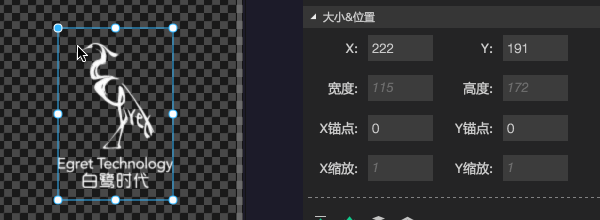
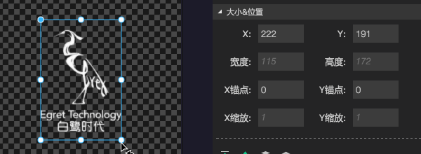
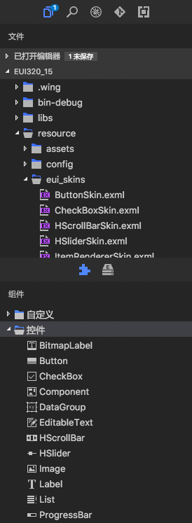
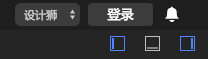
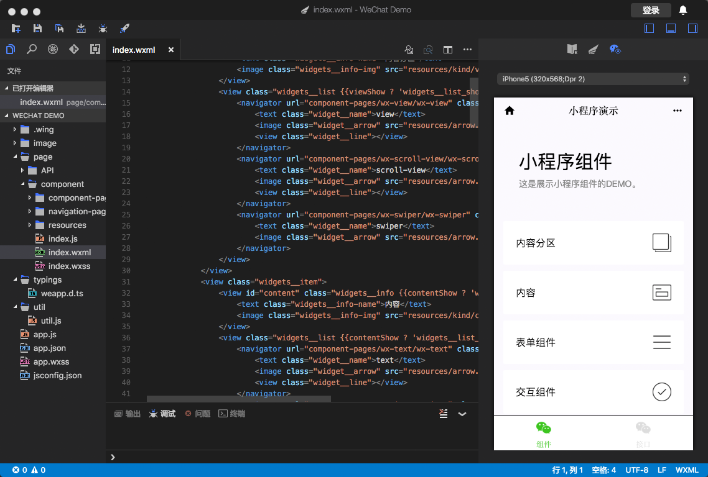
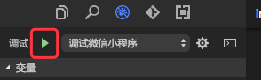
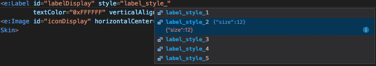

最新版本下载地址

- [Egret Wing 3.2.2 for Windows](http://tool.egret-labs.org/EgretWing/electron/EgretWing-v3.2.2.exe?d=0707)
- [Egret Wing 3.2.2 for Mac OS](http://tool.egret-labs.org/EgretWing/electron/EgretWing-v3.2.2.dmg?d=0707)

Egret Wing在3.2.2中主要重构了EUI可视化编辑器部分的结构，同时增加了设计师模式，简化了部分UI的显示。
同时重构了微信小程序的单页面预览部分，而且增加了对完整微信小程序项目的预览功能。

## 新特性介绍：

### EUI可视化编辑中全新的变换框。

在本次版本中重构了整个EUI可视化编辑的部分，尤其针对变换框进行了深度的重构，增加了对控件旋转、锚点、缩放等属性的可视化控制。

#### 锚点设置：

您可以通过拖拽选中控件中的小圆点进行锚点的快捷设置：

同时按住shift键拖拽，可以锁定锚点的拖拽位置：

#### 旋转设置：

在四周四个变换控制点的旁边点击并进行拖拽，可以对目标控件围绕着锚点进行旋转：

同时按住shift键拖拽，可以锁定控件的旋转角度：

#### 缩放设置：

按住shift键同时拖拽四周的控制点，可以直接调整目标控件的缩放值，而不是尺寸。

#### 已知问题：

- 新版变换框还不兼容旧版的参考线吸附功能。
- 对于设置了top，left，right，bottom等约束的控件，如果进行移动会自动取消这些约束设置。

### 针对EUI项目的设计师模式

新版的Wing，对于左侧面板的结构进行了调整，将资源库和组件面板放到了下方可以同时和其他面板进行显示。

在Wing的右上角增加了设计师模式切换的按钮，切换到设计师模式的时候，会自动隐藏掉与代码相关的大部分UI。

### 微信小程序单页面动态实时渲染

在本次版本中我们重构了微信小程序的单页面预览功能：

- 增加了设备的选择。
- 支持了对绝大多数动态数据的渲染。
- 支持了交互功能，可以直接在单页面预览中点击并切换页面。
- 文件改变时，页面的刷新更加及时。

### 微信小程序项目的运行和调试

在新版的Wing中，您可以直接通过如下按钮启动整个微信小程序项目，同时您可以在弹出的官方开发者工具中进行调试。

- 注意：该功能需要官方开发者工具的支持。

## 细节优化与Bug修复

- 增加Exml中Label标签style属性的代码提示与可视化设置

- 对Wing菜单中，查看->放大缩小功能的数值进行了记录，以便下次启动的时候自动恢复到上次设置。

- 调试窗体记录上次弹出的位置。

- 修复替换资源文件后，项目内和资源面板对应的资源没有动态及时刷新的bug。