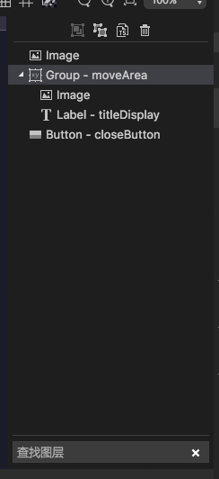
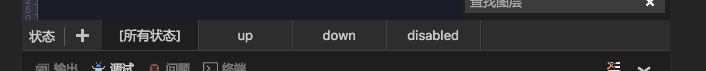

最新版本下载地址

- [Egret Wing 3.2.3 for Windows](http://tool.egret-labs.org/EgretWing/electron/EgretWing-v3.2.3.exe?d=0707)
- [Egret Wing 3.2.3 for Mac OS](http://tool.egret-labs.org/EgretWing/electron/EgretWing-v3.2.3.dmg?d=0707)

Egret Wing在3.2.3中，我们着重对上几个版本新增加的功能进行了体验优化，同时重构了现有版本的部分界面显示：

### 图层面板：

在当前版本中，我们将原有的图层面板替换为了dom的渲染方式，同时增加了搜索功能。

### 状态面板：

我们也将状态面板替换为了原生的dom渲染，以提升用户体验：

### 优化体验

- 优化了新版exml可视化编辑框的交互体验，增加鼠标指针，retina适配，修复部分报错等。
- 优化exml属性面板对Label的style属性支持的体验交互。
- 优化部分现有弹出框的显示风格。
- 修复微信小程序项目中对wxss修改，右侧的单页面实时预览效果刷新不及时的bug。

### 已知问题：

- 新版变换框尚未兼容旧版的参考线吸附功能，会在后续版本中逐步添加。
- 对于设置了top，left，right，bottom等约束的控件，如果进行移动会自动取消这些约束设置，该问题会在后续版本中完善。