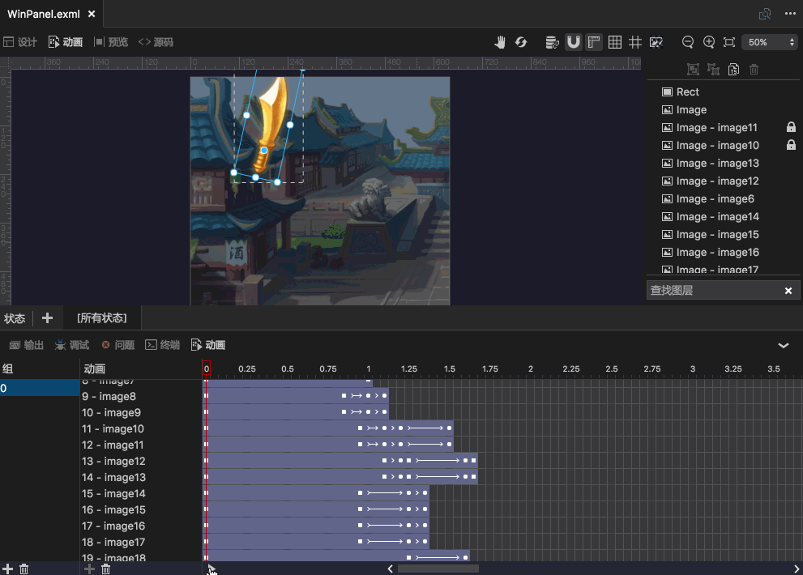
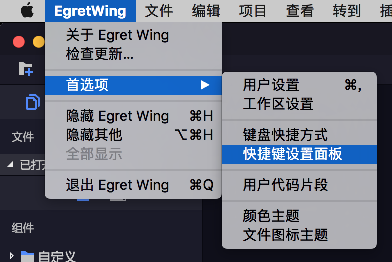
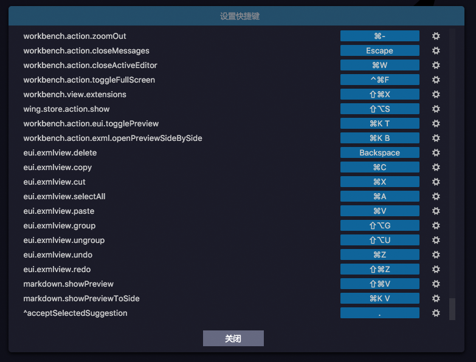
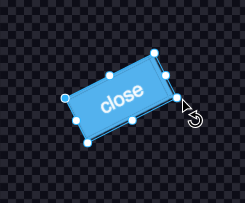
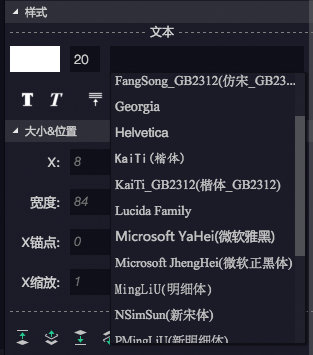
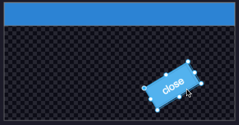
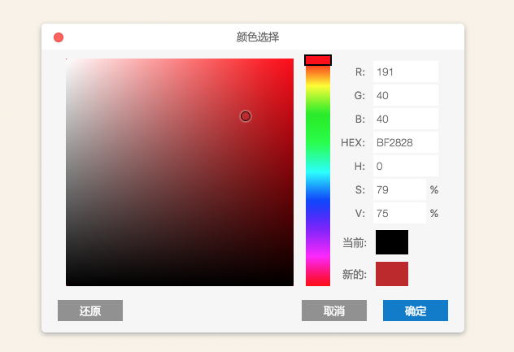

最新版本下载地址

- [Egret Wing 3.2.5 for Windows](http://tool.egret-labs.org/EgretWing/electron/EgretWing-v3.2.5.exe?d=0707)
- [Egret Wing 3.2.5 for Mac OS](http://tool.egret-labs.org/EgretWing/electron/EgretWing-v3.2.5.dmg?d=0707)

本版本最大的改变是增加了Tween动画的可视化编辑功能。同时重构了eui可视化编辑区的结构，实现在切换编辑器的时候eui可视化编辑区域不会再闪烁。
并且，我们也对可视化编辑的细节和体验做了优化。

## 新特性介绍：

### Tween可视化动画编辑功能

全新的Tween动画可视化编辑功能，熟悉的时间轴操作，可以更方便的实现EUI界面中的动画需求。

[教程链接](../../../Wing/editor/animation/README.md)

### 切换可视化编辑器不再闪烁

旧版本中由于部分机制问题，导致在切换编辑器的时候，可视化编辑区的内容会闪烁刷新。在该版本中，我们重构了可视化编辑区的部分结构，以实现切换不闪烁。提升用户体验。

### 可视化用户快捷键设置

本版本那种加入了对快捷键操作的可视化设置面板，如下图：

## 体验优化

### 增加了可视化变换框中AABB框的显示。

为了方便观察目标控件旋转之后的实际AABB范围，我们加入了AABB框的显示。

### 增加字体选择下拉功能

加入了常用字体的下拉选择：

### 新版本变换框兼容吸附功能

基于AABB框的吸附功能：

### 新版本变换框兼容对于设置了约束控件的拖拽。

### 全新的颜色选择器

