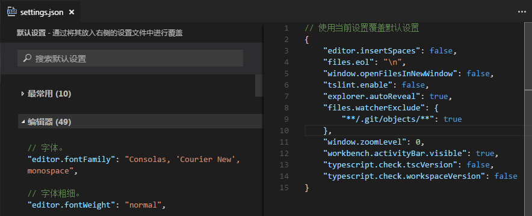
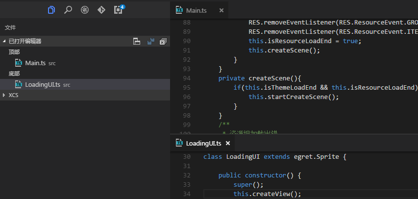
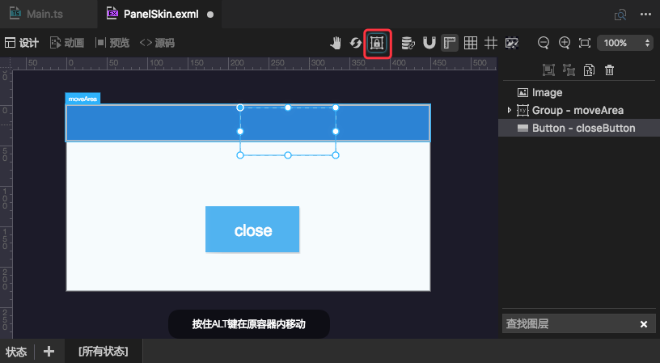

最新版本下载地址

- [Egret Wing 4.0.0 for Windows](http://tool.egret-labs.org/EgretWing/electron/EgretWing-v4.0.0.exe?d=0707)
- [Egret Wing 4.0.0 for Mac OS](http://tool.egret-labs.org/EgretWing/electron/EgretWing-v4.0.0.dmg?d=0707)

本版本主要为合并 vscode 代码到最新 master 以支持 TypeScript 2.1.5 ，也引入了 vscode 新功能与特性。同时优化了可视化编辑的部分用户体验。详情如下：

## 新特性介绍：

- **热退出**

	现在退出EgretWing时，将记住你未保存的文件，当下次启动时将还原工作空间中暂存的文件状态。可以通过设置 `files.hotexit` 来启用或者关闭该功能。

- **改善设置体验**

	

	现在用户功能更加方便地在编辑器中编辑 `setting.json` 来自定义EgretWing。

- **编辑器垂直布局**

	

	编辑器组现在支持编辑器垂直布局。可以通过已打开编辑器视图右侧的按钮切换垂直或者水平布局模式。

- **用户可以更加方便的控制被拖拽控件是在平级容器内拖拽还是允许拖入到其他容器**

	
	- 在拖拽过程中可以通过Alt键来控制是在元容器内拖拽或者允许拖入到其他容器。
	- 同时，允许您通过红框内的按钮来切换默认行为

## EUI可视化编辑体验优化：

- 优化通过方向键调整控件位置时的性能开销。

- 优化图层面板拖拽改变层级时，提示线不准确的问题。

- 按住shift键同时通过拖拽调整控件尺寸，可以锁定控件的宽高比。

- 优化动画模式下的吸附线显示问题。

- 优化图层树状图展开折叠的鼠标交互。

- 优化动画面板删除选中项以后默认选中最近的一个动画。

- Skin根节点去掉无用属性内容显示。

## 其他

- 更新微信小程序支持到 0.12.130400