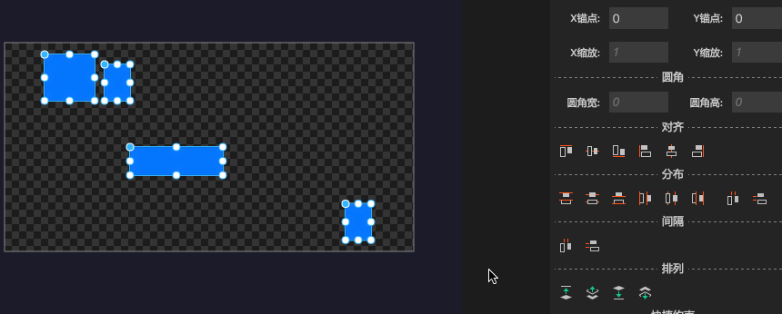
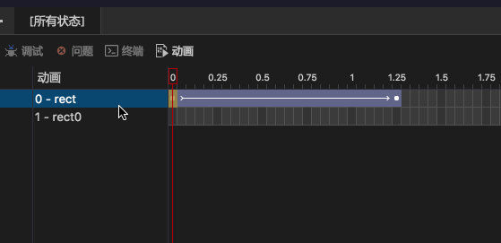

最新版本下载地址

- [Egret Wing 4.0.1 for Windows](http://tool.egret-labs.org/EgretWing/electron/EgretWing-v4.0.1.exe?d=0707)
- [Egret Wing 4.0.1 for Mac OS](http://tool.egret-labs.org/EgretWing/electron/EgretWing-v4.0.1.dmg?d=0707)

本版本主要为用户体验优化以及部分情况下的性能提升，同时也进行了部分新功能添加，详情如下：

## 新功能：

- **平均间隙功能**

	对于多选控件，增加水平平均间隔和垂直平均间隔的功能快速布局功能。

	

- **Tween动画复制**

	Eui的动画可视化编辑中增加对于Tween动画的复制功能。

	

## 体验优化：

- 提升长按方向键调整控件位置时的性能，减少性能开销。

- 优化右侧边栏微信小程序Wxml文件预览的用户体验，其中包括如下：

	- 等待状态时做用户提示，告知用户当前状态。
	- 添加刷新按钮，支持手动刷新。
	- 优化设备选择下拉框。
	- 允许用户配置微信小程序路径。
	- 添加清空缓存的功能。

- Exml编辑器顶部动画标签与底部动画面板的切换，增加自动对应关系。

- 优化图层面板树的用户体验，其中包括如下：

	- 双击可以控制项目的展开与折叠。
	- 删除一个选中项则选中就近项。
	- 图层面板多选后，右键复制定义调整为复制选中项。

- 优化可视化编辑框在1倍分辨率屏幕下的显示。

- 更换程序图标。

## 问题修复

- 可视化编辑中，List对于使用对于项目中实现了eui.IItemRenderer接口但没有继承自eui.ItemRenderer的呈现器不支持预览的bug。

- 在切换到设计师模式重启会引发报错的bug。

- 对于连续操作需要多次撤销的bug。

- 内嵌皮肤中通过键盘调整控件位置失败的bug。