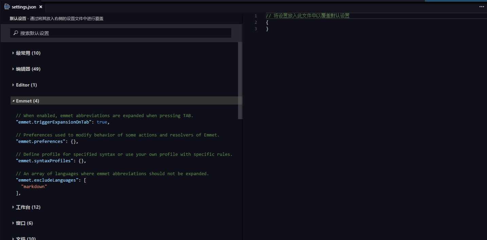

EgretWing提供了包括 **编辑器设置，文件设置，窗口设置** 等近200个设置项来满足各种用户习惯。常用的设置如：

    // 字体.
    "editor.fontFamily": "",
    // 字体大小.
    "editor.fontSize": 0,
    // 显示行号
    "editor.lineNumbers": true,
    // 一个制表符等于的空格数
    "editor.tabSize": 4,
    // 按 "Tab" 时插入空格
    "editor.insertSpaces": true,
    
    // 读取或写入文件的默认编码格式.
    "files.encoding": "utf8",
    // 默认换行符
    "files.eol": "\r\n"
    
点击`文件---首选项---用户设置` 可以进入如下编辑界面：

