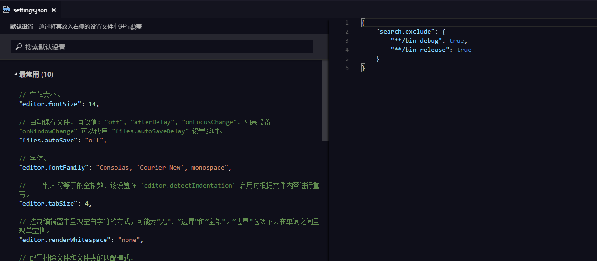

### 工作空间

EgretWing可以通过打开一个文件或者文件件夹进行代码编写。EgretWing也可以同时打开多个窗口，每个窗口对应一个文件或者文件。当一个窗口打开的是一个文件夹时，这个文件夹被称为当前工作空间。

可以使用菜单栏中的 **文件---新建窗口** 命令(`Ctrl+Shift+N`)打开一个新窗口。
新建项目(`Alt+Shift+P`)在项目创建成功后也会自动打开新窗口。

一般来说，每个工作空间就对应一个项目。在工作空间目录下有一个特殊的文件夹 `.wing`。这个文件夹存放当前工作空间的一些设置和配置文件。常见的几个配置文件如 `task.json` , `launch.json` , `settings.json`，这几个文件的作用下面会具体说明。

> EgretWing和WebStorm都是基于文件夹来表示工作空间，这个工作空间就是文件系统中的一个目录。而Eclipse的工作空间则是由多个项目构成，每个项目对应一个目录，而工作空间是这些目录的集合。几乎所有的IDE都会有一个特殊的文件夹存放工作空间的配置。如 WebStorm的 `.idea` 文件夹， Eclipse的 `.metadata` 文件夹。EgretWing中的 `.wing` 文件夹也是类似，只不过里面的文件一般都是json文件，有时候我们也会手动修改这些配置设置工作空间的行为。

### 工作空间设置

可以通过菜单栏，`文件---首选项---工作区域` 进入工作空间设置。

设置分为**用户设置**和**工作空间设置**。用户设置是全局的，在任何地方都可以生效，用户设置会覆盖默认设置。用户设置保存在用户缓存目录的 settings.json 中。
工作空间设置是针对某个文件夹的，只对当前工作空间有效，工作空间设置会覆盖用户设置。工作空间设置保存在当前工作空间下的 .wing/settings.json 中。
所以最终的优先级是 **工作空间设置  > 用户设置 > 默认设置**。

通过修改 `settings.json` 文件改变当前的设置。例如：

	{
		"editor.insertSpaces": false,
		"files.eol": "\n",
		"window.openFilesInNewWindow": false,
		"tslint.enable": false
	}

每个字段表示的功能可以通过默认配置中的字段说明找到具体的含义。