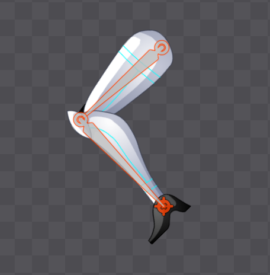
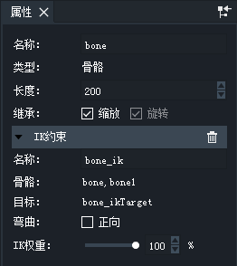
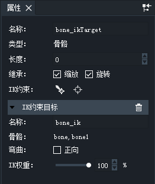

#### 简介
IK是反向动力学Inverse Kinematics的缩写。

DragonBones Pro 从 4.5.0 开始支持IK约束功能

FK为正向动力学的缩写。通常情况下，父骨骼带动子骨骼运动即为正向动力学。例如，大臂带动小臂，大腿带动小腿。
IK与FK相反，用来实现由下而上的驱动。例如，做俯卧撑时，手撑住地面，支起身体。

下图就是一个典型的IK约束的例子。
大腿为父骨骼，小腿围子骨骼。两个骨骼被IK约束在红色的约束目标上。
特别注意的是红色的骨骼并非为小腿的子骨骼。而是和大腿骨骼同级的骨骼。

拖动红色的约束目标骨骼，IK约束便会不动调整父子骨骼的旋转值，使得子骨骼的末端固定在约束目标骨骼上。

#### 添加IK约束
选中骨骼后在属性面板可以看到两个IK约束按钮，点击便可创建IK约束。

- 末端创建约束目标： 在选中骨骼的骨骼末端自动创建约束目标骨骼并绑定IK约束。
- 自定义拾取约束目标： 手动指定作为约束目标的骨骼，并绑定IK约束。

#### IK约束特性：
- 绑定了IK约束的骨骼外框显示为红色
- 作为IK约束目标的骨骼整体显示为红色
- 单根骨骼可以绑定IK约束
- 两根连续父子骨骼可以绑定IK约束
- 两个以上骨骼无法绑定IK约束
- 非连续父子骨骼无法绑定IK约束
- 非父子骨骼无法绑定IK约束
- 所选骨骼的直接或间接子骨骼不能手动指定为IK约束目标骨骼
- 关闭“旋转”继承的骨骼无法绑定IK约束
- 绑定了Ik约束的骨骼不能关闭“旋转”继承

添加了IK约束的骨骼的属性面板如下

其中IK约束属性部分包括：
- 名称：IK约束的名称，默认为自动命名，也可以重命名。
- 骨骼：IK约束所绑定的骨骼
- 目标：作为约束目标的骨骼的名称
- 弯曲：IK的弯曲方向
- IK权重：IK约束影响骨骼的权重

*当前的版本中还不支持在动画播放中变换弯曲和Ik权重的值。*

约束目标骨骼的属性面板如下：

其中IK约束目标属性和IK约束属性相同，只是没有目标项，因为约束目标即为约束目标骨骼本身。