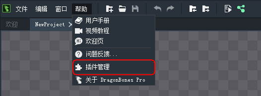
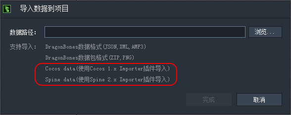

DragonBones Pro 4.2 新增插件系统，通过插件系统使得DragonBones Pro具有更好可扩展性。插件可由第三方基于DragonBones Pro的插件规范来开发。

在帮助菜单中选择“插件管理”打开插件管理窗口。

插件管理窗口如下

右上角的按钮依次为：打开插件目录，安装插件，卸载选中插件。
- 打开插件目录：点击按钮会打开DragonBones Pro安装插件的目录。直接拷贝插件文件夹（不是.expl文件）到插件目录，启动DragonBones Pro便可以自动安装插件。
- 安装插件： 点击按钮后，系统窗口弹出，指定插件安装包（DragonBones Pro的插件包扩展名为.expl），便可完成插件的安装。
- 卸载选中插件： 在插件列表中选中需要移除的插件，然后点击卸载按钮便可卸载相应插件。

安装后的插件，可以在列表中的设置列设为“开启”或“禁用”。

DragonBones Pro 4.2 默认安装了 Cocos 1.x 和 Spine 2.x 的导入插件。这两个插件安装并开启后，在导入界面便可以看到支持导入Cocos和spine项目的提示了

以Spine项目为例，选中Spine项目的json文件，便会自动使用Spine的导入插件。也可以点击“选择插件”按钮来手动指定使用的导入插件。

插件选择窗口如下

其中"DragonBones Pro"为默认内置导入插件，不会显示在插件管理窗口。（如果使用错误的导入出插件导入项目，会提示更换使用正确插件）