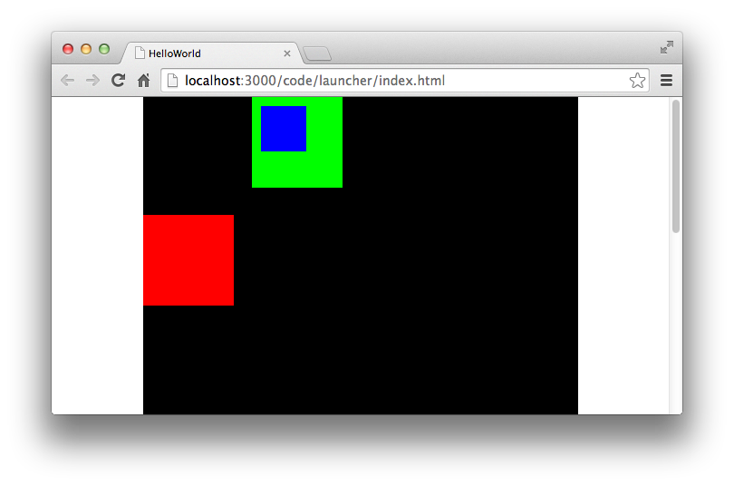

在Egret中建立显示对象和渲染显示对象是两个过程。建立显示对象后,对象会处于内存中,但不会参与渲染过程,只有把显示对象放到显示列表后,显示对象才会参与渲染过程。如果想将某个显示对象从渲染过程中删除,只需要将其移除显示列表即可。

## 添加显示对象到显示列表

当我们创建一个显示对象后，就可以将其添加到显示列表中，首先我们绘制一个Sprite，这个Sprite是一个宽高为100的绿色正方形。

```
var spr:egret.Sprite = new egret.Sprite();
spr.graphics.beginFill( 0x00ff00 );
spr.graphics.drawRect(0, 0, 100, 100);
spr.graphics.endFill();
```

上面的代码就是我们所说的建立显示对象的过程，这一步完成后我们可以测试一下程序，在舞台中看不到任何内容。接下来我们将 spr 添加到显示列表中。

```
this.addChild( spr );
```

添加这句代码之后，我们再次编译运行程序，此时你可以在浏览器中看到效果如图：


代码中 `addChild` 就是将 `spr` 添加到显示列表中。我们前面介绍过，显示列表是一个树状结构，这里 `spr` 的上一级就是 `this`,也就是我们的文档类。文档类是 `stage` 舞台的第一个子对象。

下面是关于当前示例的层级示意图:


## 删除显示对象

上面我们介绍了如何添加一个显示对象到显示列表中，下面来介绍一下如何将显示对象从显示列表中删除。

执行删除的函数非常简单，使用 `removeChild` 方法即可删除一个显示对象。

```
this.removeChild( spr );
```

执行删除操作与添加显示对象操作类似，我们将被删除的显示对象作为参数传递给 `removeChild` 方法。示例中 `spr` 就是被删除的显示对象，而 `this` 则是 `spr` 的父级。

## 显示对象操作的注意点

### 1.显示对象独立于显示列表

虽然我们的显示对象在运行时会被高频率的添加删除到显示列表，但显示对象独立于显示列表。简单解释一下，当我们创建一个显示对象Sprite时，该对象拥有自己的坐标属性，旋转角度属性等。这些属性都是显示对象独立拥有的。一旦该显示对象被键入到显示列表之中，Egret就会按照显示对象的状态进行显示。

当用户将显示对象从显示列表中移除后，这些状态依然存在。将一个显示对象移除显示列表后，该对象并非在内存中被销毁。我们只是不让显示对象参与渲染而已。

我们来通过一段代码来观察一下显示对象在容器中的操作与状态改变。

```
//创建了一个类型为Sprite的显示对象
var spr:egret.Sprite = new egret.Sprite();
spr.graphics.beginFill( 0x00ff00 );
spr.graphics.drawRect(0, 0, 100, 100);
spr.graphics.endFill();
//该对象存在，被添加到显示列表中，在画面中显示
this.addChild( spr );
//该对象存在，但已被移除显示列表，画面上不显示
this.removeChild( spr );
//该对象存在，驻于内存中
```

### 2.相对坐标系

显示对象的坐标系是相对坐标系，而非绝对坐标系。

当我们将一个显示对象的x,y坐标值均设置为100的时候，该坐标值表示，当前显示对象居于父级原点100，100的位置。我们通过下面一个实例来看一下具体区别。

首先我们建立两个容器，为了能够方便的看清效果，我们将两个容器的宽高都设置为100*100，同时将两个容器分别设置为红色和绿色。

红色的容器x轴设置为120像素。

绿色的容器y轴设置为130像素

将两个容器都添加到显示列表中，他们的父级都是文档类。下面是示例代码：

```
var sprcon1:egret.Sprite = new egret.Sprite();
sprcon1.graphics.beginFill( 0x00ff00 );
sprcon1.graphics.drawRect(0, 0, 100, 100);
sprcon1.graphics.endFill();
this.addChild( sprcon1 );
sprcon1.x = 120;

var sprcon2:egret.Sprite = new egret.Sprite();
sprcon2.graphics.beginFill( 0xff0000 );
sprcon2.graphics.drawRect(0, 0, 100, 100);
sprcon2.graphics.endFill();
this.addChild( sprcon2 );
sprcon2.y = 130;
```

此时运行后的效果如下：


然后我们绘制一个宽高为50的蓝色正方形，我们将这个正方形的x轴和y轴都设置为10像素。下面我们分别将这个蓝色的正方形添加到不同的容器中，以便查看效果。

创建并绘制一个蓝色正方形的代码：

```
var spr:egret.Sprite = new egret.Sprite();
spr.graphics.beginFill( 0x0000ff );
spr.graphics.drawRect( 0, 0, 50, 50 );
spr.graphics.endFill();
spr.x = 10;
spr.y = 10
```

添加到文档类的显示容器中：

```
this.addChild( spr );
```

运行效果：


添加到sprcon1绿色容器中：

```
sprcon1.addChild( spr );
```

运行效果：



添加到sprcon2红色容器中：

```
sprcon2.addChild( spr );
```

运行效果：


### 3.多次添加显示对象到显示列表

同一个显示对象无论被代码加入显示列表多少次，在屏幕上只绘制一次。

如果一个显示对象A被添加到了B这个容器中，然后A又被添加到了C容器中。那么在第二次执行 C.addChild(A) 的时候，A自动的从B容器中被删除，然后添加到C容器中。

### 4.删除操作的注意点

当我们想要删除一个显示对象的时候需要执行的操作是：

`容器对象.removeChild( 显示对象 );`

但执行这个删除操作，我们的“显示对象”必须拥有父级。换句话说，被删除的显示对象必须存在于显示列表当中。

如果当前删除显示对象不在显示列表之中，那么在JavaScript控制台中你将看见报错信息：`Uncaught Error: [Fatal]child未被addChild到该parent:`

避免这种问题的处理方法非常简单，就是当你每次removeChild之前，你都对即将要被删除的显示对象做一次判断，判断它是否拥有父级。判断的代码如下：

```
if( spr.parent )
{
    spr.parent.removeChild( spr );
}
```

