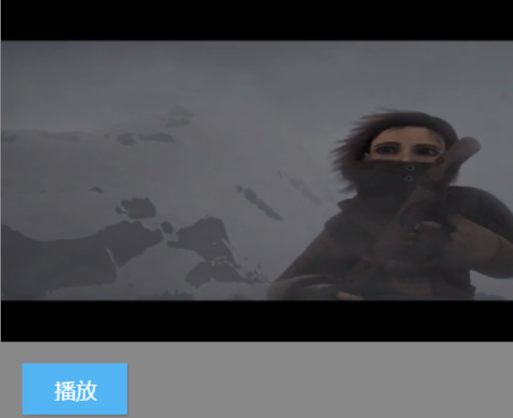

在 Egret Engine 2.5 中添加了新的媒体系统，其中包括新的视频系统。通过`egret.Video`来创建和管理视频。

> 需要注意的是，大部分移动设备只支持全屏播放。

### 准备工作

我们可以使用 W3C 提供的在线地址来测试 HTML5 的视频功能。地址为：`http://media.w3.org/2010/05/sintel/trailer.mp4`。
下面的代码里我们将使用这个视频作为素材。

下面代码需要一些 UI 的元素，所以使用默认的 EUI 项目。

可以通过:

```
egret create VideoTest --type eui
```

来创建默认的 EUI 项目。更多关于使用 EUI 方法参考:[EUI库](http://edn.egret.com/cn/index.php/article/index/id/517)

### 创建Video

先来看一下创建`Video`的代码:

```
class VideoTest extends egret.DisplayObjectContainer {
    public constructor() {
        super();
        this.video = new egret.Video();
        this.video.x = 0;                       //设置视频坐标x
        this.video.y = 0;                       //设置视频坐标y
        this.video.width = 640;                 //设置视频宽
        this.video.height = 320;                //设置视频高
        this.video.fullscreen = false;          //设置是否全屏（暂不支持移动设备）
        this.video.poster = "resource/assets/Button/button_up.png"; //设置loding图
        this.video.load("http://media.w3.org/2010/05/sintel/trailer.mp4");
        this.addChild(this.video);              //将视频添加到舞台
        //监听视频加载完成
        this.video.once(egret.Event.COMPLETE,this.onLoad,this);
        //监听视频加载失败
        this.video.once(egret.IOErrorEvent.IO_ERROR,this.onLoadErr,this);
    }
    private video: egret.Video;
    private onLoad(e: egret.Event) {
        var btnPlay: eui.Button = new eui.Button(); //新建播放按钮
        btnPlay.label = "播放";
        btnPlay.x = this.video.x + 20;
        btnPlay.y = this.video.y + this.video.height + 20;
        this.addChild(btnPlay);
        //监听按钮行为，当按下时调用播放函数。
        btnPlay.addEventListener(egret.TouchEvent.TOUCH_TAP,this.play,this);
        //获取视频长度
        console.log(this.video.length);
    }
    private onLoadErr(e: egret.Event) {
        console.log("video load error happened");
    }
    public play(e: egret.TouchEvent) {
        this.video.play();
    }
}
```

这里需要注意的是在 EUI 默认项目的入口文件类里面需要实例化上面的`VideoTest`,并删除默认的 UI。代码如下：

```
class Main extends eui.UILayer {

    protected createChildren(): void {
        super.createChildren();

        var theme = new eui.Theme("resource/default.thm.json", this.stage);
        this.addChild(new VideoTest());
    }
}
```

编译并运行我们可以看到如下的效果：



> 注意: 在大多数移动设备中，视频是强制全屏播放的。当在手机上点击播放时会弹出全屏的播放器。
而上面的代码在PC上将按照我们的设定不会全屏播放。

上面的代码我们首先设置了视频的宽高和位置。 `egret.Video`类同样继承自DisplayObject，所以我们也可以操作其的位置宽高和`touchEnable`属性等。同样也需要加到显示列表当中才能被显示出来。

然后设置了`poster` 属性为本地的一张图片，`poster`表示视频加载前，或者在不支持将 video 画在 canvas 的设备上，想要显示的视频截图地址,就是我们下面的截图。


之后通过`load`方法载入了视频的地址，然后监听加载完成和失败的事件。

> 需要注意的是视频需要加载完成再调用`play()`方法。

这里当视频加载完成之后添加一个播放按键，当点击时播放该视频。

这里视频的`play()`方法有两个参数，为播放的位置和是否循环。默认的从头开始播放，并且不循环。

#### 暂停视频

通过Video的`pause()`,方法将暂停视频。
继续完善上面的程序，添加暂停按钮的功能。在`onLoad`函数中，绘制一个暂停的按钮，并监听其行为：

```
//在onLoad函数中添加暂停按钮
var btnPause:eui.Button = new eui.Button();
btnPause.label = "暂停";
btnPause.x = btnPlay.x + btnPlay.width + 20;
btnPause.y = btnPlay.y;
this.addChild(btnPause);
btnPause.addEventListener(egret.TouchEvent.TOUCH_TAP,this.pause,this);
```

然后在`VideoTest`类中添加暂停视频函数：
```
public pause(e:egret.TouchEvent) {
    this.video.pause(); //暂停视频
}
```

点击该按钮视频将暂停播放，再一次点击播放按钮视频将继续播放。

#### 设置音量

通过设置`Video`的`volume`属性可以设置其音量的大小。其属性值为0到1。
下面通过 EUI 的水平滑块来控制。同样在`onLoad`函数中添加如下代码：

```
//设置控制音量的滑块，监听它的CHANGE事件,当滑动滑块时回调 `setVoluem()` 函数。
var volume:eui.HSlider = new eui.HSlider();
volume.x = btnPlay.x;
volume.y = btnPlay.y + btnPlay.height + 20;
this.addChild(volume);
volume.value = 100;
volume.maximum = 100;
volume.minimum = 0;
volume.width = 200;
volume.addEventListener(egret.Event.CHANGE,this.setVoluem,this);
```

然后在`VideoTest`类中添加设置音量的函数：

```
public setVoluem(e:egret.Event) {
    this.video.volume = e.target.value / 100;
}
```
这里滑块设置的最大值和最小值是0和100，由于`volume`的默认值为0到1,所以要除以100.

#### 全屏播放

这里只有在桌面浏览器上才能控制非全屏的效果。通过设置`fullscreen`属性来控制是否全屏。默认值为`true`，即全屏播放。

同样在`onLoad`函数中添加如下代码：

```
//设置全屏播放开关按钮
var screenSwitcher:eui.ToggleSwitch = new eui.ToggleSwitch();
screenSwitcher.label = "全屏";
screenSwitcher.x = btnPause.x + btnPause.width + 20;
screenSwitcher.y = btnPause.y;
screenSwitcher.addEventListener(egret.Event.CHANGE,this.setFullScreen,this);
this.addChild(screenSwitcher);
```

然后在`VideoTest`类中添加设置是否全屏显示的函数：

```
public setFullScreen(e:egret.Event) {
    //当开关被选择后。该开关的selected属性将变为true,反之则为false
    this.video.fullscreen =e.target.selected;
}
```

#### 显示播放时间

`Video`的`position`属性表示当播放视频时，position 属性表示视频文件中当前播放的位置（以秒为单位）。

同样在`onLoad`函数中添加如下代码，用来显示播放时间。

```
//使用label标签来显示文字，并监听`ENTER_FRAME`事件来更新显示。
var position:eui.Label = new eui.Label();
position.x = btnPlay.x;
position.y = volume.y + volume.height + 20;
this.addChild(position);
position.addEventListener(egret.Event.ENTER_FRAME,this.showPosition,this);
```

然后在`VideoTest`类中添加显示播放时间的函数：

```
public showPosition(e:egret.Event) {
    e.target.text = "播放时间: " + this.video.position;
}
```

#### 获取视频的`bitmapData` 

通过视频的`bitmapData`属性可以获得其当前帧的纹理信息。可以将它绘制到舞台上。

在`onLoad`函数中添加截图的按钮，点击该按钮将在舞台上添加一张截图:

```        
var btnPrintScreen:eui.Button = new eui.Button();
btnPrintScreen.label = "截图";
btnPrintScreen.x = screenSwitcher.x + screenSwitcher.width + 40;
btnPrintScreen.y = btnPlay.y;
this.addChild(btnPrintScreen);
btnPrintScreen.addEventListener(egret.TouchEvent.TOUCH_TAP,this.printScreen,this);
```

然后在`VideoTest`类中添加截图的函数：

```
public printScreen(e:egret.Event) {
    var bitmap:egret.Bitmap = new egret.Bitmap();
    bitmap.bitmapData = this.video.bitmapData;
    bitmap.x = this.video.x;
    bitmap.y = this.video.y + this.video.height + 150;
    this.addChild(bitmap);
}
```

这里创建了一个位图，并将它的`bitmapData`属性设置为视频的`bitmapData`属性。将该位图添加到舞台上面就可以显示截图了。

#### 获取视频长度

通过 Egret 3.0.8 新增的 length 属性可以获得视频的长度。

```
//获取视频长度
console.log(this.video.length);
```

### 完整代码与示例

可以在[视频示例](http://edn.egret.com/cn/index.php/article/index/id/656)处获得完整的项目代码。


