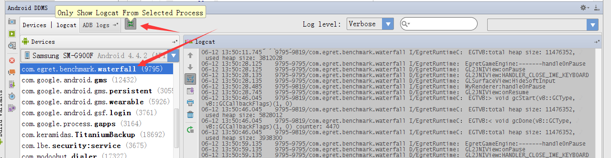

# Android基本调试技巧

在Android App打包运行过程中，有可能会发现一些问题，比如打包后黑屏无法正常运行。这时就需要使用Android的logcat调试功能来诊断问题。

在IntelliJ运行Android项目，会自动弹出Android标签，如图：

常规情况下，会显示整个系统的全部log，为了过滤掉不需要的信息，我们可以用进程过滤功能只显示我们正在调试的app输出的log，选中该按钮，并选中我们要调试的app进程：

即便是以限定了一个app进程，仍然可能有大量我们不需要的信息，别郁闷，我们可以进一步根据log的类型进行过滤：

通常我们最常用到的是Warn和Error级别的log，因为这两个级别包含程序运行不正常时首先需要检查的信息。

Eclipse环境的logcat显示方法基本一致，可参考：[Android的logcat中如何根据标签去过滤掉不显示某些log信息](http://www.crifan.com/android_logcat_filter_out_not_show_some_log_item_info_by_tag/)

如在进行App打包过程中出现无法正常运行问题，请通过logcat取得关键报错信息，[发到官方论坛问答板块](http://bbs.egret-labs.org/forum.php?mod=forumdisplay&fid=44)，或在本教程评论直接反映，谢谢！

