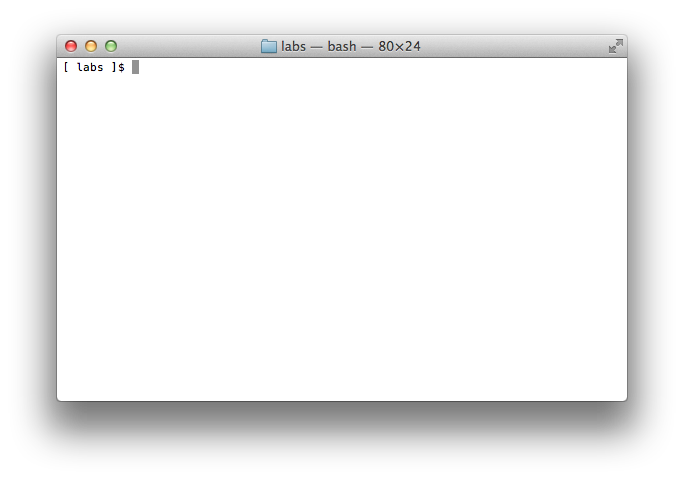

egret-ios-support是Egret打包为原生ios APP的方案，你可以使用egret-ios-support将你的HTML5游戏打包为ipa文件，并提供给用户安装。

具体使用方法如下：

### -1、预备知识

为了顺利完成本教程，请确认您已熟练掌握以下知识：

* 了解文件、文件夹的概念，以及创建，移动、复制、重命名和删除等知识。

* 了解终端、命令行、Shell其中之一，会启动她，并能通过命令行执行的方式完成上一条的相关操作

* 了解如何下载文件并解压缩文件

* 了解以下术语：

    * 编写游戏逻辑需要：JavaScript、TypeScript、nodejs、npm

    * 打包iOS App需要：Objective-C、C++、Xcode

尽管本文由部分内容覆盖 [HelloWorld](http://edn.egret.com/cn/docs/page/639)，但是还是强烈建议在阅读本文之前先阅读 [HelloWorld](http://edn.egret.com/cn/docs/page/639)

### 0、文档概述

本文会完整的展示如何在一个已经安装npm管理包的环境中全新安装Egret核心包、Egret的iOS支持包，最终在模拟机中运行Demo的过程。

本文分为三部分：第一部分为iOS开发环境的安装、第二部分为Egret游戏框架的安装、第三部分创建一个完整iOS App的示例。

## 第一部分、iOS开发环境安装

### 1、安装iOS开发环境——Xcode

运行App Store，在搜索项查找“Xcode”，下载并安装即可


## 第二部分、安装Egret游戏框架

### 2、预备知识

运行Mac OS X的Terimal应用：在Finder中打开Applications文件夹，再打开Utilities文件夹，找到Termial应用，双击运行。如下图：


进入你的工作目录，在演示中，我们的的工作目录为“labs/”，工作目录为空文件夹，如下图：




接下来，为我们的游戏建立一个projects文件夹，运行

```
$ mkdir projects
```

如下图：


### 3、安装Egret

传送门：[Mac OS X 系统下安装最新的Egret](http://edn.egret.com/cn/docs/page/580#Egret Engine 在 Mac OS X 系统下安装)。

### 4、下载Egret的iOS支持包

创建Egret Support文件夹


*下载Egret ios支持包*

下载[egret-ios-support](http://www.egret.com/iossupport)，将egret-ios-support放置在“labs/egret-support/”文件夹下，如下图：


## 第三部分、创建一个iOS打包的示例

### 5、创建一个Egret项目

这里创建一个名称为`ACoolHtmlGame`的项目，使用命令如下：

```
$ egret create ACoolHtmlGame
```

如图：


### 6、编写你的游戏项目

接下来要做的事情就是编写你的游戏项目逻辑。这里我们不进行操作，使用默认的项目来进行演示。

### 7、创建你的ios项目工程

#### 从你的HTML5游戏创建ios项目工程

回到我们的游戏工程文件夹“labs/projects/”下，我们通过一个新的命令来创建适用于ios的项目，该命令创建项目时，需要指定原有HTML5工程和你的egret-ios-support路径。命令如下：

```
$ cd projects/
$ egret create_app ACoolIosGame -f ACoolHtmlGame -t ../egret-support/egret-ios-support
```

>`create_app`命令可用来创建适用于ios的项目工程。`ACoolIosGame`则是该工程的工程名。

`-f`参数则指定我们的HTML5游戏项目，我们直接将刚刚创建的HTML5项目路径填写进入即可。

`-t`参数则是ios项目工程的模板，我们需要指定“egret-ios-support”项目路径。

下图为运行命令演示：


运行命令后，你将看到新生成的ACooliosGame项目文件夹，该文件夹结构如下：


自此，我们已经创建了一个完整的ios工程，我们来看一下当前的文件层级：

```
labs/-+
      +-- egret-core/-+                         # egret
      +-- egret-support/-+                      # egret 支持库
      |                  +-- egret-ios-support/ # ios支持
      +-- projects/-+
      |             +-- ACoolIosGame            # ios工程
      |             +-- ACoolHtmlGame           # html应用
      ...
```

### 8、编译iOS游戏

#### 8.1 导入项目

打开ACoolIosGame文件夹，双击“ACoolIosGame.xcodeproj”，等待Xcode加载完成


### 9、测试项目

点击Xcode的Run命令，直接进入iOS模拟器运行


下图为运行效果


如需生成ipa包，请访问[苹果开发网站](http://developer.apple.com/)，注册开发者账号，阅读相关设置即可。

自此，完成了使用Egret实现一个iOS游戏应用的全过程。

### 10、项目开发的整体流程

我们推荐的开发方式：在原有的HTML5游戏项目中进行开发，开发测试ok，再编译到iOS平台。下面为大家演示一下流程：

1.创建一个HTML5游戏：

`egret create ACoolHtmlGame`

2.创建对应的iOS游戏

`egret create_app ACoolIosGame -f ACoolHtmlGame -t ../egret-support/egret-ios-support`

3.测试一下各个平台游戏

4.在ACoolHtmlGame中开发游戏，一个小步进的开发后，我们要开始编译我们的游戏并在浏览器上测试，这是使用

`egret build ACoolHtmlGame --runtime native -e`

这行命令执行了两项任务：1.编译TypeScript到JavaScript，2.将编译出的文件同步到Xcode项目中。这里需要注意的有两点：1.编译的项目是*HTML5项目，2.不要更改iOS项目的位置*，项目位置的设置将在高级教程给出, 3.此时HTML5项目会失效，想查看HTML5项目，请使用

`egret build ACoolHtmlGame -e`

来使得HTML5项目生效，此时iOS项目失效。

5.此时可以使用egret startserver ACoolHtmlGame 启动游戏服务，这样浏览器就能观察到实现的游戏逻辑了。

6.接下来回到ACoolIosGame的Xcode工程中，使用Xcode来清除、重新编译、调试项目，这样就可以在手机上得到和HTML项目的游戏逻辑了。

7.返回4，不断的迭代。