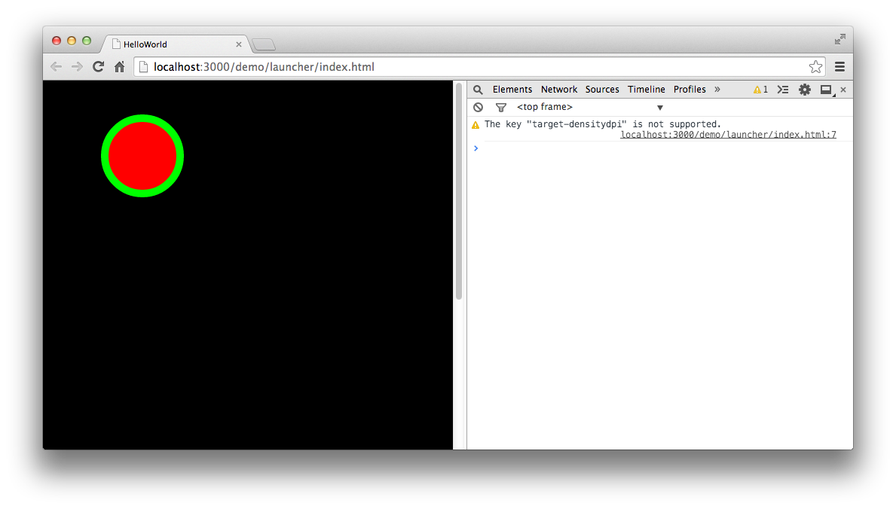

与绘制矩形一样，我们可以通过 `Graphics` 中的方法来绘制一个圆形，具体代码示例如下：

```
class GraphicsTest extends egret.DisplayObjectContainer
{
    public constructor()
    {
        super();
        this.addEventListener(egret.Event.ADDED_TO_STAGE,this.onAddToStage,this);
    }
    private onAddToStage(event:egret.Event)
    {
        var shp:egret.Shape = new egret.Shape();
        shp.x = 100;
        shp.y = 100;
        shp.graphics.lineStyle( 10, 0x00ff00 );
        shp.graphics.beginFill( 0xff0000, 1);
        shp.graphics.drawCircle( 0, 0, 50 );
        shp.graphics.endFill();
        this.addChild( shp );
    }
}
```

编译并运行，效果如图：



我们绘制了一个半径为50像素的圆形，绘制圆形调用的主要方法如下：

```
shp.graphics.drawCircle( 0, 0, 50 );
```

drawCircle 方法接受三个参数，第一个参数为圆形的X轴，第二个参数为圆形的Y轴，第三个参数为圆形半径。

此处需要注意的是，圆形的X轴和Y轴位置是相对于Shape对象的锚点计算的.

