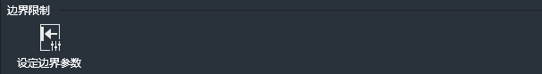
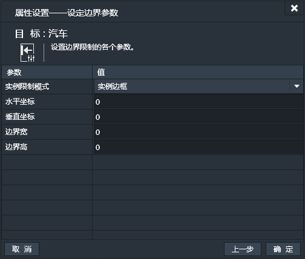

应用了边界限制行为的实例，其活动范围将被限制在指定的边界范围内。

### 属性面板：

- 实例限制模式：实例限制出界模式。可选项有：
 - 实例边框：设定实例的外边框不能走出指定的限制边界。例如：限制边界为屏幕范围内，实例边框模式，则当实例的边框达到屏幕边缘后便无法再往外运动了。
 - 实例锚点：设定实例的锚点不能走出指定的限制边界。这样，在上边那个例子中，改为实例锚点模式，则实例的边框是可以出屏幕边缘的，而当实例的锚点达到屏幕边缘后便无法再往外运动了。
- 水平坐标：设定限制边界的最左上角坐标点的水平坐标值。（单位：像素）
- 垂直坐标：设定限制边界的最左上角坐标点的垂直坐标值。（单位：像素）
- 边界宽：设置限制边界的宽。（单位：像素）
- 边界高：设置限制边界的高。（单位：像素）

------------

### 边界限制条件：
边界限制行为没有特有的条件。

------------

### 边界限制动作：

#### 设定边界参数：
设置边界限制的各个参数。
- 实例限制模式：实例限制出界模式。可选项有：
 - 实例边框：设定实例的外边框不能走出指定的限制边界。
 - 实例锚点：设定实例的锚点不能走出指定的限制边界。
- 水平坐标：设定限制边界的最左上角坐标点的水平坐标值。（单位：像素）
- 垂直坐标：设定限制边界的最左上角坐标点的垂直坐标值。（单位：像素）
- 边界宽：设置限制边界的宽。（单位：像素）
- 边界高：设置限制边界的高。（单位：像素）

