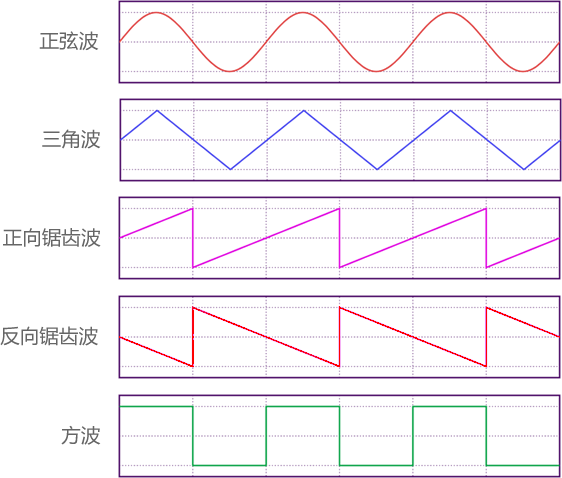
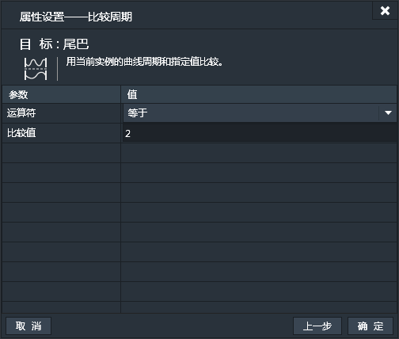
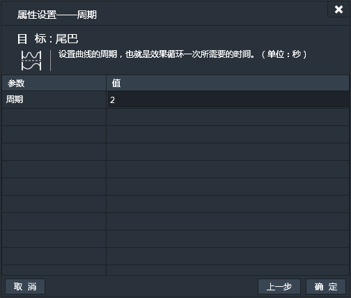

应用了曲线行为的实例，可以使其指定的运动或变化应用曲线效果。应用了曲线效果的运动或变化看起来更自然。

### 属性面板：

- 开始便激活：实例创建时立即应用曲线效果。设置为“是”，则实例加载后便立即应用曲线行为。如果选择“否”，事件表中可以通过动作启用。
- 运动类型：选择应用了曲线效果的运动或变化。可选项有：
 - 水平移动：在X轴方向上，实例的位置依照曲线左右移动。
 - 垂直移动：在Y轴方向上，实例的位置依照曲线上下移动。
 - 大小变化：实例的尺寸依照曲线变化大小。
 - 宽度变化：实例的宽度依照曲线变化大小。
 - 高度变化：实例的高度依照曲线变化大小。
 - 角度变化：实例的角度依照曲线变化大小。
 - 透明度变化：实例的透明度依照曲线变化大小。
 - 值变化：
 - 前/后移动：前后是基于实例自身的角度定义的。比如，实例角度是45度，那么前后移动便是沿着斜45度的直线往复移动。
- 波形：曲线的波形。可选项有：
 - 正弦波
 - 三角波
 - 正向锯齿波
 - 反向锯齿波
 - 方波
各种波形示意图如下：

- 周期：设置曲线的周期，也就是效果循环一次所需要的时间。（单位：秒）
- 周期随机数：给周期时间添加一个随机数。（单位：秒）
例如：周期为2，随机数也为2，则实际的周期会是在2到4之间的随机数值。随机数值在曲线初始化时产生并和设置周期值相加，初始化后实际周期便固定不变了。
- 周期偏移值：设置曲线在X轴方向的偏移值。（单位：秒）
例如：曲线振幅为1，周期为2秒，默认曲线值由0开始。偏移0.5秒，则曲线值变成从1开始。
- 周期偏移值随机数：周期偏移值随机数。（单位：秒）
例如：偏移值为0.5，随机数为1，则实际的偏移值会是在0.5到1.5之间的随机数值。随机数值在曲线初始化时产生并和设置偏移值相加，初始化后实际偏移值便固定不变了。
- 振幅：曲线的振幅即为曲线的振动范围，决定了实例的曲线运动范围可取到的最大和最小值。（单位：与运动类型相关）
- 振幅随机数：振幅随机数。
例如：振幅为1，随机数为2，则实际的偏移值会是在1到3之间的随机数值。随机数值在曲线初始化时产生并和设置振幅相加，初始化后实际振幅值便固定不变了。

------------

### 曲线条件：

#### 若启用：
如果曲线行为是启用状态的话触发。
此条件无特有属性设置窗口。

#### 判定运动类型：
如果当前实例的曲线运动类型是指定类型触发。可选项如下图：

#### 比较周期：
用当前实例的曲线周期和指定值比较，条件为真则触发。

#### 比较振幅：
用当前实例的振幅和指定值比较，条件为真则触发。

#### 判定波形：
如果当前实例的曲线波形为指定波形触发。可选项如下图：

------------

### 曲线动作：

#### 启用/禁用：
设置曲线行为启用或禁用。

#### 运动类型：
设置应用了曲线效果的实例运动或变化类型。可选项如下图：

#### 周期：
设置曲线的周期。

#### 振幅：
设置曲线的振幅。

#### 波形：
设置曲线的波形。可选项如下图：

#### 初始化：
初始化曲线。表示曲线由坐标原点重新开始波动。
此动作无特有属性设置窗口。