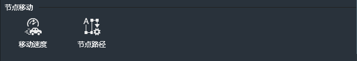
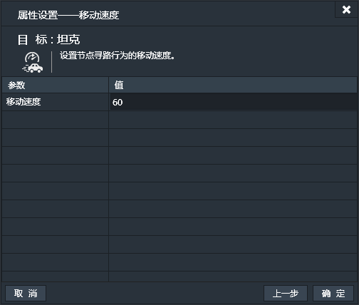
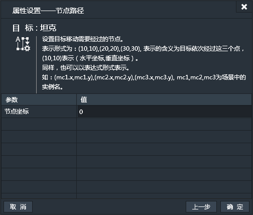

添加了节点移动行为的实例，可以按照设定的节点移动。相邻的两个节点间是直线运动。与寻路行为不同的是，用户需要指定移动中每一个节点的坐标，但不再需要依赖于Tile Map地图。

### 属性面板

- 移动速度：设置节点移动的速度。默认值60.（单位：像素/秒）

------------

### 节点移动条件

#### 当准备移动时
当实例准备移动时。【一次性触发】
可以看作是实例对于节点移动行为的一种状态的切换，即从静止到移动状态的切换，但此时，实例还是处于静止状态。
此条件无属性设置窗口。
#### 到达终点时
当实例经过所有节点后，到达最后一个节点时。【一次性触发】
此条件无属性设置窗口。
#### 到达节点时
当实例到达路径上每一个节点时。【一次性触发】
比如路径上设有A，B，C，D四个节点，那么到达A，B，C，D中的每一个节点都会触发。
此条件无属性设置窗口。
#### 当移动进行时
当节点移动的实例处于节点移动中时。【持续性触发】

------------

### 节点移动动作

#### 移动速度
设置节点移动的速度。

#### 节点路径
设置节点移动中的每个节点坐标。
此处节点的表达式表达形式可分为静态与动态数据。
- 静态数据
静态数据可用如下表达形式：
`(100,100),(150,200),(180,400)`
本例中共设置了三个节点坐标信息。每个括号代表1个节点的的坐标信息，括号中的第1个数值代表水平坐标，第2个数值代表垂直坐标。
- 动态数据
动态数据可用如下表达形式：
`(mc1.x,mc1.y),(mc2.x,mc2.y),(mc3.x,mc3.y)`
本例中，同样设置了三个节点坐标信息，mc1，mc2，mc3分别代表场景中的三个实例的名称。那么三个坐标就分别是三个实例在游戏中的位置。mc1.x为mc1的水平坐标，mc1.y为mc1的垂直坐标。

