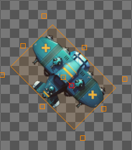

场景中选中实例后，右侧面板会显示基本属性。

*注：添加声音，触屏，数组，微信，函数组件后产生的实例只支持基本属性中的“名称”和“全局”，不支持其他属性。

- 名称： 实例的名称。
- GUID: 实例的内部ID。基本属性中唯一不可修改的属性。
- 全局： 设置实例是否是全局存在的。默认为“否”。
如果设置为“否”表示实例会随着所在场景的退出而销毁。如果设置为“是”，则实例不会随着所在场景的退出而销毁，场景切换后，实例依然存在，实例的各种属性也保持不变。
- 可见： 设置实例是否可见。默认为“是”。
- X 轴坐标： 设置实例在场景中的X轴的坐标，也就是实例锚点的X轴坐标。
- Y 轴坐标： 设置实例在场景中的Y轴的坐标，也就是实例锚点的Y轴坐标。
- X 锚点： 设置实例的锚点在X轴方向上相对于实例所处的位置。默认值为“0.5”,表示X轴方向上锚点处于实例的中间。如果设为“0”，表示处于实例的最左侧边缘，如果设为“1”，表示处于最右侧边缘。
- Y 锚点： 设置实例的锚点在Y轴方向上相对于实例所处的位置。默认值为“0.5”，表示Y轴方向上锚点处于实例的中间。如果设为“0”，表示处于实例的最上边缘。如果设置“1”，表示处于实例的最下边缘。
例如下图：
锚点X=0.5，锚点Y=0.5

锚点X=0，锚点Y=0

锚点X=1，锚点Y=1

如果锚点值大于1或小于0，则锚点位于实例本身范围以外。
- 宽：实例的宽度。
- 高：实例的高度。
- 角度：实例的角度。默认值为“0”。实例的角度旋转以锚点为旋转中心。
如下图，角度=45

- 透明度：设置实例的透明度。默认值为“1”，表示透明度为100%，完全不透明。设置为“0”，表示透明度为“0%", 完全透明。

