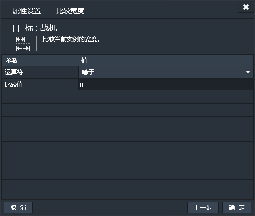

精灵，按钮，文本框等大多数实例都具有的条件，我们定义为通用条件。这些条件是最基本，最常用的条件。
#### 快速链接：
|通用条件||
|------:|:------|
|其它|[当实例创建时](#当实例创建时：)|
|网络|[当图片加载完毕](#当图片加载完毕：)|
|实例自定义变量|[比较自定义变量](#比较自定义变量：)|
|大小与位置|[比较水平坐标](#比较水平坐标：)，[比较垂直坐标](#比较垂直坐标：)，[比较宽度](#比较宽度：)，[比较高度](#比较高度：)，[比较透明度](#比较透明度：)，[显隐状态](#显隐状态：)，[是否在屏幕内](#是否在屏幕内：)|
|碰撞|[碰撞](#碰撞：)|
|角度|[顺时针旋转](#顺时针旋转：)，[处于两角度之间](#处于两角度之间：)|

#### 当实例创建时：
当所选实例创建时触发。【一次性触发】
当游戏中包含所选实例的场景加载时，实例才会被创建。比如，游戏的第一个场景是A，所选实例只存在于场景B中。那么，游戏开始时，所选实例并没有创建，只有切换到场景B后，所选实例才被创建，才触发“当实例创建时”这个条件。（此时实例内的图片资源还未加载完毕）
此条件无特有属性设置窗口。
#### 当图片加载完毕：
当所选实例中的图片资源加载完毕。【一次性触发】
要先创建实例，然后加载其中的图片资源。所以“当图片加载完毕”要晚于“当实例创建时”。
此条件无特有属性设置窗口。
#### 比较自定义变量：
用当前实例的一个自定义变量和指定值比较。【持续性触发】
先要确保当前实例已经添加了自定义变量，然后从已有自定义变量中选择一个。（如果不选择任何自定义变量，项目运行可能会出错。）

#### 比较水平坐标：
用当前实例的水平坐标和指定值比较。【持续性触发】

#### 比较垂直坐标：
用当前实例的垂直坐标和指定值比较。【持续性触发】

#### 比较宽度：
用当前实例的宽度和指定值比较。【持续性触发】

#### 比较高度：
用当前实例的高度和指定值比较。【持续性触发】

#### 比较透明度：
用当前实例的透明度和指定值比较。【持续性触发】

#### 显隐状态：
判定当前实例的显隐状态。【持续性触发】
可选项为“显示”和“隐藏”。

#### 是否在屏幕内：
判定当前实例是否在屏幕内。【持续性触发】
可选项为“屏幕里”和“屏幕外”。

#### 碰撞：
如果当前实例与指定实例产生了碰撞。【一次性触发】
在属性设置窗口里选择一个其他实例，来与当前实例进行碰撞判定。如果产生了碰撞，那么条件为真则触发。

#### 顺时针旋转：
比较角度1和角度2。【持续性触发】
如果角度2顺时针旋转不超过180度便能到达角度1则条件成立。
比如，假设角度2为30度，角度1为120度。由30度开始顺时针旋转90度可以到达120度，旋转过程没有超过180度，所以条件成立。
假设角度2为30度，角度1为250度。有30度开始顺时针旋转220度才可以到达250度，旋转了220度>180度，所以条件不成立。

#### 处于两角度之间：
比较指定角度是否在两个角度之间。【持续性触发】
两个角度之间指的是由角度1顺时针旋转到角度2形成的扇形区域。
例如，60度在30度到120度之间。而60度不在120度到30度之间，150度在120度到30度之间。

