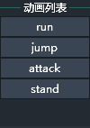
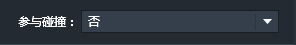
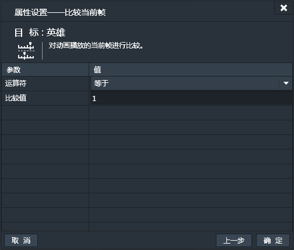
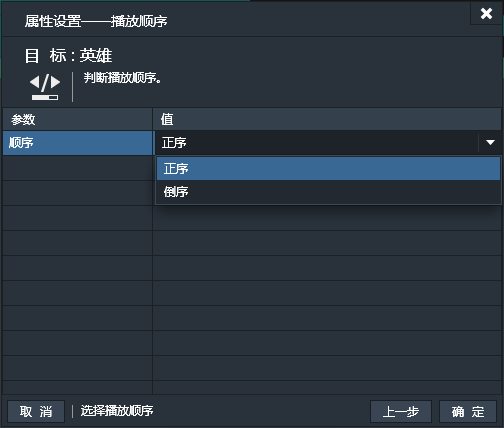
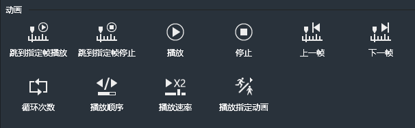
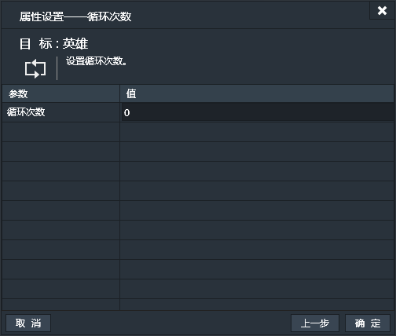
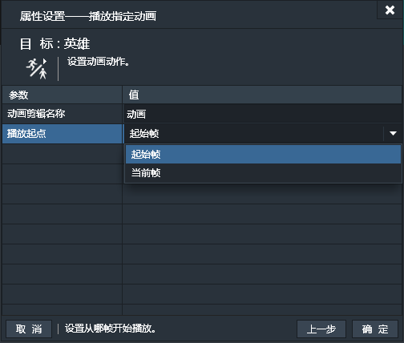

动画组件可以理解为支持序列帧动画的精灵组件。它能实现精灵所有的功能，并支持动画播放。

### 序列帧面板
添加动画组件并选中后，序列帧面板便被激活。

点击“添加帧”按钮，打开素材库窗口。项目目录中images目录下的所有可用图片文件都会列在素材库窗口中。

可以按住键盘上的Ctrl键，鼠标依次单击，复选要添加到帧的图片。也可以按住鼠标拖拽框选所有要添加的图片。（***注：图片序列在序列帧中的默认顺序由选择的顺序和添加的顺序决定。添加到序列帧面板后，也可以通过拖拽改变排序**）。素材库窗口中，单击右键选择“添加图片素材”可以添加图片到项目素材库中。

***注1：当前不支持中文命名的图片文件，游戏运行中中文命名的图片将无法显示。**

***注2：没有加载拷贝到项目素材库目录的图片文件无法在游戏中显示。**

添加图片到序列帧面板后如下图：

#### 序列帧工具栏

由左向右依次为，上一帧，播放/停止，下一帧，帧频，循环次数，帧数，时长
- 上一帧；切换到当前帧的上一帧，如果当前为首帧则点击无效。
- 播放/停止：播放或停止当前动画组件中的序列帧。
- 下一帧：切换到当前帧的下一帧，如果当前为末帧则点击无效。
- 帧频：每秒播放的帧数，也称作FPS。默认值为6。
- 循环次数：设置序列帧动画的循环次数，默认为0，表示无限次循环。
- 帧数：当前序列帧的总帧数。
- 时长：当前序列帧依照设置的帧频和总帧数计算得出的播放时长。

#### 序列帧动画列表

动画列表列出所有当前动画组件中的动画剪辑。
- 一个动画组件中可以包含多个动画剪辑，每个动画剪辑对应一组序列帧。
例如，一个横轴过关游戏的角色，他可能有好多种动作，跑，跳，攻击，站立等，每一个动作就对应一个动画剪辑，而每一个动作又是由多张图组成的动画序列帧。在游戏中可以根据角色处于的状态不同，通过动作来切换动画剪辑，便可以让角色呈现出跑，跳，攻击等不同的动作。
- 默认的动画剪辑名为“动画”，右键单击动画列表可以添加“动画剪辑”。
- 右键单击动画剪辑可以添加动画，重命名当前动画剪辑，复制当前动画剪辑和删除当前动画剪辑。
- 当动画列表中只有一个动画剪辑时，动画剪辑不能被删除。
- 游戏中，动画组件初始化后，默认播放第一个动画剪辑。

### 特有属性

- 参与碰撞：设置动画实例是否参与碰撞。默认值为“否”。

### 动画条件
动画组件除特有条件外，也适用所有通用条件，参看：[通用条件](http://edn.egret.com/cn/index.php/portal/article/index/id/707)

#### 全部播放完毕
检测当前动画是否全部播放完毕。【一次性触发】
动画可能会循环播放多次，这里表示最后一次播放完毕时触发。对于设置无限循环的动画，此条件永远为假。
此条件无属性设置窗口。
#### 单次播放完毕
检测当前动画是否单次播放完毕。【一次性触发】
动画可能会循环多次，每完成一次循环就会触发一次。例如，循环次数为10次的动画，会触发10次。
此条件无属性设置窗口。
#### 正在播放
如果正在播放动画，条件为真，触发。【持续性触发】
此条件无属性设置窗口。
#### 比较当前帧
比较动画播放中，当前帧和指定帧的大小关系。【持续性触发】

#### 比较播放速率
比较当前动画的播放速率和指定速率的大小关系。【持续性触发】

#### 播放顺序
判断当前动画剪辑的播放顺序。【持续性触发】
默认为“正序”，可选项有
- 正序
- 倒序

#### 比较循环次数
比较当前动画剪辑的循环次数和指定次数的大小关系。【持续性触发】

#### 若为指定动画
如果当前播放动画剪辑为指定动画剪辑，则条件为真，触发。【持续性触发】

### 动画动作
动画组件除特有动作外，也适用所有通用动作，参看：[通用动作](http://edn.egret.com/cn/index.php/portal/article/index/id/708)

#### 跳到指定帧播放
跳到当前动画剪辑的指定帧然后按指定循环次数开始播放。

#### 跳到指定帧停止
跳到当前动画剪辑的指定帧，然后停止播放。画面会停在指定帧。

#### 播放
按指定循环次数播放当前动画剪辑。

#### 停止
停止播放当前动画剪辑。
此动作无属性设置窗口。
#### 上一帧
跳到当前动画剪辑当前帧的上一帧。
此动作无属性设置窗口。
#### 下一帧
跳到当前动画剪辑当前帧的下一帧。
此动作无属性设置窗口。
#### 循环次数
设置当前动画剪辑的播放循环次数。

#### 播放顺序
设置当前动画剪辑的播放顺序，默认为正序。
可选项有：
- 正序
- 倒序

#### 播放速率
设置当前动画剪辑的播放速率。

#### 播放指定动画
播放当前动画组件的指定动画剪辑。
- 动画剪辑名称：指定的动画剪辑名称。
- 播放起点：
 - 起始帧：从动画剪辑的首帧开始播放。
 - 当前帧；从当前动画剪辑的当前帧数开始播放。
 

