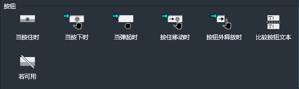
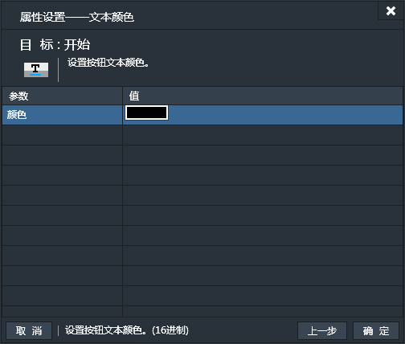
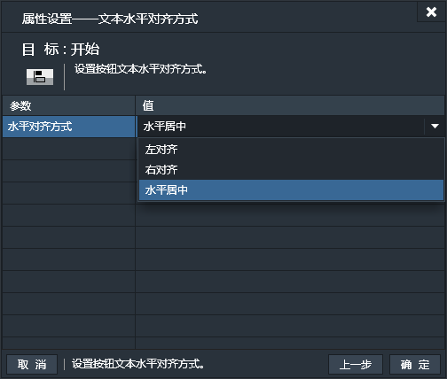

按钮组件可以实现点击功能。游戏菜单中的按钮，游戏中需要单独接受点击事件的实例都可以用按钮来实现。

### 特有属性

- 弹起状态：设置按钮弹起状态时显示的图片的地址。
- 按下状态：设置按钮按下状态时显示的图片的地址。
- 禁用状态：设置按钮禁用状态时显示的图片的地址。
- 文本：设置按钮上默认显示的文本内容。

*注1：每个状态的图片的地址均需单独指定，若为空，则相应状态不会有图片显示。

*注2：按钮不支持碰撞。

------------

### 按钮条件
按钮组件除特有条件外，也适用部分通用条件（按钮不支持“碰撞”相关条件），参看：[通用条件](http://edn.egret.com/cn/index.php/portal/article/index/id/707)

#### 当按住时
当按钮被按住时。【持续性触发】
只要按钮处于按下状态，条件便为真，会一直触发动作。
此条件无属性设置窗口。
#### 当按下时
当按钮被按下时。【一次性触发】
当按钮被按下的那一刻，条件为真，只触发一次。
此条件无属性设置窗口。
#### 当弹起时
当按钮弹起时。【一次性触发】
按钮从按下状态变为弹起状态的那一刻，条件为真，值触发一次。
此条件无属性设置窗口。
#### 按住移动时
按住按钮并有移动时。【一次性触发】
按钮处于按下状态，并且鼠标/触摸手指有移动时，条件为真，只触发一次。判断依据为存在移动便触发一次，所以如果鼠标/触摸手指在按钮处于按下状态时持续一直移动，便会一直触发。例如，鼠标按住按钮并一直左右滑动，那么条件便持续触发，那么动作便会被一直执行。
此条件无属性设置窗口。
#### 按钮外释放时
按钮处于按下状态，鼠标/触摸手指移出按钮外然后释放按钮时。【一次性触发】
此条件无属性设置窗口。
#### 比较按钮文本
如果按钮的文本内容和指定文本内容相同时。【持续性触发】
比较文本内容，若相同，条件为真，会一直触发动作。

#### 若可用
如果当前按钮处于可用状态。【持续性触发】

------------

###按钮动作
按钮组件除特有动作外，也适用部分通用动作（按钮不支持“碰撞”相关动作），参看：[通用动作](http://edn.egret.com/cn/index.php/portal/article/index/id/708)

####文本内容
设置按钮上的文本内容。

####文本颜色
设置按钮上的文本颜色。

####文本字体
设置按钮上的文本字体。

####字体大小
设置按钮上的字体大小。

####文本水平对齐方式
设置按钮上文本的水平对齐方式。默认为"水平居中"，可选项有：
- 左对齐
- 右对齐
- 水平居中

####文本垂直对齐方式
设置按钮上温恩的垂直对齐方式。默认为"垂直居中"，可选项有：
- 上对齐
- 下对齐
- 垂直居中

