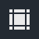
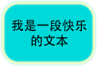
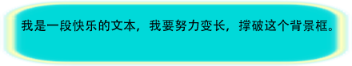
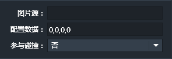

### 九宫格简介
游戏中为了美观，常会使用一些圆角矩形或者边缘不规则的矩形。
比如下图

我们可以用这个圆角矩形做一个文本框的背景。如下图：

但如果文本内容是动态的，而且很多，就有可能需要拉伸这个圆角矩形。如果不使用九宫格，就可能出现下面的情况。

大家可以看到，圆角变形了，这样很难看。
如果背景的圆角矩形用九宫格来实现就能达到下边的效果。

------------

### 特有属性面板：

- 图片源：九宫格所用到的图片地址。
- 配置数据：九宫格的配置数据。默认值为(0,0,0,0)
格式为（X,Y,Width,Height)
其中X和Y表示井字线左上角的交点的坐标。
Width和Height分别表示井字线中心口字的宽和高。如下图所示：

填写好配置数据，任意拉伸九宫格图片，图片都不会因为拉伸而产生变形的问题了。
- 参与碰撞：设置九宫格实例是否参与碰撞。

九宫格实例在游戏中也可以通过动作动态的拉伸缩放大小，也同样不会变形。

------------

### 九宫格条件
九宫格组件无特有条件，适用所有通用条件。参见：[通用条件](http://edn.egret.com/cn/index.php/portal/article/index/id/707)

------------

### 九宫格动作
九宫格组件无特有动作，适用所有通用动作。参见：[通用动作](http://edn.egret.com/cn/index.php/portal/article/index/id/708)