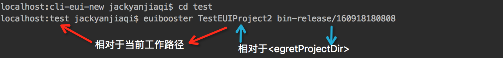
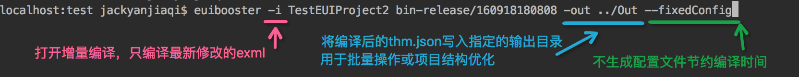

将运行时解析exml修改为编译时解析,eui加载提速10倍以上


准备工作:
---
	安装最新版本node 或将node升级到最新版本

	将游戏项目提升至v3.1.4版本以上并执行egret build -e(确保使用了最新的引擎版本)

使用方法:
---
全局安装euibooster命令行工具

```
npm install -g cli-eui-new
```

### 1.加速一个游戏项目

```
euibooster [-i] <egretProjectDir> <egretPublishDir> [ -out <outDir> ] [--fixedConfig] [-cfg <configFilePath>]
```

说明：


`egretProjectDir` 游戏目录,必要参数,绝对路径或相对于当前工作路径(pwd)的相对路径 可以使用 . 或 ../ 格式

`egretPublishDir` 发布目录,必要参数,绝对路径或相对于<egretProjectDir>的相对路径 可以使用 . 或 ../格式

`outDir`          自定义输出目录,可选参数,绝对路径或相对于当前工作路径(pwd)的相对路径 可以使用 . 或 ../ 格式

`-i` 开启增量编译模式 只编译改动的exml文件,若未开启则默认编译*.thm.json下列出的所有exml文件

`--fixedConfig` 开启固定配置模式 默认编译流程会搜索工程目录下的所有ts文件生成一个中间配置，如果项目较大且仅仅是修改exml皮肤文件则可以打开此项节省编译时间

`-cfg` 指定生成的中间配置位置 仅用于测试或高级开发功能

以下是使用实例:






### 2.从加速项目恢复成普通项目(非必须)

```
euibooster clean <egretProjectDir> <egretPublishDir> [ -out <outDir> ]
```


---
_注：若确定使用加速模式运行则可以不再运行euibooster clean命令，仅用于从非稳定版本导致问题后对项目的恢复，同时支持对制定了输出目录的恢复_