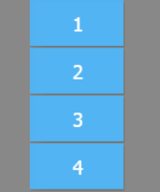

屏幕的尺寸总是有限的，当您的内容已经超出屏幕的范围，该如何处理呢？在 PC 上浏览网页的时候，我们是如何看到屏幕显示不下的那些内容呢？没错，用滚动条。通过拉动滚动条，我们就能一点一点的看完整个网页。这里就引入了一个概念：视口(ViewPort)，如下图所示：


可以这样理解：视口就是您的显示器，内容可以在视口中滚动，这样您就可以看到本来是隐藏的那些部分。在 PC上，我们用滚动条来控制内容滚动，在手机上就比较特殊了，我们是用手指的滑动，实现滚动条类似的效果。对于移动设备的浏览器来说，"滚动"是内置的功能，一个网页不需要特殊设置就能使用这个功能。但对 Egret 来说，"滚动"却是需要自己实现的，因为 Egret 一般情况下要禁用浏览器的滚动，以免对交互造成干扰。对于在Canvas上绘制的内容，"滚动"是需要自己去"虚拟实现"的。

好在 EUI 中已经提供了一个组件，就是 Scroller。您只需要创建一个 Scroller 的实例，设置位置和尺寸，然后把需要"滚动"的那个容器，设置到 Scroller 的 viewport 属性上就可以了。

下面的示例中我们使用了一张比较大的图片，手机屏幕是显示不下的，然后我们看看如何交给Scroller来处理：

``` TypeScript
class ScrollerDemo extends eui.Group {
    constructor() {
        super();
    }
    protected createChildren() {
        super.createChildren();
        //创建一个容器，里面包含一张图片
        var group = new eui.Group();
        var img = new eui.Image("resource/bg.jpg");
        group.addChild(img);
        //创建一个Scroller
        var myScroller = new eui.Scroller();
        //注意位置和尺寸的设置是在Scroller上面，而不是容器上面
        myScroller.width = 200;
        myScroller.height = 200;
        //设置viewport
        myScroller.viewport = group;
        this.addChild(myScroller);
    }
}

```
> 注意位置和尺寸的约束应该是在Scroller上面，而不是容器上面，这是新手容易犯的错误，需要注意

实现效果：


### 定位滚动位置
除了通过手指控制 Scroller , 我们通过代码也可以获取和控制滚动的位置
``` 
Scroller.viewport.scrollV  纵向滚动的位置
Scroller.viewport.scrollH  横向滚动的位置
``` 
改变这2个值，就可以改变滚动的位置。
下面是一个滚动的示例，初始化以后就会改变 Scroller 里列表的位置，点击按钮也会移动列表。
~~~ TypeScript
class ScrollerPosition extends eui.UILayer {
    private scroller: eui.Scroller;
    constructor() {
        super();
        //创建一个列表
        var list = new eui.List();
        list.dataProvider = new eui.ArrayCollection([1, 2, 3, 4, 5]);
		//创建一个 Scroller
        var scroller = new eui.Scroller();
        scroller.height = 160;
        scroller.viewport = list;
        this.addChild(scroller);
        this.scroller = scroller;
		//创建一个按钮，点击后改变 Scroller 滚动的位置
        var btn = new eui.Button();
        btn.x = 200;
        this.addChild(btn);
        btn.addEventListener(egret.TouchEvent.TOUCH_TAP,this.moveScroller,this);
    }
    protected createChildren() {
    	//初始化后改变滚动的位置
        this.scroller.viewport.validateNow();
        this.scroller.viewport.scrollV = 40;
    }
    private moveScroller():void{
    	//点击按钮后改变滚动的位置
        var sc = this.scroller;
        sc.viewport.scrollV += 10;
        if ((sc.viewport.scrollV + sc.height) >= sc.viewport.contentHeight) {
          console.log("滚动到底部了");
        }
    }
}
~~~
上面代码最后一段可以计算是否滚动到列表的底部
~~~
Scroller.viewport.scrollV 是滚动的距离，这个值是变化的
Scroller.height 是滚动区域的高度，这个值是固定的
Scroller.viewport.contentHeight 是滚动内容的高度，这个值是固定的
~~~
通过计算这3个值，就可以判断是否滚动到顶部或者底部了

### 停止滚动动画

在 Egret Engine 3.0.2 优化了Scroller 的体验，并新增了`stopAnimation()`方法，可以立即停止当前的滚动动画。这里我们可以扩展上面的代码，在`moveScroller`函数中加入停止动画的方法。

```
private moveScroller(): void {
    //点击按钮后改变滚动的位置
    var sc = this.scroller;
    sc.viewport.scrollV += 10;

    if((sc.viewport.scrollV + sc.height) >= sc.viewport.contentHeight) {
        console.log("滚动到底部了");
    }
    //停止正在滚动的动画
    sc.stopAnimation();
}
```

在滚动的过程中点击按钮就可以停止滚动动画了。

### 滚动条显示策略

在 Egret Engine 3.0.3 优化了 Scroller 的体验。当我们使用 Scroller 实现一些滚动区域的效果时，会发现右侧有一个滚动条(ScrollBar)，默认是自动隐藏的。即当我们不滚动区域时时不会显示该滚动条的。现在可以使用 ScrollBar （VScrollBar 和 HScrollBar） 的 `autoVisibility`属性，设置是否自动隐藏该滚动条。具体是如下的策略：

默认的 `autoVisibility` 属性为`true`,即自动隐藏的。当我们把 `autoVisibility` 的属性设置为 `false` 时，是否显示滚动条取决于 ScrollerBar 的 `visible` 属性，当 `visible` 为 `true` 时始终显示滚动条，为 `false` 时始终隐藏滚动条。比如下面的 EXML 设置永不显示滚动条。

```
<?xml version="1.0" encoding="utf-8"?>
<e:Skin class="skins.ScrollerSkin" minWidth="20" minHeight="20" xmlns:e="http://ns.egret.com/eui">
    <e:HScrollBar id="horizontalScrollBar" width="100%" bottom="0" autoVisibility = "false" visible="false"/>
    <e:VScrollBar id="verticalScrollBar" height="100%" right="0" autoVisibility = "false" visible="false"/>
</e:Skin>
```

当我们添加该滚动条到舞台以后可发现不会再显示垂直方向的滚动条了:

```
var scroller = new eui.Scroller();

var list = new eui.List();
list.dataProvider = new eui.ArrayCollection([1,2,3,4,5,6,7]);
scroller.viewport = list;
scroller.height = 200;

this.addChild(scroller);
```

效果如下图所示:



当然也可以在 TS 代码中直接修改 `autoVisibility`属性如下:

```
var scroller = new eui.Scroller();

var list = new eui.List();
list.dataProvider = new eui.ArrayCollection([1,2,3,4,5,6,7]);
scroller.viewport = list;
scroller.height = 200;

this.addChild(scroller);
//需要在scroller添加到舞台上面之后再访问verticalScrollBar
scroller.verticalScrollBar.autoVisibility = false;
scroller.verticalScrollBar.visible = false;
```