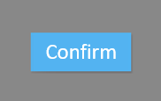
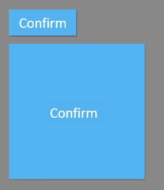

首先新建一个 eui 项目，使用：
```
egret create HelloEUI --type eui
```
> 下面的教程里使用该项目的默认皮肤设置。可以在示例项目的`eui_skins`文件夹下找到默认皮肤的 exml 文件。

按钮控件对应的类是 `eui.Button`。`eui.Button` 继承自 `eui.Component`类，因此它可以定制皮肤。要显示按钮通常要给按钮指定皮肤，按钮的代码如下：

```  TypeScript
var button = new eui.Button();
button.width = 100;
button.height = 40;
button.label = "Confirm";
button.skinName = "ButtonSkin.exml";
this.addChild(button);
```

按钮的效果如下图所示：



按钮的皮肤通常需要有 up、down、disabled 等状态。如果按钮没显示出来，请确认：1，是否正确配置了皮肤，2，组件皮肤和相关素材是否在项目中.

按钮可以设置禁用，禁用的按钮会以另外一种样式显示（进入disabled视图状态），且不再响应交互，设置`enabled`属性可以控制是否禁用：

```  TypeScript
button.enabled = false;
```

在按钮上，可以添加事件侦听，判断当用户按下按钮后，下一步要执行的方法：

```  TypeScript
button.addEventListener(egret.TouchEvent.TOUCH_TAP,this.btnTouchHandler,this);

private btnTouchHandler(event:egret.TouchEvent):void {
        console.log("button touched");
}
```
可以在按钮上设置宽度和高度，按钮上的文本会自动居中，以适应不同的按钮尺寸：
```  TypeScript
var button = new eui.Button();
button.width = 100;
button.height = 40;
button.label = "Confirm";
this.addChild(button);
var button2 = new eui.Button();
button2.y = 50;
button2.width = 200;
button2.height = 200;
button2.label = "Confirm";
this.addChild(button2);
```  

若想要获取按钮的文本对象请使用如下方法：
``` TypeScript
var button = new eui.Button();
(<eui.Label>button.labelDisplay).size = 50；
```
因为`labelDisplay`是个接口，所以需要使用`eui.Label`转换。


