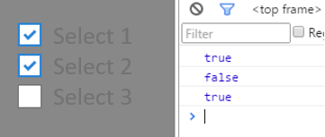

复选框组件 eui.CheckBox 继承自切换按钮 eui.ToggleButton。当它被选中,selected属性将变为true，反之则为false。

当然复选框按钮也继承自按钮 eui.Button 和容器 eui.Component ,他具有按钮和容器的基本功能。

``` TypeScript
var cbx = new eui.CheckBox();
cbx.label = "选择1";
this.addChild(cbx);
cbx.addEventListener(
    eui.UIEvent.CHANGE,
    (evt:eui.UIEvent)=>{egret.log(evt.target.selected);
    },this
);

var cbx2 = new eui.CheckBox();
cbx2.label = "选择2";
cbx2.y = 30;
this.addChild(cbx2);

var cbx3 = new eui.CheckBox();
cbx3.label = "选择3";
cbx3.y = 60;
cbx3.enabled = false;//禁用复选框
this.addChild(cbx3);
```
得到的效果：



> 同前面一节一样，这里也使用：
```
egret create HelloEUI --type eui
```
> 创建的示例项目的默认皮肤。可以在示例项目的`skins`文件夹下找到皮肤的 exml 文件。