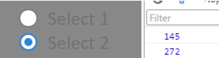

单选按钮和复选框的区别在于，单选按钮不会单独使用，而是若干个单选按钮结成一组来使用，并且选择是排斥性的，如果选择了A，那B,C,D则会自动切换到非选中状态。如果在界面上，不止一组单选按钮，那么结组使用就更有必要了，并且必须保证不同的单选按钮组之间互不干扰。
创建单选按钮的方式如下：

~~~ typescript 
var rdb:eui.RadioButton = new eui.RadioButton();
rdb.label = "Select 1";
rdb.value =1;
this.addChild(rdb);
~~~ 

~~~ typescript
注意上面的`value`属性，它可以设置附加的数据，类型不限，可以是数字，字符串，甚至是一个自定义类型的对象。
当用户选择了某一个单选按钮，就可以直接获取其附加的数据。
~~~ 
当然，一个单选按钮没有实际意义，创建多个单选按钮并结组的代码示例如下：

### 方式1：使用groupName
~~~ typescript 
private initRadioButton():void {
    var rdb: eui.RadioButton = new eui.RadioButton();
    rdb.label = "Select 1";
    rdb.value = 145;
    rdb.groupName = "G1";
    rdb.addEventListener(eui.UIEvent.CHANGE,
        this.radioChangeHandler,
        this);
    this.addChild(rdb);
    var rdb2: eui.RadioButton = new eui.RadioButton();
    rdb2.y = 30;
    rdb2.label = "Select 2";
    rdb2.value = 272;
    rdb2.selected = true;//默认选项
    rdb2.groupName = "G1";
    rdb2.addEventListener(eui.UIEvent.CHANGE,
        this.radioChangeHandler,
        this);
    this.addChild(rdb2);
}
private radioChangeHandler(evt:eui.UIEvent):void {
    egret.log(evt.target.value);
}
~~~ 
得到的效果：

这样的实现方式较为简单，但缺点是，如果想监视选项的变化，需要在每个单选按钮上都添加`egret.Event.CHANGE`事件侦听。同样，如果想得到最终选定的那个值，就必须循环判断，找到`selected = true`的那个单选按钮，取它的值。所以更推荐使用第二种方案：

### 方式2：使用RadioButtonGroup
创建一个`egret.gui.RadioButtonGroup`的实例，并设置到每个单选按钮的`group`属性上。这样的好处在于，只需要处理`RadioButtonGroup`实例上的事件侦听，就能捕获数值的变化，要取得最终选择的值，从`RadioButtonGroup`实例上直接获取即可。示例代码：
~~~ typescript 
private initRadioButtonWithGroup():void {
    var radioGroup: eui.RadioButtonGroup = new eui.RadioButtonGroup();
    radioGroup.addEventListener(eui.UIEvent.CHANGE, this.radioChangeHandler, this);
    var rdb: eui.RadioButton = new eui.RadioButton();
    rdb.label = "Select 1";
    rdb.value = 145;
    rdb.group = radioGroup;
    this.addChild(rdb);
    var rdb2: eui.RadioButton = new eui.RadioButton();
    rdb2.y = 30;
    rdb2.label = "Select 2";
    rdb2.value = 272;
    rdb2.selected = true;//默认选项
    rdb2.group = radioGroup;
    this.addChild(rdb2);
}
private radioChangeHandler(evt:eui.UIEvent):void {
    var radioGroup: eui.RadioButtonGroup = evt.target;
    console.log(radioGroup.selectedValue);
}
~~~ 
> 同前面一节一样，这里使用：
~~~ typescript
egret create HelloEUI --type eui
~~~ 
> 创建示例项目的默认皮肤。可以在示例项目的`eui_skins`文件夹下找到默认皮肤的 exml 文件。

